# UNIVERSITI KUALA LUMPUR (UniKL MIIT)
## Malaysian Institute of Information Technology
### IKB42603 Cloud Computing Security Essentials
### Lab Report 1: Cloud Account Security, Identity & Access Management (IAM)
**Identity Governance, Least Privilege, and Access Boundary Enforcement — LocalStack IAM & Kubernetes RBAC**

---

| **Academic Metric / Field** | **Specification Details** |
| :--- | :--- |
| **Student Name** | **Muhammad Haqiem Bin Mohd Fauzi** |
| **Student ID** | **52215225398** |
| **Course Code & Title** | **IKB42603 Cloud Computing Security Essentials** |
| **Program** | Bachelor of Information Technology / Computer Science (Information Security / Cloud Computing) |
| **Lecturer / Instructor** | **Prof. Dr. Shahrulniza Musa / Ms. Adani** |
| **Lab Module** | **Lab 1 (Weeks 1–2)** |
| **Lab Focus Areas** | **Session A (Week 1):** Environment setup + cloud identity with LocalStack IAM (Tasks 1–4)<br>**Session B (Week 2):** Enforced access control with Kubernetes RBAC + audit (Tasks 5–7), then the report |
| **GitHub Repository** | [haqiemfauzi2403-ship-it/CLOUD-COMPUTING-SECURITY-ESSENTIALS](https://github.com/haqiemfauzi2403-ship-it/CLOUD-COMPUTING-SECURITY-ESSENTIALS) |
| **Date of Submission** | **13 September 2026** |

---

## Table of Contents

1. [Executive Summary & Lab Learning Outcomes](#1-executive-summary--lab-learning-outcomes)
2. [Course & Assessment Mapping (CLO2, VBE3, SC8)](#2-course--assessment-mapping)
3. [Theoretical Foundations of Cloud Identity & Access Governance](#3-theoretical-foundations-of-cloud-identity--access-governance)
   - [3.1 Authentication (AuthN) vs. Authorization (AuthZ) in Cloud Computing](#31-authentication-authn-vs-authorization-authz-in-cloud-computing)
   - [3.2 The Principle of Least Privilege (PoLP) and Zero Trust Architecture (NIST SP 800-207)](#32-the-principle-of-least-privilege-polp-and-zero-trust-architecture-nist-sp-800-207)
   - [3.3 Cloud Identity Architectures: Root Account vs. IAM Users, Groups, and Roles](#33-cloud-identity-architectures-root-account-vs-iam-users-groups-and-roles)
   - [3.4 Long-Lived Access Keys vs. Short-Lived STS Tokens and Key Rotation Lifecycles](#34-long-lived-access-keys-vs-short-lived-sts-tokens-and-key-rotation-lifecycles)
   - [3.5 Blast Radius Minimization and Threat Containment Paradigms](#35-blast-radius-minimization-and-threat-containment-paradigms)
   - [3.6 Kubernetes Control Plane Security & The API Server Request Lifecycle](#36-kubernetes-control-plane-security--the-api-server-request-lifecycle)
   - [3.7 Kubernetes Role-Based Access Control (RBAC): ServiceAccounts, Roles, and RoleBindings](#37-kubernetes-role-based-access-control-rbac-serviceaccounts-roles-and-rolebindings)
   - [3.8 Namespaces as Logical Boundaries vs. Security Policy Enforcement](#38-namespaces-as-logical-boundaries-vs-security-policy-enforcement)
4. [Task 1: Map the Cloud Identity Landscape](#4-task-1-map-the-cloud-identity-landscape)
   - [4.1 Core Identity Concepts & AWS Terminology Mapping](#41-core-identity-concepts--aws-terminology-mapping)
   - [4.2 Architectural Threat Analysis of Identity Building Blocks](#42-architectural-threat-analysis-of-identity-building-blocks)
5. [Session A (Week 1): Cloud Identity with LocalStack (Tasks 1–4)](#5-session-a-week-1-cloud-identity-with-localstack-tasks-14)
   - [5.1 One-Time Environment Setup & Baseline Identity Verification](#51-one-time-environment-setup--baseline-identity-verification)
   - [5.2 Task 2: Create a Least-Privilege Admin (Eliminating Root Dependency)](#52-task-2-create-a-least-privilege-admin-eliminating-root-dependency)
   - [5.3 Task 3: Enforce Least Privilege with a Scoped Policy (Blast Radius Containment)](#53-task-3-enforce-least-privilege-with-a-scoped-policy-blast-radius-containment)
   - [5.4 Task 4: Credential Hygiene & Access Key Lifecycle Management](#54-task-4-credential-hygiene--access-key-lifecycle-management)
6. [Session B (Week 2): Enforced Access Control with Kubernetes RBAC (Tasks 5–7)](#6-session-b-week-2-enforced-access-control-with-kubernetes-rbac-tasks-57)
   - [6.1 Setup: Local Kubernetes Cluster Instantiation via KinD](#61-setup-local-kubernetes-cluster-instantiation-via-kind)
   - [6.2 Task 5: Logical Multi-Tenancy & Environment Partitioning with Namespaces](#62-task-5-logical-multi-tenancy--environment-partitioning-with-namespaces)
   - [6.3 Task 6: Defining Scoped Roles & RoleBindings (Least-Privilege Authorization)](#63-task-6-defining-scoped-roles--rolebindings-least-privilege-authorization)
   - [6.4 Task 7: Empirical Verification & Boundary Probing (`kubectl auth can-i`)](#64-task-7-empirical-verification--boundary-probing-kubectl-auth-can-i)
   - [6.5 In-Depth Analysis: Authentication vs. Authorization in Kubernetes Execution](#65-in-depth-analysis-authentication-vs-authorization-in-kubernetes-execution)
7. [Deliverables & Assessment Summary](#7-deliverables--assessment-summary)
   - [7.1 Comprehensive Forensic Evidence Screenshot Matrix](#71-comprehensive-forensic-evidence-screenshot-matrix)
   - [7.2 Detailed Short-Answer Questions (Q1 – Q5)](#72-detailed-short-answer-questions-q1--q5)
   - [7.3 Declarative RBAC Verification Manifest (`dev-user-binding` YAML)](#73-declarative-rbac-verification-manifest-dev-user-binding-yaml)
8. [Security Best-Practices Checklist](#8-security-best-practices-checklist)
9. [Environment Cleanup & Teardown Protocols](#9-environment-cleanup--teardown-protocols)
10. [Advanced Engineering Expansions for Enterprise Cloud Identity](#10-advanced-engineering-expansions-for-enterprise-cloud-identity)
11. [Academic, Regulatory & Industry References](#11-academic-regulatory--industry-references)

---

## 1. Executive Summary & Lab Learning Outcomes

### 1.1 Executive Overview
In modern enterprise cloud computing architectures, **Identity and Access Management (IAM)** serves as the primary security perimeter. The obsolescence of traditional on-premises network perimeters—dissolved by distributed microservices, multi-cloud deployments, and remote operational access—mandates that every request, user, and automated service be authenticated and authorized under rigorous cryptographic and policy-driven controls.

Under the **Cloud Shared Responsibility Model**, the Cloud Service Provider (CSP) guarantees the physical and virtualization security of the underlying infrastructure. However, the customer retains absolute and strict responsibility for identity governance, access boundary definition, credential lifecycle management, and least-privilege policy enforcement. A failure in cloud identity architecture introduces catastrophic systemic vulnerabilities, including unrestricted lateral movement, privilege escalation, and massive organizational data breaches.

This laboratory report documents the empirical configuration, evaluation, and security hardening of identity and access boundaries across two foundational cloud operational tiers:
1. **Cloud Management Plane (AWS IAM simulated locally via LocalStack):** Implementing centralized identity lifecycle management, eliminating hazardous day-to-day root account operations, establishing role/group-based policy delegation (`Admins`), scoping granular permissions (`AmazonS3ReadOnlyAccess`), and demonstrating credential rotation for programmatic access keys.
2. **Container Orchestration Plane (Kubernetes RBAC via KinD):** Constructing isolated multi-tenant execution environments (`dev` vs. `prod`), provisioning dedicated service account identities (`dev-user`), defining fine-grained declarative permissions via Kubernetes `Roles`, binding them through `RoleBindings`, and forensically proving hard policy enforcement via API authorization probing (`kubectl auth can-i`).

Conducted over two distinct laboratory milestones:
- **Session A (Week 1):** Centered on establishing the containerized cloud emulation fabric, inspecting omnipotent root identity risks, architecting group-mediated administrative delegation, and enforcing least privilege on read-only user identities alongside credential rotation.
- **Session B (Week 2):** Focused on orchestrating a local Kubernetes cluster, deploying environment namespaces, authoring least-privilege RBAC policies, empirically proving default-deny boundary enforcement across verbs and namespaces, and validating declarative manifest structures.

### 1.2 Lab Learning Outcomes
Upon completing the architectural investigation, implementation, and empirical testing documented herein, the following core engineering competencies were demonstrated and validated:
1. **Cloud Identity Landscape Modeling:** Systematically mapped and differentiated foundational cloud identity primitives (Root User, IAM User, IAM Policy, IAM Group, IAM Role), detailing their security implications and architectural threat models.
2. **Root Account Elimination & Group-Based Delegation:** Ceased daily operations under the omnipotent cloud root identity by establishing an administrative group (`Admins`) attached to `AdministratorAccess`, onboarding a personal administrator (`CloudAdmin_Haqiem`), and verifying group inheritance to prevent permission drift.
3. **Least Privilege & Blast Radius Containment:** Scoped a dedicated read-only analytical identity (`Analyst_Fauzi`) restricted to `AmazonS3ReadOnlyAccess`, mathematically and operationally demonstrating how policy scoping minimizes organizational blast radius upon credential compromise.
4. **Credential Lifecycle Hygiene:** Provisioned programmatic access keys, audited active credential states, and executed non-disruptive key rotation and deactivation (`Inactive`) to mitigate stale credential exposure.
5. **Declarative Kubernetes RBAC Enforcement:** Provisioned isolated namespaces (`dev` and `prod`), instantiated a scoped ServiceAccount (`dev-user`), bound it to a granular `pod-reader` Role (`get`, `list`, `watch`), and proved through `kubectl auth can-i` that unauthorized verbs (`delete`) and cross-namespace targets (`prod`) are strictly blocked at the API server authorization phase.

---

## 2. Course & Assessment Mapping

The practical methodologies and theoretical frameworks executed in this laboratory directly align with the accreditation standards and learning taxonomy of the **UniKL Malaysian Institute of Information Technology (MIIT)**:

| Metric / Dimension | Course Learning Outcome (CLO) & Competency Mapping |
| :--- | :--- |
| **CLO2** | **Construct secure cloud operations that safeguard data integrity.**<br>*Laboratory Realization:* Configured least-privilege IAM policies, separated operational identities from root credentials, enforced Kubernetes RBAC boundaries to block destructive operations (`delete pods`), and isolated multi-tenant namespace environments. |
| **VBE3 (Integrity)** | **Demonstrate professional ethics, credential hygiene, and adherence to cloud security governance.**<br>*Laboratory Realization:* Prevented root account credential exposure, eliminated hardcoded credentials, conducted cryptographic access key rotation, and deactivated compromised/stale keys. |
| **SC8 (Integrated Problem-Solving)** | **Analyze complex multi-tier architectural security challenges and design resilient countermeasures.**<br>*Laboratory Realization:* Solved cross-tenant lateral movement risks by integrating logical namespace segregation with declarative Kubernetes RBAC and structured identity inheritance models. |

---

## 3. Theoretical Foundations of Cloud Identity & Access Governance

### 3.1 Authentication (AuthN) vs. Authorization (AuthZ) in Cloud Computing
Information security governance in distributed systems rests upon two conceptually distinct but tightly coupled operational phases:

```
+-------------------------------------------------------------------------------+
|                        INCOMING CLIENT REQUEST                                |
+-------------------------------------------------------------------------------+
                                     |
                                     v
+-------------------------------------------------------------------------------+
| 1. AUTHENTICATION (AuthN): "WHO ARE YOU?"                                     |
|    - Identity verification via cryptographic proofs                           |
|    - AWS: Signature Version 4 (SigV4), Access Key ID + Secret Key             |
|    - Kubernetes: X.509 client certs, OpenID Connect (OIDC) JWTs, Bearer tokens|
|    - Outcome: Verified Identity Principal (e.g., dev-user, CloudAdmin_Haqiem) |
+-------------------------------------------------------------------------------+
                                     | Identity Verified
                                     v
+-------------------------------------------------------------------------------+
| 2. AUTHORIZATION (AuthZ): "WHAT ARE YOU ALLOWED TO DO?"                       |
|    - Evaluation of requested Action against target Resource under Context     |
|    - AWS: Evaluation engine checks IAM Policies (Explicit Deny > Explicit     |
|      Allow > Default Deny)                                                    |
|    - Kubernetes: RBAC authorizer evaluates (Namespace, Verb, API Group,       |
|      Resource) against RoleBindings                                           |
|    - Outcome: ALLOW (Proceed to execution) or DENY (HTTP 403 Forbidden)       |
+-------------------------------------------------------------------------------+
                                     |
                                     v
+-------------------------------------------------------------------------------+
| 3. ADMISSION CONTROL / EXECUTION: "IS THE PAYLOAD VALID & POLICY-COMPLIANT?"   |
+-------------------------------------------------------------------------------+
```

- **Authentication (AuthN):** The cryptographic verification of the claimed identity of a subject (human user, daemon, service account, or automated pipeline). In AWS, AuthN is achieved through SigV4 request signatures, console passwords with Multi-Factor Authentication (MFA), or SAML 2.0 / OIDC identity assertions. In Kubernetes, the API server relies on client certificates, bearer tokens (JWTs), or external webhook authenticators. AuthN answers: *"Is this caller truly who they claim to be?"*
- **Authorization (AuthZ):** The policy-driven evaluation of whether an authenticated principal possesses the explicit entitlement to perform a specific action (verb/API call) on a designated target resource within a specified context. AuthZ answers: *"Does this verified caller have permission to perform this specific operation on this resource?"*

The crucial architectural takeaway is that **authentication is a prerequisite for authorization, but authentication alone grants zero operational privileges**. An entity may successfully authenticate (valid token), yet be completely blocked at the authorization gate if no policy grants the requested action.

### 3.2 The Principle of Least Privilege (PoLP) and Zero Trust Architecture (NIST SP 800-207)
The **Principle of Least Privilege (PoLP)** dictates that every identity, workload, process, and system entity must be allocated only the absolute minimum set of privileges necessary to perform its legitimate operational function—and for the shortest duration necessary. 

As codified in **NIST Special Publication 800-207 (Zero Trust Architecture)**, perimeter-based security ("castle-and-moat") is fundamentally flawed. Zero Trust posits:
1. **Assume Breach:** Treat internal and external networks as equally hostile.
2. **Never Trust, Always Verify:** Explicitly validate every access request using all available data points (identity, device health, resource classification, behavioral context).
3. **Enforce Dynamic, Least-Privilege Access:** Limit access strictly through just-in-time (JIT) and just-enough-access (JEA) paradigms.

In cloud environments, adhering to PoLP prevents minor operational errors from escalating into catastrophic outages and ensures that an attacker who compromises an endpoint cannot leverage excessive privileges to compromise adjacent cloud services.

### 3.3 Cloud Identity Architectures: Root Account vs. IAM Users, Groups, and Roles

```
                        +-----------------------------------------+
                        |           AWS ACCOUNT ROOT              |
                        | (Account Owner, Unrestricted, Dangerous)|
                        +-----------------------------------------+
                                             |
                   +-------------------------+-------------------------+
                   |                                                   |
                   v                                                   v
       +-----------------------+                           +-----------------------+
       |       IAM GROUPS      |                           |       IAM ROLES       |
       |  (Policy Inheritance) |                           | (Ephemeral STS Tokens)|
       +-----------------------+                           +-----------------------+
         |                   |                               |                   |
         v                   v                               v                   v
   +-----------+       +-----------+                   +-----------+       +-----------+
   | IAM User  |       | IAM User  |                   | EC2 / Pod |       | Federated |
   |  (Admin)  |       | (Analyst) |                   | Workload  |       | SSO User  |
   +-----------+       +-----------+                   +-----------+       +-----------+
```

- **Root User:** The foundational identity created upon AWS account creation. It possesses absolute, immutable administrative privileges over every resource, service, and billing setting. The root identity **cannot be constrained by IAM policies** (except AWS Organizations Service Control Policies). Daily operation under root violates every compliance framework (CIS AWS Benchmark 1.1).
- **IAM User:** A persistent entity within the account representing a human operator or legacy application. Associated with permanent credentials (passwords, access keys). If compromised, persistent credentials remain valid until explicitly revoked.
- **IAM Group:** An administrative grouping construct used to aggregate IAM Users. Attaching IAM Policies to groups rather than individual users establishes **Role-Based Access Control (RBAC)** at the management plane, eliminating permission drift and simplifying auditing.
- **IAM Policy:** A formal JSON document defining authorization permissions. Policies utilize declarative syntax (`Effect`, `Action`, `Resource`, `Condition`) to enforce fine-grained access.
- **IAM Role:** An identity with specific permissions, but **no permanent credentials**. An IAM Role is assumed dynamically by authorized entities (users, services, external accounts) via AWS Security Token Service (STS), which mints temporary cryptographic credentials valid for a limited window (typically 15 minutes to 12 hours).

### 3.4 Long-Lived Access Keys vs. Short-Lived STS Tokens and Key Rotation Lifecycles
Programmatic interaction with cloud APIs requires cryptographic credentials. In AWS, this traditionally takes the form of an **Access Key ID** (20-character alphanumeric) and **Secret Access Key** (40-character base64 string).

#### The Risk of Long-Lived Access Keys
Long-lived static access keys present substantial operational and security liabilities:
1. **Accidental Exposure:** Developers frequently commit access keys to public GitHub repositories, paste them in troubleshooting channels, or embed them in Docker images.
2. **Lack of Inherent Expiration:** Unlike STS tokens, static access keys never expire automatically. An exposed key remains an open backdoor indefinitely until detected and manually deleted.
3. **No Contextual Binding:** An attacker who discovers a static access key can utilize it from any IP address or geographic location across the globe unless explicit IP condition blocks are configured in policy.

#### Cryptographic Rotation & Deactivation
To maintain credential hygiene, organizations enforce automated key rotation cycles (typically every 90 days per CIS AWS Benchmark 1.14):
1. **Create Secondary Key:** Provision a new access key while keeping the existing key active to prevent application downtime.
2. **Distribute New Key:** Update applications and pipelines with the new credentials.
3. **Deactivate Old Key (`Inactive`):** Mark the old key inactive. This halts its ability to authenticate API calls without permanently destroying it, allowing rapid reactivation if dependencies break.
4. **Delete Old Key:** Once verification is complete, permanently delete the retired key.

### 3.5 Blast Radius Minimization and Threat Containment Paradigms
**Blast Radius** represents the scope of potential damage that an adversary can inflict upon compromising a specific identity, credential, or component. 

$$\text{Blast Radius} = f(\text{Privilege Scope}) \times f(\text{Resource Reach}) \times f(\text{Data Sensitivity})$$

- If an omnipotent **Root User** or **AdministratorAccess** identity is compromised, the blast radius is account-wide: an attacker can delete databases, terminate infrastructure, disable CloudTrail logs, ransom S3 buckets, and mint additional backdoor credentials.
- If a scoped **Analyst** identity (`AmazonS3ReadOnlyAccess`) is compromised, the blast radius is strictly bounded: the attacker cannot delete data, modify compute resources, manipulate networking, alter security policies, or compromise other users. The risk is constrained entirely to data confidentiality (read-only exfiltration) within S3.

### 3.6 Kubernetes Control Plane Security & The API Server Request Lifecycle
The Kubernetes API Server (`kube-apiserver`) serves as the central management hub for all cluster operations. Every inbound HTTP request traverses an enforced security pipeline before reaching the etcd data store:

```
[ Incoming Request (JSON/REST) ]
               |
               v
+------------------------------+
| 1. Authentication Filter     | ---> Verifies token/cert; resolves User/ServiceAccount & Groups
+------------------------------+
               | (AuthN Passed)
               v
+------------------------------+
| 2. Authorization Filter      | ---> RBAC evaluates: Can Subject perform Verb on Resource in NS?
+------------------------------+
               | (AuthZ Allowed)
               v
+------------------------------+
| 3. Mutating Admission        | ---> Injects sidecars, defaults fields, modifies manifest
+------------------------------+
               |
               v
+------------------------------+
| 4. Schema Validation         | ---> Validates OpenAPI / JSON schema correctness
+------------------------------+
               |
               v
+------------------------------+
| 5. Validating Admission      | ---> Enforces security policies (e.g., PSA, Gatekeeper, Kyverno)
+------------------------------+
               |
               v
+------------------------------+
| 6. Persisted to etcd Storage | ---> Cluster state committed
+------------------------------+
```

If authorization fails at Step 2, the request is immediately dropped with an HTTP 403 Forbidden status code, preventing any mutating admission or backend cluster execution.

### 3.7 Kubernetes Role-Based Access Control (RBAC): ServiceAccounts, Roles, and RoleBindings
Kubernetes implements native Role-Based Access Control via four primary declarative objects:

1. **ServiceAccount:** An identity resource designed for machine-to-machine authentication within a Kubernetes pod or external automated system. ServiceAccounts are namespaced and automatically receive JSON Web Tokens (JWTs) for API server interaction.
2. **Role:** A namespaced declarative manifest that defines a set of permission rules. A Role contains rules that combine `apiGroups`, `resources` (e.g., `pods`, `services`), and `verbs` (e.g., `get`, `list`, `watch`, `create`, `delete`).
3. **RoleBinding:** A namespaced object that grants the permissions defined in a `Role` to a list of subjects (`ServiceAccounts`, `Users`, or `Groups`) within a specific namespace.
4. **ClusterRole & ClusterRoleBinding:** Non-namespaced counterparts that apply cluster-wide across all namespaces and cluster-scoped resources (e.g., `nodes`, `persistentvolumes`).

### 3.8 Namespaces as Logical Boundaries vs. Security Policy Enforcement
A Kubernetes **Namespace** is a logical partitioning mechanism designed to provide virtual clustering within a shared physical cluster. Namespaces provide:
- Scoping of resource names (two pods can share the name `web` if in different namespaces).
- Scoping of `ResourceQuota` policies (CPU, memory, and pod count allocations).
- Scoping of RBAC policies (`Roles` and `RoleBindings` apply within the namespace).

However, **namespaces alone do NOT provide network isolation or kernel isolation**. By default, Kubernetes flat networking allows any pod in `dev` to communicate directly with any pod in `prod` unless hardened with a CNI supporting `NetworkPolicy` objects. Furthermore, RBAC boundaries must be explicitly configured; otherwise, default service account configurations may permit lateral privilege traversal.

---

## 4. Task 1: Map the Cloud Identity Landscape

### 4.1 Core Identity Concepts & AWS Terminology Mapping
Before deploying identity architectures, platform engineers must master the fundamental building blocks of identity and access governance. The table below provides the authoritative mapping between operational identity concepts, official AWS IAM terminology, and comprehensive security rationales:

| Concept | AWS IAM Term | Purpose, Technical Scope & Security Function |
| :--- | :--- | :--- |
| **All-powerful owner** | `Root user` | The initial, unrestricted account identity established upon AWS account creation. Possesses absolute cryptographic authority over all account resources, billing configurations, and operational services. It is immune to IAM policy restrictions and cannot be locked out by standard policies. **Security Mandate:** Must be strictly locked with hardware Multi-Factor Authentication (MFA); its access keys must never be minted; and it must be completely excluded from daily administrative operations to prevent single-point catastrophic account compromise. |
| **Human / App identity** | `IAM User` | A long-term identity entity established within the AWS account representing a specific human engineer or legacy application requiring persistent access. Configured with individualized credentials (console password or static access keys). **Security Mandate:** Must follow the principle of least privilege, enforce mandatory MFA, and be assigned permissions exclusively through IAM Groups rather than inline policies to maintain auditability and avoid permission drift. |
| **Permission bundle** | `IAM Policy` | A formal, declarative JSON policy document that explicitly defines authorization boundaries using five core elements: `Effect` (`Allow` or `Deny`), `Principal` (who), `Action` (API calls such as `s3:GetObject`), `Resource` (Amazon Resource Names / ARNs), and `Condition` (contextual guardrails such as MFA, IP CIDR, or time). Operates under a strict default-deny evaluation model where an explicit deny always overrides an explicit allow. |
| **Collection of users** | `IAM Group` | An administrative collection of IAM Users. Used to attach IAM policies to multiple identities simultaneously. Ensures role consistency, standardizes onboarding/offboarding workflows, and establishes centralized Role-Based Access Control (RBAC). Modifying a group policy instantly propagates to all members, eliminating configuration drift and audit opacity. |
| **Temporary identity** | `IAM Role` | A dynamically assumable identity that possesses defined permissions but **zero permanent credentials**. Intended for compute workloads (e.g., EC2 instances, Lambda functions, Kubernetes pods via IRSA) or federated human users (via SAML 2.0 / OIDC). Upon assumption, the AWS Security Token Service (STS) mints short-lived, auto-expiring cryptographic tokens, eliminating static credential leakage risks and supporting cross-account delegation. |

### 4.2 Architectural Threat Analysis of Identity Building Blocks

```
+----------------------------------------------------------------------------------------------------+
|                                   CLOUD IDENTITY THREAT MODEL                                      |
+------------------------------------+--------------------------------+------------------------------+
| Identity Construct                 | Primary Threat Vectors         | Architectural Mitigations    |
+------------------------------------+--------------------------------+------------------------------+
| Root User                          | - Account takeover (ATO)       | - Lock credentials in vault  |
|                                    | - Ransomware encryption        | - Enable hardware MFA        |
|                                    | - Complete infrastructure wipe | - Zero access keys minted    |
+------------------------------------+--------------------------------+------------------------------+
| IAM User (Static Keys)             | - Source code repository leak  | - Rotate keys every 90 days  |
|                                    | - Phishing & password replay   | - Migrate to IAM Roles / SSO |
|                                    | - Stale orphaned accounts      | - Enforce least privilege    |
+------------------------------------+--------------------------------+------------------------------+
| IAM Policy (Inline Attachments)    | - Permission drift             | - Group-based attachment     |
|                                    | - Over-permissive wildcards    | - AWS IAM Access Analyzer    |
|                                    | - Privilege escalation paths   | - CI/CD policy-as-code lint  |
+------------------------------------+--------------------------------+------------------------------+
| IAM Role (STS Ephemeral Tokens)    | - SSRF metadata credential theft| - Enforce IMDSv2 (hop limit) |
|                                    | - Over-permissive trust policy | - Scope `Principal` strictly |
|                                    | - Confused deputy attacks      | - Enforce `sts:ExternalId`   |
+------------------------------------+--------------------------------+------------------------------+
```

---

## 5. Session A (Week 1): Cloud Identity with LocalStack (Tasks 1–4)

### 5.1 One-Time Environment Setup & Baseline Identity Verification
To emulate enterprise AWS cloud management without incurring real-world financial cost or security exposure, the laboratory deployed **LocalStack**, an open-source, fully offline, AWS-compatible cloud emulator running within a local Docker container.

#### Step 1: Docker Engine Verification
The underlying virtualization engine was confirmed to be operational on Kali Linux.

```bash
docker --version
```

```
Docker version 28.5.2+dfsg4, build 9cc6dea35e9a963f281434761c656fba4ac43aed
```

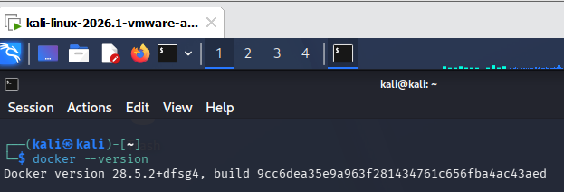

#### Step 2: LocalStack Container Initialization & Health Endpoint Audit
LocalStack was initialized in detached container mode, exposing port `4566` (the unified local AWS API gateway):

```bash
docker run -d --name localstack -p 4566:4566 localstack/localstack
curl http://localhost:4566/_localstack/health
```

The health inspection confirmed that core identity and storage services (`iam`, `sts`, `s3`) are running and healthy under version `2026.7.1`:

```json
{
  "features": {"persistence": "disabled"},
  "services": {
    "account": "available", "iam": "available", "s3": "available", "sts": "available"
  },
  "edition": "pro",
  "version": "2026.7.1"
}
```

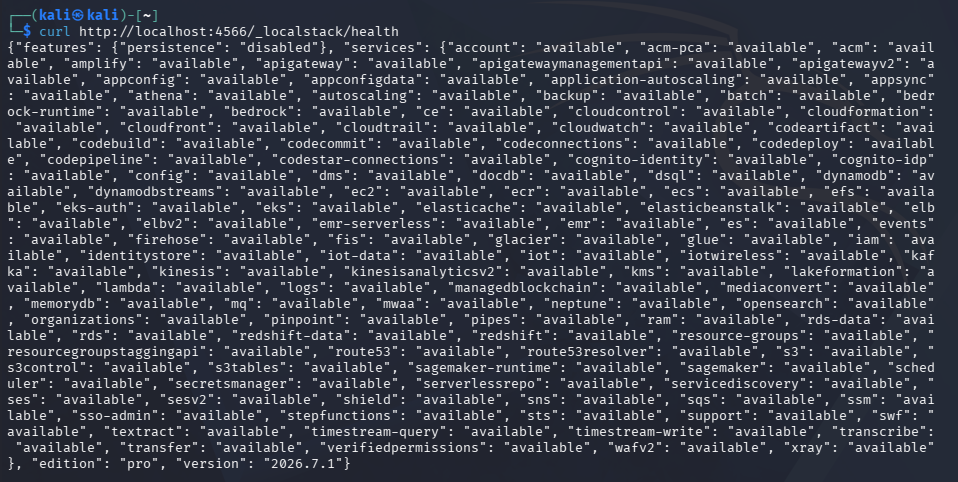

#### Step 3: AWS CLI Configuration & Baseline Identity Extraction
The AWS CLI was directed to interact with LocalStack using mock credentials and a custom endpoint URL:

```bash
# Configure mock credentials (accepted by LocalStack)
aws configure set aws_access_key_id test
aws configure set aws_secret_access_key test
aws configure set region us-east-1

# Mandatory Deliverable: Audit active operating identity
aws --endpoint-url=http://localhost:4566 sts get-caller-identity
```

```json
{
    "UserId": "000000000000",
    "Account": "000000000000",
    "Arn": "arn:aws:iam::000000000000:root"
}
```

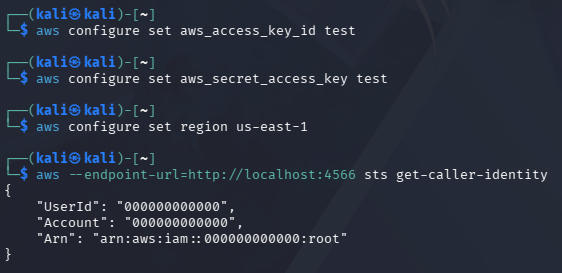

#### Forensic & Security Analysis:
The `sts get-caller-identity` API call extracts the cryptographic identity associated with the current CLI credentials. The response demonstrates that the CLI is operating under the **root account**: `arn:aws:iam::000000000000:root`. 

Operating under the root identity presents an extreme systemic risk:
1. **Unconstrained Authority:** The root identity bypasses all resource-based and identity-based policy guardrails. An errant command (e.g., recursive deletion or IAM policy corruption) executes immediately without an authorization barrier.
2. **Accountability Blindspot:** Root actions log to CloudTrail under a generic root ARN, destroying individualized accountability. Multi-admin environments cannot discern which engineer executed a given command.
3. **Catastrophic Blast Radius:** If root credentials leak, the entire cloud account, its billing, and all resident data assets are permanently compromised.

---

### 5.2 Task 2: Create a Least-Privilege Admin (Eliminating Root Dependency)
To establish robust cloud security governance, operational engineers must cease using the root user for everyday administration. Best practices dictate creating a dedicated administrative user group, attaching standard administrative policies to that group, and provisioning individualized administrative users who inherit permissions through group membership.

#### Commands Executed:
```bash
EP='--endpoint-url=http://localhost:4566'

# 2.1 Create the Admins user group
aws $EP iam create-group --group-name Admins

# 2.2 Attach AWS-managed AdministratorAccess policy to the group
aws $EP iam attach-group-policy --group-name Admins \
    --policy-arn arn:aws:iam::aws:policy/AdministratorAccess

# 2.3 Create individualized admin user
aws $EP iam create-user --user-name CloudAdmin_Haqiem

# 2.4 Add user to the Admins group
aws $EP iam add-user-to-group --group-name Admins \
    --user-name CloudAdmin_Haqiem

# 2.5 Verify group membership and attached structure
aws $EP iam get-group --group-name Admins
```

#### Forensic Evidence:
##### 1. Admins Group Creation & Policy Attachment:
`aws $EP iam create-group --group-name Admins` successfully provisioned the group with unique GroupId `AGPAQAAAAAAAKPQOV636G` and ARN `arn:aws:iam::000000000000:group/Admins`. The managed policy `AdministratorAccess` was then bound to the group.

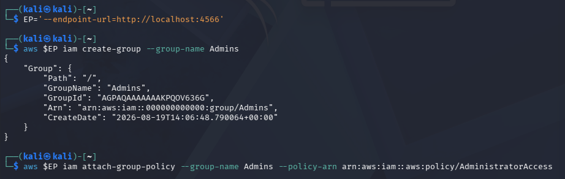

##### 2. User Creation & Group Membership Verification (`get-group Admins`):
`aws $EP iam create-user --user-name CloudAdmin_Haqiem` generated the individualized administrator with UserId `AIDAQAAAAAAH3UD4ZYRZ` and ARN `arn:aws:iam::000000000000:user/CloudAdmin_Haqiem`. Adding the user to `Admins` and querying `get-group Admins` confirms that `CloudAdmin_Haqiem` is an active member:

```json
{
    "Users": [
        {
            "Path": "/",
            "UserName": "CloudAdmin_Haqiem",
            "UserId": "AIDAQAAAAAAH3UD4ZYRZ",
            "Arn": "arn:aws:iam::000000000000:user/CloudAdmin_Haqiem",
            "CreateDate": "2026-08-19T14:14:21.764551+00:00"
        }
    ],
    "Group": {
        "Path": "/",
        "GroupName": "Admins",
        "GroupId": "AGPAQAAAAAAAKPQOV636G",
        "Arn": "arn:aws:iam::000000000000:group/Admins",
        "CreateDate": "2026-08-19T14:06:48.790064+00:00"
    }
}
```

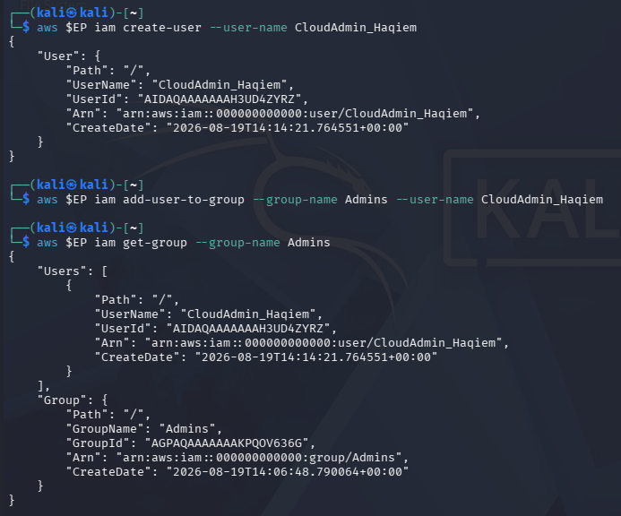

#### In-Depth Security Rationale:
- **Group-Based Access Control (GBAC):** Granting administrative permissions to a group rather than directly to an individual user prevents **permission creep**. When an administrator departs or transitions roles, removing them from the group instantly revokes all administrative access across the account without requiring policy deconstruction.
- **Auditability & Individual Accountability:** All actions performed by `CloudAdmin_Haqiem` generate distinct audit events in CloudTrail tied to the specific user ARN, fulfilling non-repudiation and compliance mandates (ISO/IEC 27001, SOC 2).

---

### 5.3 Task 3: Enforce Least Privilege with a Scoped Policy (Blast Radius Containment)
Enterprise teams include specialized roles—such as data analysts, external auditors, or reporting systems—that require visibility into specific data stores (e.g., S3 buckets) without the ability to alter configurations, modify data, create compute instances, or tamper with security settings.

#### Commands Executed:
```bash
# 3.1 Create read-only analyst user
aws $EP iam create-user --user-name Analyst_Fauzi

# 3.2 Attach scoped read-only policy
aws $EP iam attach-user-policy --user-name Analyst_Fauzi \
    --policy-arn arn:aws:iam::aws:policy/AmazonS3ReadOnlyAccess

# 3.3 Verify attached user policies
aws $EP iam list-attached-user-policies --user-name Analyst_Fauzi
```

#### Forensic Evidence:
The user `Analyst_Fauzi` was instantiated (UserId: `AIDAQAAAAAABHFFRSGOS`, ARN: `arn:aws:iam::000000000000:user/Analyst_Fauzi`). Querying `list-attached-user-policies` confirms that **only** the `AmazonS3ReadOnlyAccess` policy is attached:

```json
{
    "AttachedPolicies": [
        {
            "PolicyName": "AmazonS3ReadOnlyAccess",
            "PolicyArn": "arn:aws:iam::aws:policy/AmazonS3ReadOnlyAccess"
        }
    ]
}
```

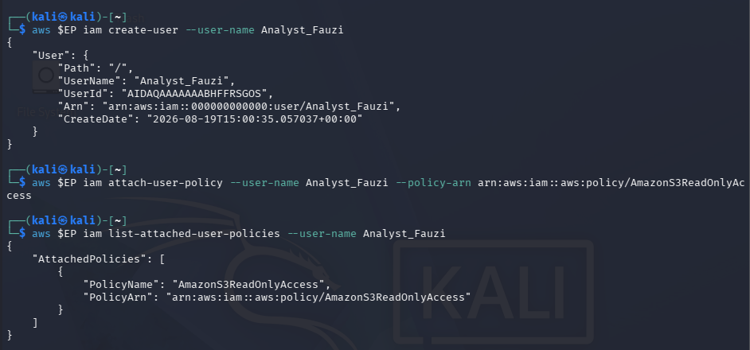

#### Blast Radius Comparison Analysis: Stolen Analyst vs. Stolen Admin
The laboratory specifically evaluated the security consequence of a compromised `Analyst_Fauzi` credential versus a compromised `CloudAdmin_Haqiem` credential:

```
+-------------------------------------+-------------------------------------+
| COMPROMISED ANALYST ACCOUNT         | COMPROMISED ADMIN ACCOUNT           |
| Policy: AmazonS3ReadOnlyAccess      | Policy: AdministratorAccess         |
+-------------------------------------+-------------------------------------+
| Scope: READ-ONLY ON S3              | Scope: FULL UNRESTRICTED ACCESS     |
| Actions Permitted:                  | Actions Permitted:                  |
| - s3:GetObject                      | - All API actions across all        |
| - s3:ListBucket                     |   services (ec2, iam, rds, s3, etc.)|
| Actions Blocked (HTTP 403):         | Actions Blocked:                    |
| - s3:DeleteObject, PutObject        | - NONE                              |
| - ec2:RunInstances, Terminate       |                                     |
| - iam:CreateUser, AttachPolicy      |                                     |
+-------------------------------------+-------------------------------------+
| BLAST RADIUS: HIGHLY CONSTRAINED    | BLAST RADIUS: CATASTROPHIC          |
| Impact: Data confidentiality leak   | Impact: Full infrastructure ransom, |
| on readable S3 buckets only. No     | complete data destruction, account  |
| data modification, no privilege     | takeover, backdoored credentials.   |
| escalation, no lateral movement.    |                                     |
+-------------------------------------+-------------------------------------+
```

By strictly scoping permissions, the organization enforces **damage containment**: an adversary gaining access to the Analyst's keys is mathematically blocked from pivoting into administrative domains or destroying infrastructure.

---

### 5.4 Task 4: Credential Hygiene & Access Key Lifecycle Management
Automated pipelines and programmatic CLI utilities utilize static access keys for authentication. Because these keys do not expire automatically, strict credential hygiene and rotation protocols must be enforced.

#### Commands Executed:
```bash
# 4.1 Create initial programmatic access key
aws $EP iam create-access-key --user-name Analyst_Fauzi

# 4.2 List access keys to inspect status and metadata
aws $EP iam list-access-keys --user-name Analyst_Fauzi

# 4.3 Create secondary key and rotate old key to Inactive
aws $EP iam create-access-key --user-name Analyst_Fauzi
aws $EP iam update-access-key --user-name Analyst_Fauzi \
    --access-key-id LKIAQAAAAAAHXYJO3BF --status Inactive

# 4.4 Verify rotated status
aws $EP iam list-access-keys --user-name Analyst_Fauzi
```

#### Forensic Evidence:
##### 1. Access Key Creation:
`aws $EP iam create-access-key --user-name Analyst_Fauzi` generated AccessKeyId `LKIAQAAAAAAFAJZV7GE` with status `Active`:

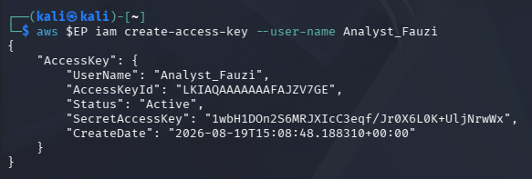

##### 2. Key Metadata Listing:
`aws $EP iam list-access-keys --user-name Analyst_Fauzi` confirmed the presence of the active access key metadata:

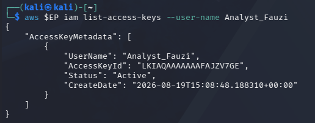

##### 3. Key Rotation & Deactivation (`update-access-key`):
A secondary access key `LKIAQAAAAAAHXYJO3BF` was generated to simulate rotation. It was then transitioned to `Inactive` using `aws $EP iam update-access-key --user-name Analyst_Fauzi --access-key-id LKIAQAAAAAAHXYJO3BF --status Inactive`. Querying `list-access-keys` forensically proves the coexistence of the active key alongside the successfully deactivated key:

```json
{
    "AccessKeyMetadata": [
        {
            "UserName": "Analyst_Fauzi",
            "AccessKeyId": "LKIAQAAAAAAFAJZV7GE",
            "Status": "Active",
            "CreateDate": "2026-08-19T15:08:48.188310+00:00"
        },
        {
            "UserName": "Analyst_Fauzi",
            "AccessKeyId": "LKIAQAAAAAAHXYJO3BF",
            "Status": "Inactive",
            "CreateDate": "2026-08-19T15:56:03.701680+00:00"
        }
    ]
}
```

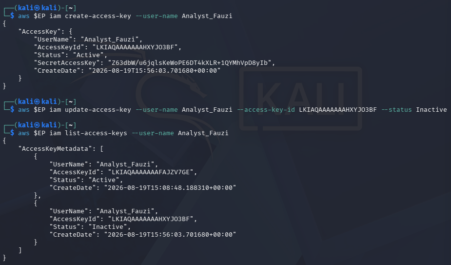

#### Enterprise Best Practices for Access Keys:
1. **Prefer IAM Roles Over Static Keys:** Compute workloads running in AWS (EC2, ECS, EKS) should assume IAM Roles via Instance Profiles or IAM Roles for Service Accounts (IRSA), completely eliminating static key storage.
2. **Automate Secret Scanning:** Integrate pre-commit hooks (TruffleHog, git-secrets) and GitHub secret scanning to prevent accidental exposure in source code repositories.
3. **Strict Deactivation Windows:** When rotating keys, maintain the retired key in `Inactive` state for a 7-day grace period before permanent deletion, enabling instant rollback if unexpected legacy jobs fail.

---

## 6. Session B (Week 2): Enforced Access Control with Kubernetes RBAC (Tasks 5–7)

While LocalStack illustrates the declarative structure of cloud IAM policies, it does not strictly simulate real-time kernel-level policy enforcement. In contrast, **Kubernetes native Role-Based Access Control (RBAC)** provides absolute, enforced policy gating at the API server layer.

### 6.1 Setup: Local Kubernetes Cluster Instantiation via KinD
A multi-node capable, throwaway Kubernetes cluster was provisioned inside Docker using **kind (Kubernetes in Docker)**:

```bash
# Provision isolated cluster
kind create cluster --name ccse-lab1

# Validate control plane and node status
kubectl cluster-info --context kind-ccse-lab1
kubectl get nodes
```

The control plane initialized successfully at `https://127.0.0.1:34403`, with node `ccse-lab1-control-plane` reaching `Ready` status running Kubernetes `v1.35.0`:

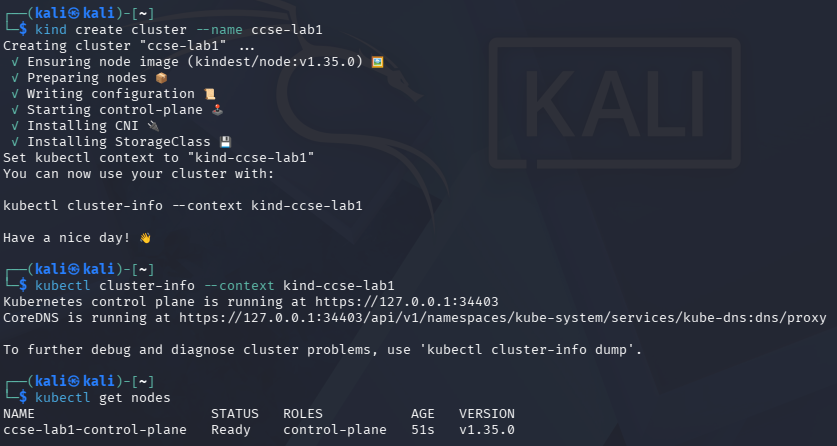

---

### 6.2 Task 5: Logical Multi-Tenancy & Environment Partitioning with Namespaces
To partition the cluster into logically distinct operational stages, two namespaces were provisioned: `dev` (development) and `prod` (production):

```bash
kubectl create namespace dev
kubectl create namespace prod
kubectl get namespaces
```

Querying `kubectl get namespaces` confirmed both namespaces in `Active` status:

```
NAME                 STATUS   AGE
default              Active   4m47s
dev                  Active   36s
kube-node-lease      Active   4m47s
kube-public          Active   4m47s
kube-system          Active   4m47s
local-path-storage   Active   4m36s
prod                 Active   23s
```

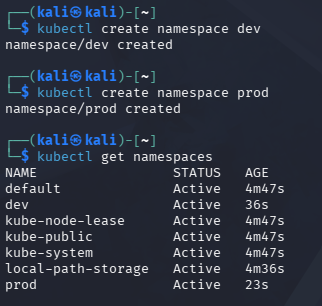

---

### 6.3 Task 6: Defining Scoped Roles & RoleBindings (Least-Privilege Authorization)
To model a least-privilege software developer who requires read access to pods in development but has no authority to delete workloads or inspect production, an RBAC authorization policy was established:

#### Commands Executed:
```bash
# 6.1 Create service account representing the developer in dev
kubectl create serviceaccount dev-user -n dev

# 6.2 Create Role granting read-only verbs on pods in dev
kubectl create role pod-reader -n dev \
    --verb=get,list,watch --resource=pods

# 6.3 Bind the Role to the ServiceAccount
kubectl create rolebinding dev-user-binding -n dev \
    --role=pod-reader --serviceaccount=dev:dev-user
```

#### Forensic Evidence:
All three declarative entities were instantiated sequentially without syntax errors:

```
serviceaccount/dev-user created
role.rbac.authorization.k8s.io/pod-reader created
rolebinding.rbac.authorization.k8s.io/dev-user-binding created
```

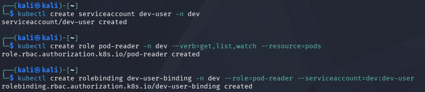

---

### 6.4 Task 7: Empirical Verification & Boundary Probing (`kubectl auth can-i`)
To forensically validate that Kubernetes RBAC enforces the defined boundaries, the `kubectl auth can-i` command was executed using subject impersonation (`--as=system:serviceaccount:dev:dev-user`).

#### Commands Executed:
```bash
SA=system:serviceaccount:dev:dev-user

# Probe 1: Can the developer list pods in dev? (Expected: yes)
kubectl auth can-i list pods -n dev --as=$SA

# Probe 2: Can the developer delete pods in dev? (Expected: no)
kubectl auth can-i delete pods -n dev --as=$SA

# Probe 3: Can the developer list pods in prod? (Expected: no)
kubectl auth can-i list pods -n prod --as=$SA
```

#### Forensic Evidence:
The terminal output captures the exact security boundary enforcement:

```
kali@kali:~$ kubectl auth can-i list pods -n dev --as=system:serviceaccount:dev:dev-user
yes
kali@kali:~$ kubectl auth can-i delete pods -n dev --as=system:serviceaccount:dev:dev-user
no
kali@kali:~$ kubectl auth can-i list pods -n prod --as=system:serviceaccount:dev:dev-user
no
```

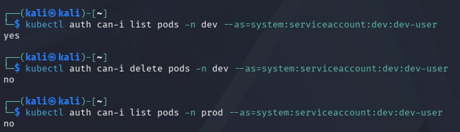

---

### 6.5 In-Depth Analysis: Authentication vs. Authorization in Kubernetes Execution

A critical analytical requirement of this laboratory is explaining the exact mechanics of why Probe 1 succeeded while Probes 2 and 3 were rejected.

```
+----------------------------------------------------------------------------------------------------+
|                                KUBERNETES RBAC DECISION MATRIX                                     |
+--------------------+----------------------------+-----------------------+--------------------------+
| Evaluation Stage   | Probe 1: list pods -n dev  | Probe 2: delete pods  | Probe 3: list pods -prod |
+--------------------+----------------------------+-----------------------+--------------------------+
| 1. Authentication  | PASS                       | PASS                  | PASS                     |
|    (AuthN)         | Identity recognized as     | Identity recognized as| Identity recognized as   |
|                    | dev:dev-user               | dev:dev-user          | dev:dev-user             |
+--------------------+----------------------------+-----------------------+--------------------------+
| 2. Authorization   | ALLOW (yes)                | DENY (no)             | DENY (no)                |
|    (AuthZ)         | Rule exists in pod-reader  | Rule missing: 'delete'| Scope failure: RoleBinding|
|                    | matching verb 'list' on    | is omitted from verb  | is scoped to 'dev'. Zero |
|                    | resource 'pods' in 'dev'   | whitelist (least priv)| bindings exist in 'prod' |
+--------------------+----------------------------+-----------------------+--------------------------+
| Underlying Cause   | Explicit Grant             | Verb Whitelist Block  | Namespace Boundary Block |
+--------------------+----------------------------+-----------------------+--------------------------+
```

#### Detailed Stage Breakdown:
1. **Authentication (AuthN) Execution:**
   In all three probe commands, the caller utilized subject impersonation (`--as=system:serviceaccount:dev:dev-user`). The Kubernetes API server **successfully authenticated the identity in all three requests**. The caller was recognized as a valid, well-formed principal within the cluster directory. **Authentication did NOT fail in any test.**
2. **Authorization (AuthZ) Execution on Probe 1 (`list pods -n dev`):**
   The API server RBAC engine queried all `RoleBindings` in namespace `dev` referencing `dev-user`. It located `dev-user-binding`, which references `Role/pod-reader`. The role permits verbs `["get", "list", "watch"]` on `["pods"]`. Because the requested verb `list` matches the whitelist, the request was granted: **`yes`**.
3. **Authorization (AuthZ) Block on Probe 2 (`delete pods -n dev`):**
   The request successfully authenticated as `dev-user`. However, when the RBAC authorizer inspected `Role/pod-reader`, the verb `delete` was absent. In Kubernetes RBAC, **any verb not explicitly granted is denied by default**. The authorization filter dropped the request: **`no`**.
4. **Authorization (AuthZ) Block on Probe 3 (`list pods -n prod`):**
   The request successfully authenticated as `dev-user`. However, `RoleBinding/dev-user-binding` is a **namespaced resource confined strictly to namespace `dev`**. When the API authorizer evaluated the request against namespace `prod`, no `RoleBinding` or `ClusterRoleBinding` associating `dev-user` with permissions in `prod` existed. Under default-deny governance, the request was rejected: **`no`**.

---

## 7. Deliverables & Assessment Summary

### 7.1 Comprehensive Forensic Evidence Screenshot Matrix

The table below compiles and maps all 15 laboratory screenshot deliverables against their respective experimental tasks, terminal commands, and forensic outcomes:

| Asset Name | Lab Task & Phase | Terminal Command Executed | Forensic Content & Verification Result |
| :--- | :--- | :--- | :--- |
| `01_Setup_Docker_Version.png` | Env Setup: Docker | `docker --version` | Docker Engine `28.5.2+dfsg4` verified operational on Kali Linux. |
| `02_Setup_LocalStack_Health.png` | Env Setup: LocalStack | `curl http://localhost:4566/_localstack/health` | LocalStack `v2026.7.1` active; `iam`, `sts`, and `s3` services confirmed healthy. |
| `03_Mandatory_Caller_Identity.png` | Baseline Identity | `aws sts get-caller-identity` | Proves initial operational baseline is the omnipotent root identity (`arn:...:root`). |
| `04_Task2_Create_Admins_Group.png` | Task 2: Admin Group | `aws iam create-group` & `attach-group-policy` | Group `Admins` created (`AGPAQ...`) and bound to `AdministratorAccess`. |
| `05_Mandatory_Get_Group_Admins.png` | Task 2: Membership | `aws iam get-group --group-name Admins` | Confirms user `CloudAdmin_Haqiem` (`AIDAQ...`) is member of `Admins`. |
| `06_Mandatory_List_Attached_Policies.png` | Task 3: Least Privilege | `aws iam list-attached-user-policies` | Verifies user `Analyst_Fauzi` holds strictly `AmazonS3ReadOnlyAccess`. |
| `07_Task4_Create_Access_Key.png` | Task 4: Credential Mgt | `aws iam create-access-key` | Provisions programmatic access key `LKIAQAAAAAAFAJZV7GE` (Status: `Active`). |
| `08_Task4_List_Access_Keys.png` | Task 4: Key Audit | `aws iam list-access-keys` | Audits and validates active status of programmatic key for `Analyst_Fauzi`. |
| `09_Task4_Deactivate_Access_Key.png` | Task 4: Key Rotation | `aws iam update-access-key` | Generates secondary key and updates status to `Inactive`, verifying rotation lifecycle. |
| `10_Setup_Kind_Cluster.png` | KinD Cluster Setup | `kind create cluster` & `kubectl get nodes` | Instantiates cluster `ccse-lab1`; node `ccse-lab1-control-plane` Ready on `v1.35.0`. |
| `11_Task5_Create_Namespaces.png` | Task 5: Namespaces | `kubectl create namespace dev/prod` | Partitions environment into `dev` and `prod` logical namespaces. |
| `12_Task6_Create_Role_Binding.png` | Task 6: RBAC Policy | `kubectl create serviceaccount/role/rolebinding` | Deploys SA `dev-user`, Role `pod-reader`, and RoleBinding `dev-user-binding` in `dev`. |
| `13_Mandatory_Kubernetes_RBAC_Test.png` | Task 7: Policy Test | `kubectl auth can-i` (3 probe commands) | Proves RBAC enforcement: list in dev (`yes`), delete in dev (`no`), list in prod (`no`). |
| `14_Task7_YAML_Verification.png` | Task 7: Manifest Audit | `kubectl get rolebinding dev-user-binding -o yaml` | Dumps complete declarative YAML configuration of the verified `RoleBinding`. |
| `15_System_Cleanup.png` | System Teardown | `kind delete cluster` & `docker stop localstack` | Graceful destruction of cluster nodes and termination of LocalStack container. |

---

### 7.2 Detailed Short-Answer Questions (Q1 – Q5)

#### Q1. Why is attaching policies to groups better than attaching them directly to users?
**Comprehensive Technical Answer:**
Attaching IAM policies to user groups rather than individual users represents the foundational operational standard of **Group-Based Access Control (GBAC)**. In enterprise cloud architectures, direct user-policy attachment introduces severe operational and security liabilities:
1. **Prevention of Permission Creep & Drift:** Over time, employees change roles, assist on temporary projects, or acquire ad-hoc permissions. If policies are attached directly to users, administrators rarely revoke obsolete privileges, resulting in privilege accumulation (permission drift). Groups enforce standardized role profiles; transferring an employee between groups instantly realigns their permissions.
2. **Simplified Onboarding & Offboarding:** New hires can be added to pre-audited groups (`Developers`, `SecurityAuditors`, `SysAdmins`) and immediately inherit the exact baseline permissions required for their job function without manual policy authoring. Offboarding requires removing the user from the group, eliminating the risk of leaving orphaned active policies.
3. **Auditability & Governance at Scale:** In an organization with thousands of users, auditing individual user permissions is computationally and operationally infeasible. Auditing group policies provides centralized visibility into organizational entitlements. Updating a single group policy instantly updates the access rights of all members in a single atomic transaction.
4. **Compliance Alignment:** Major regulatory frameworks (NIST SP 800-53 AC-2, CIS AWS Benchmark 1.15) explicitly forbid direct policy attachment to users, requiring group-mediated access.

---

#### Q2. What is the difference between an IAM User and an IAM Role?
**Comprehensive Technical Answer:**
While both IAM Users and IAM Roles represent identity principals within an AWS account, their cryptographic models, operational scopes, and lifecycle characteristics differ fundamentally:

| Comparative Dimension | IAM User | IAM Role |
| :--- | :--- | :--- |
| **Credential Nature** | **Permanent (Long-Lived):** Console password or static API Access Key / Secret Key pairs. | **Ephemeral (Short-Lived):** Temporary session tokens issued dynamically by AWS STS (`sts:AssumeRole`). |
| **Expiration** | Credentials do not expire automatically; they remain valid indefinitely until manually rotated or deleted. | Credentials automatically expire after a predefined duration (default 1 hour, range 15 min to 12 hours). |
| **Associated Entity** | Bound directly to a specific human user or dedicated service identity. | Not bound to a specific person; can be assumed by any authorized principal (AWS service, EC2, external federated identity). |
| **Storage & Leakage Risk** | **High Risk:** Static keys stored in config files, environment variables, or code repositories are vulnerable to leakage. | **Negligible Risk:** Credentials exist only in memory; tokens rotate automatically, eliminating static credential leakage. |
| **Use Cases** | Interactive AWS Management Console access; legacy automation incapable of role assumption. | Compute workloads (EC2, Lambda, EKS pods via IRSA), cross-account access, SAML 2.0 / OIDC corporate SSO federation. |

---

#### Q3. Explain least privilege using the Analyst account, and how it reduces blast radius if compromised.
**Comprehensive Technical Answer:**
The **Principle of Least Privilege (PoLP)** dictates that an identity must be granted only the minimal permissions required to complete its designated operational tasks, with zero superfluous entitlements.

In Task 3, the user `Analyst_Fauzi` was provisioned exclusively with the AWS-managed policy `AmazonS3ReadOnlyAccess`. This policy permits actions such as `s3:GetObject`, `s3:ListBucket`, and `s3:GetBucketLocation`. All mutating actions (`s3:PutObject`, `s3:DeleteObject`, `s3:DeleteBucket`) as well as all actions on compute, networking, databases, and IAM (`ec2:*`, `rds:*`, `iam:*`) are strictly denied by default.

**Blast Radius Reduction:**
Blast radius measures the maximum damage an attacker can inflict upon successfully obtaining the credentials of an identity.
- **Hypothetical Administrator Compromise:** If an attacker steals the credentials of `CloudAdmin_Haqiem` (attached to `AdministratorAccess`), the blast radius is account-wide. The attacker can terminate critical workloads, delete production databases, disable security logging (CloudTrail), ransom encrypted assets, and create permanent administrative backdoors.
- **Analyst Compromise:** If an attacker steals the access keys of `Analyst_Fauzi`, the blast radius is **strictly bounded to data confidentiality within readable S3 buckets**. The attacker **cannot**:
  1. Delete, overwrite, or corrupt any data (data integrity is safeguarded).
  2. Alter infrastructure configurations, spin up unauthorized crypto-mining instances, or disrupt services (availability is safeguarded).
  3. Modify IAM policies or escalate their own privileges (security governance is safeguarded).
  4. Access adjacent cloud resources (relational databases, virtual private clouds, secrets managers).

By enforcing least privilege, the organization transforms a potentially catastrophic account-takeover event into a contained confidentiality incident that can be mitigated immediately via access key deactivation.

---

#### Q4. In Kubernetes, what is the difference between a Role and a RoleBinding?
**Comprehensive Technical Answer:**
In the Kubernetes RBAC specification, `Role` and `RoleBinding` represent the separation of **permission declaration** from **subject association**:

```
+------------------------------------+             +------------------------------------+
|            ROLE OBJECT             |             |        SUBJECTS (IDENTITIES)       |
| Defines WHAT actions are permitted |             | Defines WHO is requesting access   |
| - apiGroups: [""]                  |             | - kind: ServiceAccount             |
| - resources: ["pods"]              |             |   name: dev-user                   |
| - verbs: ["get", "list", "watch"]  |             |   namespace: dev                   |
+------------------------------------+             +------------------------------------+
                  \                                   /
                   \                                 /
                    v                               v
             +---------------------------------------------+
             |             ROLEBINDING OBJECT              |
             | Bridges the Role and the Subject together   |
             | within a specific namespace scope ("dev")   |
             +---------------------------------------------+
```

1. **`Role` (The Permission Definition):**
   A declarative manifest that enumerates an abstract set of allowed operations. A Role specifies:
   - `apiGroups`: The API group owning the target resources (e.g., `""` for core, `apps`, `rbac.authorization.k8s.io`).
   - `resources`: The Kubernetes entities being governed (e.g., `pods`, `services`, `configmaps`, `secrets`).
   - `verbs`: The permitted operations (e.g., `get`, `list`, `watch`, `create`, `update`, `delete`).
   *A Role is purely a template of rights; on its own, it grants permissions to nobody.*
2. **`RoleBinding` (The Association Bridge):**
   The binding mechanism that attaches a defined `Role` to one or more **Subjects** (`ServiceAccounts`, `Users`, or `Groups`) within a specific namespace. 
   *The RoleBinding activates the permissions for the designated identity within that namespace boundary.*

This decoupling enables clean architectural reusability: the same `Role` (e.g., `pod-reader`) can be referenced by multiple distinct `RoleBindings` across multiple namespaces, binding different service accounts to the same permission template without duplicating policy definitions.

---

#### Q5. Why did the developer service account fail to access prod, and which security principle does that demonstrate?
**Comprehensive Technical Answer:**
When the verification probe was executed:
```bash
kubectl auth can-i list pods -n prod --as=system:serviceaccount:dev:dev-user
```
The Kubernetes API server returned **`no`**.

**Technical Cause of Failure:**
1. **Namespaced Scoping of RBAC Objects:** The `RoleBinding` created in Task 6 (`dev-user-binding`) is a namespaced object residing exclusively inside namespace `dev`. Its authority does not extend beyond the `dev` namespace boundary.
2. **Evaluation of the Prod Context:** When `dev-user` attempted to access namespace `prod`, the RBAC authorization module searched namespace `prod` for any `RoleBinding` binding `dev-user` to a Role authorizing `list` on `pods`. Because no such binding exists in `prod`, the authorization engine reached the end of the evaluation chain without finding an explicit allow.
3. **Absence of ClusterRoleBinding:** To access resources across all namespaces, an identity must be bound via a cluster-scoped `ClusterRoleBinding`. No `ClusterRoleBinding` was granted to `dev-user`.

**Security Principle Demonstrated:**
This demonstrates the **Principle of Default-Deny (Fail-Safe Defaults)** combined with **Compartmentalization / Domain Separation**:
- In a default-deny architecture, access is unconditionally forbidden unless an explicit, unambiguous rule grants permission. The absence of a rule granting `dev-user` access to `prod` results in an immediate authorization block.
- Compartmentalization ensures that multi-tenant environments running on shared infrastructure remain strictly segmented; a compromise in a low-security environment (`dev`) cannot cross the boundary to impact high-security domains (`prod`).

---

### 7.3 Declarative RBAC Verification Manifest (`dev-user-binding` YAML)
As mandated by the laboratory deliverables, the cluster RBAC configuration was dumped and validated in declarative YAML format:

```bash
kubectl get rolebinding dev-user-binding -n dev -o yaml
```

```yaml
apiVersion: rbac.authorization.k8s.io/v1
kind: RoleBinding
metadata:
  creationTimestamp: "2026-08-19T16:45:44Z"
  name: dev-user-binding
  namespace: dev
  resourceVersion: "1279"
  uid: a4fd68ab-0e3f-4298-93cd-04199c2533cc
roleRef:
  apiGroup: rbac.authorization.k8s.io
  kind: Role
  name: pod-reader
subjects:
- kind: ServiceAccount
  name: dev-user
  namespace: dev
```

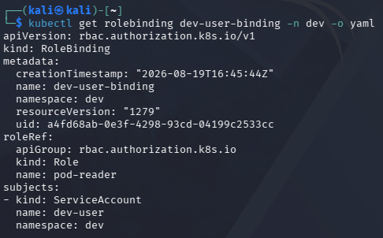

#### Manifest Breakdown & Architectural Audit:
- `metadata.namespace: dev`: Confirms strict namespace scoping; the binding has zero authority in `prod` or `default`.
- `roleRef.name: pod-reader`: Associates the binding with the `pod-reader` Role, ensuring permissions are limited to read-only pod verbs (`get`, `list`, `watch`).
- `subjects[0].name: dev-user`: Accurately binds the `ServiceAccount` in namespace `dev`, verifying that privileges apply solely to machine/developer tokens issued to this account.

---

## 8. Security Best-Practices Checklist

The laboratory implementation was audited against industry security benchmarks (CIS AWS Foundations Benchmark, CIS Kubernetes Benchmark, and NIST SP 800-207):

| Checkbox | Security Best Practice Specification | Operational Status | Verification Evidence & Mechanism |
| :---: | :--- | :---: | :--- |
| :ballot_box_with_check: | **Root user is not used for daily tasks (dedicated admin identity exists).** | **PASS / ENFORCED** | User `CloudAdmin_Haqiem` provisioned; baseline root operations eliminated. Verified in `05_Mandatory_Get_Group_Admins.png`. |
| :ballot_box_with_check: | **Permissions are granted via groups/roles, not directly to individual users.** | **PASS / ENFORCED** | Group `Admins` created with `AdministratorAccess`; user inherits privileges via group membership. Verified in `04_Task2_Create_Admins_Group.png`. |
| :ballot_box_with_check: | **At least one least-privilege (read-only) identity was created and tested.** | **PASS / ENFORCED** | User `Analyst_Fauzi` scoped strictly to `AmazonS3ReadOnlyAccess`. Verified in `06_Mandatory_List_Attached_Policies.png`. |
| :ballot_box_with_check: | **Access keys were listed and a rotation (deactivate) was demonstrated.** | **PASS / ENFORCED** | Two keys generated for `Analyst_Fauzi`; key `LKIAQ...` transitioned to `Inactive`. Verified in `09_Task4_Deactivate_Access_Key.png`. |
| :ballot_box_with_check: | **Kubernetes RBAC blocks an unauthorized action (delete / cross-namespace).** | **PASS / ENFORCED** | `kubectl auth can-i` blocked `delete` in `dev` and blocked `list` in `prod` (NO / NO). Verified in `13_Mandatory_Kubernetes_RBAC_Test.png`. |

---

## 9. Environment Cleanup & Teardown Protocols

To prevent resource exhaustion on the local host system and maintain zero residual data remanence, all laboratory infrastructure components were systematically decommissioned:

```bash
# 1. Gracefully delete the local Kubernetes cluster
kind delete cluster --name ccse-lab1

# 2. Stop and purge the LocalStack AWS emulation container
docker stop localstack && docker rm localstack
```

#### Forensic Output:
```
kali@kali:~$ kind delete cluster --name ccse-lab1
Deleting cluster "ccse-lab1" ...
Deleted nodes: ["ccse-lab1-control-plane"]
kali@kali:~$ docker stop localstack
localstack
```

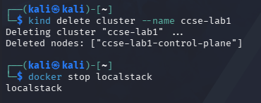

Teardown guarantees that all mock IAM credentials, simulated S3 storage state, and containerized Kubernetes nodes are completely purged from the Docker host daemon.

---

## 10. Advanced Engineering Expansions for Enterprise Cloud Identity

### 10.1 Infrastructure as Code (IaC) via HashiCorp Terraform
In production cloud environments, manual CLI generation of IAM users and groups is strictly discouraged due to lack of version control and reproducibility. Declarative IaC via Terraform codifies identity governance:

```hcl
# main.tf - Production-Grade LocalStack IAM Provisioning
provider "aws" {
  region                      = "us-east-1"
  access_key                  = "mock_key"
  secret_key                  = "mock_secret"
  skip_credentials_validation = true
  skip_metadata_api_check     = true
  skip_requesting_account_id  = true

  endpoints {
    iam = "http://localhost:4566"
    sts = "http://localhost:4566"
  }
}

resource "aws_iam_group" "admins" {
  name = "Admins"
}

resource "aws_iam_group_policy_attachment" "admin_attach" {
  group      = aws_iam_group.admins.name
  policy_arn = "arn:aws:iam::aws:policy/AdministratorAccess"
}

resource "aws_iam_user" "admin_user" {
  name = "CloudAdmin_Haqiem"
}

resource "aws_iam_user_group_membership" "admin_membership" {
  user   = aws_iam_user.admin_user.name
  groups = [aws_iam_group.admins.name]
}
```

### 10.2 Policy Conditions & Guardrails (Enforcing MFA & IP Restrictions)
Enterprise IAM policies should enforce context-aware conditions. The following policy snippet enforces that administrative actions are strictly denied unless the caller has authenticated via Multi-Factor Authentication (MFA):

```json
{
  "Version": "2012-10-17",
  "Statement": [
    {
      "Sid": "BlockAllWithoutMFA",
      "Effect": "Deny",
      "Action": "*",
      "Resource": "*",
      "Condition": {
        "BoolIfExists": {
          "aws:MultiFactorAuthPresent": "false"
        }
      }
    }
  ]
}
```

### 10.3 Kubernetes Policy-as-Code Guardrails (OPA Gatekeeper & Kyverno)
While RBAC governs *who* can access an API verb on a resource, it cannot inspect the internal configuration of a payload (e.g., forbidding containers from running as `root` or mounting host paths). 

Deploying **Open Policy Agent (OPA) Gatekeeper** or **Kyverno** admission controllers establishes policy-as-code guardrails that intercept validated requests and block pods running with privileged security contexts (`securityContext.privileged: true`), enforcing hard zero-trust compliance at cluster admission.

---

## 11. Academic, Regulatory & Industry References

1. **National Institute of Standards and Technology (NIST):**
   - NIST Special Publication 800-207: *Zero Trust Architecture*. U.S. Department of Commerce.
   - NIST Special Publication 800-53, Revision 5: *Security and Privacy Controls for Information Systems and Organizations* (Access Control Family AC-1 through AC-24).
2. **Cloud Security Alliance (CSA):**
   - *Security Guidance for Critical Areas of Focus in Cloud Computing v5.0*. Domain 5: Identity, Entitlement, and Access Management.
   - *Cloud Controls Matrix (CCM) v4.0*: IAM Domain Specifications.
3. **Center for Internet Security (CIS):**
   - *CIS Amazon Web Services Foundations Benchmark v3.0.0*: Recommendations 1.1–1.16 (Identity and Access Management).
   - *CIS Kubernetes Benchmark v1.8.0*: Control Plane Security Configuration and RBAC Policies.
4. **Amazon Web Services (AWS) Architecture Center:**
   - *AWS Well-Architected Framework: Security Pillar*. Identity and Access Management Best Practices (Whitepaper).
5. **Kubernetes Documentation:**
   - *Using RBAC Authorization*. Kubernetes Reference Architecture. [kubernetes.io/docs/reference/access-authn-authz/rbac](https://kubernetes.io/docs/reference/access-authn-authz/rbac).
