# UNIVERSITI KUALA LUMPUR (UniKL MIIT)
## Malaysian Institute of Information Technology
### IKB42603 Cloud Computing Security Essentials
### Lab Report 2: Secure Isolation & Multi-Tenancy
**Compute, Network, and Storage Isolation — Docker & Kubernetes**

---

| **Academic Metric / Field** | **Specification Details** |
| :--- | :--- |
| **Student Name** | **Muhammad Haqiem Bin Mohd Fauzi** |
| **Student ID** | **52215225398** |
| **Course Code & Title** | **IKB42603 Cloud Computing Security Essentials** |
| **Program** | Bachelor of Information Technology / Computer Science (Information Security / Cloud Computing) |
| **Lecturer / Instructor** | **Prof. Dr. Shahrulniza Musa / Ms. Adani** |
| **Lab Module** | **Lab 2 (Weeks 3–4)** |
| **Lab Focus Areas** | **Session A (Week 3):** Compute isolation: containers, namespaces, resource quotas, and the default-open risk (Tasks 1–3)<br>**Session B (Week 4):** Network & storage isolation: default-deny NetworkPolicy, per-tenant secrets, data remanence (Tasks 4–6), then the report |
| **GitHub Repository** | [haqiemfauzi2403-ship-it/CLOUD-COMPUTING-SECURITY-ESSENTIALS](https://github.com/haqiemfauzi2403-ship-it/CLOUD-COMPUTING-SECURITY-ESSENTIALS) |
| **Date of Submission** | **13 September 2026** |

---

## Table of Contents

1. [Executive Summary & Lab Learning Outcomes](#1-executive-summary--lab-learning-outcomes)
2. [Course & Assessment Mapping](#2-course--assessment-mapping)
3. [Theoretical Foundations of Multi-Tenancy & Cloud Isolation](#3-theoretical-foundations-of-multi-tenancy--cloud-isolation)
   - [3.1 Multi-Tenancy Architectures and Threat Vectors in Cloud Computing](#31-multi-tenancy-architectures-and-threat-vectors-in-cloud-computing)
   - [3.2 Linux Kernel Isolation Primitives: Namespaces and Control Groups (cgroups)](#32-linux-kernel-isolation-primitives-namespaces-and-control-groups-cgroups)
   - [3.3 Container Isolation vs. Virtual Machine (Hypervisor) Security Boundaries](#33-container-isolation-vs-virtual-machine-hypervisor-security-boundaries)
   - [3.4 The Kubernetes Networking Model & Flat Inter-Pod Communication](#34-the-kubernetes-networking-model--flat-inter-pod-communication)
   - [3.5 Container Network Interface (CNI) Architecture & Project Calico Policy Enforcement](#35-container-network-interface-cni-architecture--project-calico-policy-enforcement)
   - [3.6 Zero-Trust Network Micro-Segmentation & The Principle of Default-Deny](#36-zero-trust-network-micro-segmentation--the-principle-of-default-deny)
   - [3.7 Kubernetes Role-Based Access Control (RBAC) & ServiceAccount Isolation](#37-kubernetes-role-based-access-control-rbac--serviceaccount-isolation)
   - [3.8 Storage Isolation, Data Remanence, and SSD Wear-Leveling Dynamics](#38-storage-isolation-data-remanence-and-ssd-wear-leveling-dynamics)
   - [3.9 Overwriting Sanitization vs. Cloud Cryptographic Erasure (Crypto-Shredding)](#39-overwriting-sanitization-vs-cloud-cryptographic-erasure-crypto-shredding)
4. [Technical Prerequisites & Lab Environment Setup](#4-technical-prerequisites--lab-environment-setup)
   - [4.1 Kind Cluster Deployment with Disabled Default CNI](#41-kind-cluster-deployment-with-disabled-default-cni)
   - [4.2 Project Calico CNI Manifest Installation & DaemonSet Validation](#42-project-calico-cni-manifest-installation--daemonset-validation)
5. [Session A (Week 3): Compute Isolation & The Default-Open Risk](#5-session-a-week-3-compute-isolation--the-default-open-risk)
   - [5.1 Task 1: Multi-Tenant Logical Partitioning (Namespaces & Workloads)](#51-task-1-multi-tenant-logical-partitioning-namespaces--workloads)
   - [5.2 Task 2: Empirical Demonstration of the Default-Open Risk (Inter-Tenant Probe)](#52-task-2-empirical-demonstration-of-the-default-open-risk-inter-tenant-probe)
   - [5.3 Task 3: Noisy Neighbor Containment via Kubernetes ResourceQuotas](#53-task-3-noisy-neighbor-containment-via-kubernetes-resourcequotas)
6. [Session B (Week 4): Network & Storage Isolation](#6-session-b-week-4-network--storage-isolation)
   - [6.1 Task 4: Enforcement of Default-Deny NetworkPolicy & Cross-Tenant Traffic Blocking](#61-task-4-enforcement-of-default-deny-networkpolicy--cross-tenant-traffic-blocking)
   - [6.2 Task 5: Storage & Secret Isolation Enforced by RBAC](#62-task-5-storage--secret-isolation-enforced-by-rbac)
   - [6.3 Task 6: Data Remanence Demonstration and Secure Sanitization](#63-task-6-data-remanence-demonstration-and-secure-sanitization)
7. [Deliverables & Assessment Summary](#7-deliverables--assessment-summary)
   - [7.1 Comprehensive Forensic Evidence Screenshot Matrix](#71-comprehensive-forensic-evidence-screenshot-matrix)
   - [7.2 Detailed Short-Answer Questions (Q1 – Q5)](#72-detailed-short-answer-questions-q1--q5)
   - [7.3 Verification Command Artifacts](#73-verification-command-artifacts)
8. [Security Best-Practices Checklist](#8-security-best-practices-checklist)
9. [Environment Cleanup & Teardown Protocols](#9-environment-cleanup--teardown-protocols)
10. [Advanced Engineering Expansions for Enterprise Multi-Tenancy](#10-advanced-engineering-expansions-for-enterprise-multi-tenancy)
11. [Academic, Regulatory & Industry References](#11-academic-regulatory--industry-references)

---

## 1. Executive Summary & Lab Learning Outcomes

### 1.1 Executive Overview
Modern cloud computing is fundamentally underpinned by the economic imperative of **multi-tenancy**—the concurrent sharing of physical compute, network, and storage resources among multiple mutually untrusted customers (tenants). By multiplexing virtual workloads across consolidated hardware fabrics, Cloud Service Providers (CSPs) and enterprise private cloud operators achieve massive operational economies of scale, dynamic elasticity, and high resource utilization.

However, resource pooling introduces critical security challenges. In an unhardened multi-tenant environment, the failure of logical isolation mechanisms allows malicious or compromised tenants to execute lateral movement, conduct cross-tenant data exfiltration, eavesdrop on network traffic, tamper with shared volumes, or execute Denial-of-Service (DoS) attacks via unconstrained resource consumption ("noisy neighbor" phenomena).

Under the cloud **Shared Responsibility Model**, while CSPs guarantee hypervisor-level physical security and underlying infrastructure integrity, tenant organizations and platform administrators are strictly accountable for correctly configuring and enforcing logical isolation boundaries within container orchestration platforms such as **Kubernetes**.

This laboratory report documents the empirical investigation and hardening of a multi-tenant Kubernetes environment using **Docker**, **kind (Kubernetes in Docker)**, and **Project Calico**. Conducted across two intensive lab sessions:
- **Session A (Week 3):** Investigated compute isolation primitives, instantiated multi-tenant workloads within isolated Kubernetes namespaces, demonstrated the dangerous **default-open** networking model of standard Kubernetes clusters, and established compute resource governance via `ResourceQuota` policies.
- **Session B (Week 4):** Hardened the cluster perimeter using zero-trust **default-deny NetworkPolicy** objects enforced by the Calico CNI, implemented fine-grained **Role-Based Access Control (RBAC)** to isolate cryptographic secrets per tenant, and analyzed physical **data remanence** vulnerabilities alongside cryptographic erasure strategies.

### 1.2 Lab Learning Outcomes
Upon completion of the research, deployment, and verification phases of this laboratory, the following key competencies were demonstrated and validated:
1. **Demonstrate Compute Isolation:** Successfully segregated distinct customer tenants (`tenant-a` and `tenant-b`) using Kubernetes namespaces, dedicated deployments, and underlying Linux kernel primitives.
2. **Observe & Quantify Default-Open Infrastructure Risks:** Empirically probed cross-namespace network connectivity, demonstrating that standard Kubernetes networking allows unrestricted cross-tenant reachability (HTTP 200).
3. **Implement Network Micro-Segmentation:** Designed, deployed, and validated a default-deny ingress `NetworkPolicy` enforced by Calico's packet filtering engine, conclusively blocking unauthorized cross-tenant packet flows (HTTP timeout / exit code 28).
4. **Enforce Storage & Identity Isolation:** Leveraged Kubernetes RBAC (`Role`, `RoleBinding`, and `ServiceAccount`) to guarantee that sensitive credentials and cryptographic secrets remain strictly inaccessible across tenant boundaries (`kubectl auth can-i`).
5. **Analyze Data Remanence & Secure Deletion:** Demonstrated the risks of residual data retention on shared container storage media following standard unlinking (`rm`), and contrasted raw block overwrite sanitization (`dd`) against enterprise cloud cryptographic erasure.

---

## 2. Course & Assessment Mapping

The practical investigations, terminal commands, and analytical evaluations in this report directly support the course learning objectives and pedagogical frameworks established by UniKL MIIT:

| Dimension / Metric | Academic Specification & Course Alignment |
| :--- | :--- |
| **Course Learning Outcome (CLO)** | **CLO2:** Construct secure cloud operations that safeguard data integrity and operational confidentiality in shared infrastructure environments. |
| **Lecture Alignment** | **Week 3:** Secure Isolation of Physical & Logical Infrastructure (Multi-tenancy models, virtualization, containerization, namespaces, and CNI policy frameworks). |
| **Skill & Value Clusters** | **VBE3 (Integrity):** Demonstrating uncompromising data integrity, ethical vulnerability probing, and strict enforcement of compliance boundaries.<br>**SC8 (Integrated Problem-Solving):** Diagnosing container networking behaviors, evaluating protocol-level timeouts, and engineering multi-tier defensive controls across compute, network, and storage planes. |
| **Assessment Deliverables** | Lab Report (`LAB 2 HAQIEM FAUZI.md`), 13 forensic terminal evidence screenshots, verification CLI outputs, and in-depth academic responses to all 5 assessment questions. |

---

## 3. Theoretical Foundations of Multi-Tenancy & Cloud Isolation

### 3.1 Multi-Tenancy Architectures and Threat Vectors in Cloud Computing
Multi-tenancy represents an architectural paradigm wherein a single instance of software or shared underlying physical hardware serves multiple consumer organizations (tenants). In cloud environments, multi-tenancy manifests across three architectural tiers:

```
+-----------------------------------------------------------------------+
|                       MULTI-TENANCY SPECTRUM                         |
+-----------------------------------------------------------------------+
| [SaaS Multi-Tenancy]   Shared Application & Database (Logical Tenant ID) |
| [PaaS Multi-Tenancy]   Shared OS Kernel & Cluster (Namespaces & cgroups) |
| [IaaS Multi-Tenancy]   Shared Physical Host (Hypervisor-Enforced VMs)   |
+-----------------------------------------------------------------------+
```

1. **Soft Multi-Tenancy:** Multiple workloads from different teams or departments within the *same enterprise* share a cluster. The tenants share a baseline level of mutual trust; primary risks involve inadvertent configuration errors, accidental data leaks, and resource starvation.
2. **Hard Multi-Tenancy:** Multiple *mutually untrusted, potentially hostile external customers* share the same computing platform. In hard multi-tenancy, platform operators must assume that tenants will actively attempt to breach isolation, intercept foreign traffic, and escalate privileges.

#### Threat Vectors in Shared Infrastructure:
- **Lateral Movement:** Once an adversary compromises a single internet-facing microservice within Tenant A, unrestricted internal network fabrics allow automated network scanning and credential harvesting against internal APIs belonging to Tenant B.
- **Noisy Neighbor Attacks:** A rogue or poorly configured container in one tenant initiates intensive compute loops or memory allocations, saturating physical CPU pipelines and memory buses, leading to degraded QoS or out-of-memory (OOM) crashing of neighboring tenants.
- **Privilege Escalation & Container Breakout:** Exploiting misconfigured Linux capabilities (`CAP_SYS_ADMIN`), exposed Docker sockets (`/var/run/docker.sock`), or host filesystem mounts to break out of container boundaries and seize control of the underlying node kernel.
- **Cryptographic & Secret Interception:** Querying cluster API endpoints or sniffing unencrypted pod-to-pod network traffic to intercept API keys, database credentials, and session tokens belonging to adjacent tenants.

---

### 3.2 Linux Kernel Isolation Primitives: Namespaces and Control Groups (cgroups)
Unlike hardware-virtualized environments, Linux containers are not virtual machines; they are standard operating system processes executed with constrained visibility and resource bounds. Container isolation relies on two fundamental Linux kernel subsystems:

```
                      +-----------------------------+
                      |      LINUX CONTAINER        |
                      +-----------------------------+
                                     |
             +-----------------------+-----------------------+
             |                                               |
             v                                               v
+--------------------------+                   +--------------------------+
|     LINUX NAMESPACES     |                   |  CONTROL GROUPS (CGROUPS)|
|      "What You Can See"  |                   |     "How Much You Use"   |
+--------------------------+                   +--------------------------+
| - PID: Process tree      |                   | - CPU: Shares & quotas   |
| - NET: Network devices   |                   | - Memory: Hard limits    |
| - MNT: Filesystem mounts |                   | - BlkIO: Disk I/O limits |
| - IPC: Shared memory     |                   | - PIDs: Process limits   |
| - UTS: Hostname/domain   |                   +--------------------------+
| - USER: UID/GID mappings |
+--------------------------+
```

1. **Linux Namespaces (Isolation of View):**
   - **`pid` (Process ID):** Isolates the process ID space. A container process runs as PID 1 within its local namespace, completely unaware of processes running on the host or in neighboring containers.
   - **`net` (Network):** Virtualizes network system resources, providing each container with its own private loopback interface, virtual Ethernet pair (`veth`), routing table, and iptables chains.
   - **`mnt` (Mount):** Provides an isolated view of the filesystem hierarchy, allowing containers to mount and unmount root filesystems (`chroot`/`pivot_root`) without affecting other processes.
   - **`ipc` (Inter-Process Communication):** Isolates System V IPC mechanisms and POSIX message queues, preventing cross-container shared memory access.
   - **`uts` (UNIX Timesharing System):** Allows containers to define their own hostnames and domain names.
   - **`user` (User Namespaces):** Maps a container's root user (UID 0) to an unprivileged user (e.g., UID 10001) on the host kernel, significantly limiting the blast radius of container breakouts.

2. **Control Groups (`cgroups v1/v2`) (Resource Metering & Enforcement):**
   While namespaces govern visibility, `cgroups` enforce strict hardware resource consumption ceilings. The kernel tracks and restricts:
   - **CPU Bandwidth (`cpu.cfs_quota_us`):** Restricts the execution runtime allocated to a container's process group within a given period.
   - **Memory Quotas (`memory.max`):** Enforces hard limits; exceeding memory limits triggers the kernel's Out-Of-Memory (OOM) killer to terminate rogue processes rather than allowing system-wide starvation.
   - **Block I/O (`io.weight`, `io.max`):** Throttles read/write IOPS and byte rates on shared block storage devices.

---

### 3.3 Container Isolation vs. Virtual Machine (Hypervisor) Security Boundaries
The structural difference between containers and virtual machines represents one of the most critical risk vectors in cloud security engineering:

```
+------------------------------------+      +------------------------------------+
|        CONTAINER ARCHITECTURE      |      |     VIRTUAL MACHINE ARCHITECTURE   |
+------------------------------------+      +------------------------------------+
|  [App A]      [App B]      [App C] |      |  [App A]      [App B]      [App C] |
|  [Bins/Libs]  [Bins/Libs]  [Bins/Libs]    |  [Bins/Libs]  [Bins/Libs]  [Bins/Libs] |
|  --------------------------------- |      |  [Guest OS]   [Guest OS]   [Guest OS]  |
|      Container Engine (Docker)     |      |  --------------------------------- |
|  ================================= |      |      Type-1/2 Hypervisor (KVM)     |
|      SHARED HOST LINUX KERNEL      |      |  ================================= |
|  --------------------------------- |      |      HARDWARE (CPU/RAM/VT-x)       |
|      Physical Server Hardware      |      +------------------------------------+
+------------------------------------+
```

| Security & Architectural Dimension | Linux Containers (Docker / Podman) | Virtual Machines (KVM / VMware ESXi) |
| :--- | :--- | :--- |
| **Isolation Boundary** | **Logical / OS Kernel** (Namespaces, cgroups, Seccomp) | **Hardware-Emulated** (Hypervisor VT-x / AMD-V) |
| **Kernel Architecture** | **Shared Host Kernel:** All containers execute syscalls against the identical underlying Linux kernel. | **Dedicated Guest Kernel:** Each VM runs its own independent operating system kernel. |
| **Attack Surface** | **Large:** ~300+ Linux system calls exposed to container processes unless blocked by Seccomp filters. | **Narrow:** Hypervisor virtualizes a restricted set of hardware instructions and virtual devices (virtio). |
| **Breakout Consequence** | **Catastrophic:** Kernel vulnerabilities (e.g., Dirty COW, Dirty Pipe) grant immediate root access to the entire host. | **Contained:** Guest kernel panic or compromise remains trapped within the VM's isolated memory space. |
| **Startup Latency & Overhead** | Milliseconds, negligible memory/CPU overhead. | Seconds to minutes, significant RAM and OS overhead. |
| **Recommended Cloud Use Case** | Trusted / Soft multi-tenancy, homogeneous microservices. | Untrusted / Hard multi-tenancy, multi-customer platforms. |

> [!IMPORTANT]
> When hosting completely untrusted, adversarial multi-tenant workloads, enterprise cloud architectures must never rely exclusively on container namespaces. Organizations must augment containerization with hardware virtualization boundaries (e.g., AWS Firecracker microVMs, Kata Containers) or secure syscall proxying (e.g., Google gVisor).

---

### 3.4 The Kubernetes Networking Model & Flat Inter-Pod Communication
The foundational design tenet of Kubernetes networking is that **all Pods can communicate with all other Pods without Network Address Translation (NAT)**. 

According to the official Kubernetes Network Model:
1. Every Pod receives its own unique IP address from the cluster's Pod CIDR block.
2. Agents on a node (e.g., system daemons, `kubelet`) can communicate with all Pods on that node.
3. Pods on any node can communicate with all Pods on any other node without NAT.

While this flat networking model drastically simplifies application deployment and microservice discovery, it introduces a severe security flaw in multi-tenant environments:
> **By default, Kubernetes namespaces DO NOT provide network isolation.**

A Kubernetes `Namespace` is merely a logical API abstraction used for scoping resource names, access control policies, and quotas. It does **not** create routing boundaries or packet filters. Consequently, any pod deployed in `tenant-a` can resolve and communicate directly with any pod or service in `tenant-b` simply by routing to its ClusterIP or Fully Qualified Domain Name (`web.tenant-b.svc.cluster.local`).

---

### 3.5 Container Network Interface (CNI) Architecture & Project Calico Policy Enforcement
Kubernetes delegates all network provisioning, IP address management (IPAM), and security filtering to third-party **Container Network Interface (CNI)** plugins. 

```
                                +-------------------+
                                |   KUBERNETES API  |
                                +-------------------+
                                          |
                                (NetworkPolicy CRUD)
                                          v
                                +-------------------+
                                |    CALICO CNI     |
                                +-------------------+
                                          |
                        +-----------------+-----------------+
                        |                                   |
                        v                                   v
             +--------------------+              +--------------------+
             |  LINUX IPTABLES    |              |     eBPF ENGINE    |
             | (Connection State) |              | (Kernel Data Path) |
             +--------------------+              +--------------------+
                        |                                   |
                        +-----------------+-----------------+
                                          v
                              [PACKET DROPPED / ACCEPTED]
```

In basic local clusters (such as default `kind` configurations using `kindnet`), standard pod routing is established, but **NetworkPolicy resources are completely ignored**. NetworkPolicies are declarative API objects; unless an active CNI plugin with an integrated policy engine is present, Kubernetes will happily accept NetworkPolicy YAML manifests without ever enforcing them at the packet level.

To achieve genuine multi-tenant isolation, this laboratory utilizes **Project Calico**:
- **Felix Daemon:** Runs as an agent (`daemonset/calico-node`) on every Kubernetes node. Felix monitors the Kubernetes API server for NetworkPolicy, Pod, and Namespace lifecycle events.
- **Enforcement Mechanisms:** Felix translates high-level Kubernetes NetworkPolicies into deterministic, low-level Linux kernel packet filtering rules using either **Linux `iptables` chains** or advanced **extended Berkeley Packet Filters (eBPF)**.
- **Stateful Packet Filtering:** Calico tracks TCP connection states using Linux connection tracking (`conntrack`), ensuring that reverse traffic for established connections is permitted while unsolicited inbound connections are immediately dropped at the network interface boundary.

---

### 3.6 Zero-Trust Network Micro-Segmentation & The Principle of Default-Deny
The security principle of **Default-Deny** (also known as "deny by default, permit by exception") asserts that access must be unconditionally denied to all entities unless an explicit, verifiable authorization policy exists.

In Kubernetes network security:
1. **Unprotected State (Default-Open):** A namespace without any applied NetworkPolicies operates in a "non-isolated" state. All ingress and egress traffic is unconditionally forwarded.
2. **Protected State (Default-Deny):** The moment an administrator applies a NetworkPolicy with an empty pod selector (`podSelector: {}`) and declares `policyTypes: [Ingress]`, Calico transitions every pod in that namespace into an "isolated" state.
3. **Packet Filtering Mechanics:** In an isolated namespace, the CNI installs an implicit `DROP` rule at the bottom of the pod's ingress chain. Unless an incoming packet matches an explicitly defined whitelist rule (e.g., matching a specific `from.podSelector` or `from.namespaceSelector`), the packet is silently discarded.

---

### 3.7 Kubernetes Role-Based Access Control (RBAC) & ServiceAccount Isolation
While network policies govern the data plane (pod-to-pod packet transmission), **Role-Based Access Control (RBAC)** governs the control plane (API operations against the Kubernetes API Server).

```
   [ServiceAccount: app-a] ---> (Bearer Token) ---> [Kubernetes API Server]
                                                            |
                                                   [RBAC Authorization]
                                                            |
                                             +--------------+--------------+
                                             |                             |
                                             v                             v
                                     [Namespace: tenant-a]         [Namespace: tenant-b]
                                     RoleBinding: reader           RoleBinding: NONE
                                     Resource: secrets             Resource: secrets
                                     Verb: get                     Verb: get
                                     ==================            ==================
                                     STATUS: PERMITTED             STATUS: FORBIDDEN
```

1. **ServiceAccount (SA):** Provides an authenticated cryptographic identity for processes running inside Pods.
2. **Role:** A namespaced collection of permissions defining allowable `apiGroups`, `resources` (e.g., `secrets`, `configmaps`), and `verbs` (e.g., `get`, `list`, `watch`).
3. **RoleBinding:** Binds an RBAC `Role` to a specific `Subject` (the ServiceAccount) strictly within a specific namespace boundary.
4. **Namespace Boundary Enforcement:** Kubernetes RBAC prevents cross-tenant credential theft. Even if a container in `tenant-a` is compromised, its mounted ServiceAccount token cannot query or list secrets in `tenant-b`. The API server rejects unauthorized cross-namespace requests with an `HTTP 403 Forbidden` response.

---

### 3.8 Storage Isolation, Data Remanence, and SSD Wear-Leveling Dynamics
Data isolation in shared multi-tenant environments extends beyond compute threads and network packets to persistent storage media. When multiple tenants share local host volumes or cloud storage volumes, **Data Remanence** becomes a critical risk.

#### The Mechanics of Standard Deletion (`rm` / `unlink`):
When a tenant executes `rm /data/secret.txt`, the operating system's filesystem driver does **not** erase or zero out the physical storage sectors where the data resides:
1. The OS removes the directory entry (name-to-inode mapping).
2. The inode's link count is decremented to zero.
3. The data blocks previously allocated to the file are marked as "free" in the filesystem's block bitmap.
4. **Forensic Reality:** The actual magnetic charges on a Hard Disk Drive (HDD) or electrical charges in the NAND flash floating gates of a Solid State Drive (SSD) remain completely untouched. Any process with low-level disk access (`/dev/sda`, raw block scanners, `grep -a`) can reconstruct the full plaintext of the sensitive record.

#### Storage Abstraction & SSD Wear-Leveling Challenges:
In cloud environments, traditional disk overwriting tools (such as `shred` or `dd if=/dev/zero`) fail to provide absolute sanitization guarantees due to:
- **SSD Flash Translation Layers (FTL):** Flash memory cannot overwrite cells in-place; it must erase an entire block (e.g., 2MB) before writing a page (4KB). FTL algorithms employ **wear-leveling** to distribute writes evenly across the drive. Writing to an existing file simply writes new data to a *different* physical block, leaving the original data in an unmapped, dirty block until garbage collection occurs.
- **Storage Virtualization:** In cloud fabrics (AWS EBS, Ceph, SAN arrays), storage is thinly provisioned and distributed across hundreds of physical disk spindles. The tenant has no direct visibility into physical block mapping.

---

### 3.9 Overwriting Sanitization vs. Cloud Cryptographic Erasure (Crypto-Shredding)
To address data remanence in distributed, multi-tenant cloud storage, cloud security engineering relies on **Cryptographic Erasure (Crypto-Shredding)**:

```
+-----------------------------------------------------------------------------------+
|                        CRYPTOGRAPHIC ERASURE (CRYPTO-SHREDDING)                   |
+-----------------------------------------------------------------------------------+
|  [Plaintext Data] + [Tenant Key K_A] ----> [Encrypted Ciphertext on Shared Disk]   |
|                                                                                   |
|  DECOMMISSIONING PHASE:                                                           |
|  1. Destroy Tenant Key K_A from Cloud KMS / HSM.                                   |
|  2. Ciphertext remains on disk across distributed replicas.                       |
|  3. Mathematical Security: Reconstructing data requires solving AES-256           |
|     brute force (2^256 operations), which is computationally infeasible.          |
+-----------------------------------------------------------------------------------+
```

| Dimension | Physical / In-Place Overwrite (`dd` / `shred`) | Cloud Cryptographic Erasure (Crypto-Shredding) |
| :--- | :--- | :--- |
| **Operational Mechanism** | Overwrites physical storage sectors with zeros (`/dev/zero`) or pseudorandom noise (`/dev/urandom`). | Destroys the dedicated cryptographic key that protects the stored ciphertext. |
| **Cloud Feasibility** | **Extremely Poor:** Ineffective on thin-provisioned SANs, SSD wear-leveling controllers, and auto-replicated cloud blobs. | **Optimal:** Ideal for cloud storage; destroying the key instantaneously renders all replicas unreadable. |
| **Performance Overhead** | High I/O overhead; time scales linearly ($O(N)$) with volume capacity (hours for multi-terabyte arrays). | Instantaneous ($O(1)$ constant time); key deletion requires only milliseconds regardless of dataset size. |
| **Auditability & Proof** | Difficult to prove without physical drive forensic imaging. | Immutable KMS audit logs (e.g., AWS CloudTrail, HashiCorp Vault) provide cryptographic proof of deletion. |

---

## 4. Technical Prerequisites & Lab Environment Setup

### 4.1 Kind Cluster Deployment with Disabled Default CNI
Standard local Kubernetes clusters deployed via `kind` utilize `kindnet`, a minimalist CNI plugin designed for basic pod-to-pod networking that completely lacks the capability to evaluate or enforce Kubernetes `NetworkPolicy` objects.

To construct an enterprise-representative multi-tenant testing environment capable of real-time packet filtering, a customized kind cluster configuration was generated with `disableDefaultCNI: true` and a dedicated `podSubnet` CIDR block:

```bash
# Generate Kind cluster configuration disabling default CNI
cat <<EOF | kind create cluster --name ccse-lab2 --config=-
kind: Cluster
apiVersion: kind.x-k8s.io/v1alpha4
networking:
 disableDefaultCNI: true
 podSubnet: 192.168.0.0/16
EOF
```

```
[Cluster Architecture Analysis]
- Cluster Name: ccse-lab2
- API Version: kind.x-k8s.io/v1alpha4
- Network Subsystem: Default CNI disabled (awaiting policy-capable CNI injection)
- Pod CIDR Range: 192.168.0.0/16 (Provides 65,536 distinct private IP addresses for multi-tenant pod allocation)
```

### 4.2 Project Calico CNI Manifest Installation & DaemonSet Validation
Following cluster initialization, the official Project Calico CNI manifest was applied to inject the policy engine and packet filtering drivers into the cluster control and data planes:

```bash
# Apply official Project Calico v3.27.0 manifest
kubectl apply -f https://raw.githubusercontent.com/projectcalico/calico/v3.27.0/manifests/calico.yaml

# Await complete rollout of the Calico node daemonset
kubectl -n kube-system rollout status daemonset/calico-node --timeout=180s
```

```
daemonset "calico-node" successfully rolled out
```

With `calico-node` actively monitoring node interfaces and kernel routing tables, the cluster was equipped with stateful packet filtering capabilities, enabling deterministic enforcement of tenant segmentation boundaries.

---

## 5. Session A (Week 3): Compute Isolation & The Default-Open Risk

### 5.1 Task 1: Multi-Tenant Logical Partitioning (Namespaces & Workloads)

#### Objective & Operational Context
Model two distinct enterprise customers (`tenant-a` and `tenant-b`) sharing the same physical Kubernetes cluster infrastructure. This task establishes logical tenant boundaries via Kubernetes namespaces, deploys a web server microservice for each tenant, and exposes the services internally via ClusterIP endpoints.

#### Execution Commands
```bash
# Step 1: Create discrete customer namespaces
kubectl create namespace tenant-a
kubectl create namespace tenant-b

# Step 2: Deploy Nginx web servers within each tenant namespace
kubectl -n tenant-a create deployment web --image=nginx
kubectl -n tenant-b create deployment web --image=nginx

# Step 3: Expose web deployments on internal TCP port 80
kubectl -n tenant-a expose deployment web --port=80
kubectl -n tenant-b expose deployment web --port=80

# Step 4: Verify resource instantiation within tenant-a
kubectl get pods,svc -n tenant-a
```

#### Terminal Evidence & Output Analysis
The execution of namespace instantiation and workload deployment was captured and confirmed across four forensic terminal screenshots:

##### A. Tenant Namespaces Provisioned
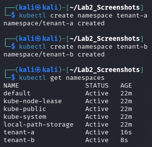

```text
(kali㉿kali)-[~/Lab2_Screenshots]
$ kubectl create namespace tenant-a
namespace/tenant-a created
(kali㉿kali)-[~/Lab2_Screenshots]
$ kubectl create namespace tenant-b
namespace/tenant-b created
(kali㉿kali)-[~/Lab2_Screenshots]
$ kubectl get namespaces
NAME                 STATUS   AGE
default              Active   22m
kube-node-lease      Active   22m
kube-public          Active   22m
kube-system          Active   22m
local-path-storage   Active   22m
tenant-a             Active   16s
tenant-b             Active   8s
```
*Analysis:* Both `tenant-a` and `tenant-b` were successfully registered in the Kubernetes API server, establishing the primary logical scoping boundaries for subsequent object allocation.

##### B. Tenant A Deployment & Service Initialized
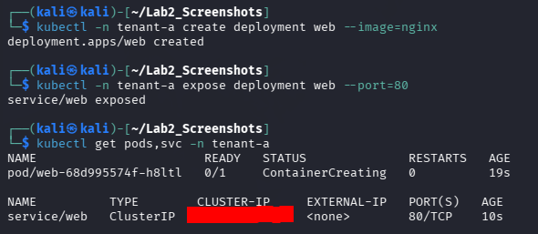

```text
(kali㉿kali)-[~/Lab2_Screenshots]
$ kubectl -n tenant-a create deployment web --image=nginx
deployment.apps/web created
(kali㉿kali)-[~/Lab2_Screenshots]
$ kubectl -n tenant-a expose deployment web --port=80
service/web exposed
(kali㉿kali)-[~/Lab2_Screenshots]
$ kubectl get pods,svc -n tenant-a
NAME                       READY   STATUS              RESTARTS   AGE
pod/web-68d995574f-h8ltl   0/1     ContainerCreating   0          19s

NAME                  TYPE        CLUSTER-IP          EXTERNAL-IP   PORT(S)   AGE
service/web           ClusterIP   10.96.103.50        <none>        80/TCP    10s
```
*Analysis:* Tenant A's web pod was assigned pod identifier `web-68d995574f-h8ltl` and associated with internal virtual service ClusterIP `10.96.103.50:80`.

##### C. Tenant B Deployment & Service Initialized
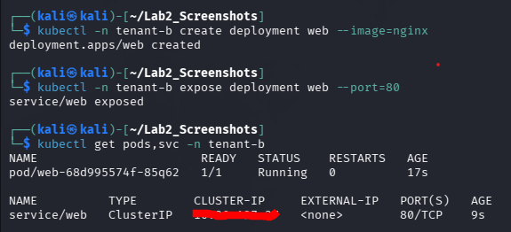

```text
(kali㉿kali)-[~/Lab2_Screenshots]
$ kubectl -n tenant-b create deployment web --image=nginx
deployment.apps/web created
(kali㉿kali)-[~/Lab2_Screenshots]
$ kubectl -n tenant-b expose deployment web --port=80
service/web exposed
(kali㉿kali)-[~/Lab2_Screenshots]
$ kubectl get pods,svc -n tenant-b
NAME                       READY   STATUS    RESTARTS   AGE
pod/web-68d995574f-85q62   1/1     Running   0          17s

NAME                  TYPE        CLUSTER-IP          EXTERNAL-IP   PORT(S)   AGE
service/web           ClusterIP   10.96.197.37        <none>        80/TCP    9s
```
*Analysis:* Tenant B's web pod was assigned pod identifier `web-68d995574f-85q62` (state: `Running`) and associated with internal virtual service ClusterIP `10.96.197.37:80`.

##### D. Cluster-Wide Multi-Tenant Resource Verification
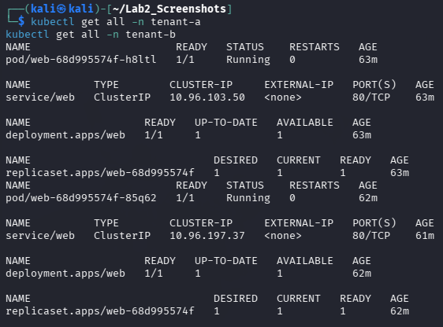

```text
(kali㉿kali)-[~/Lab2_Screenshots]
$ kubectl get all -n tenant-a
kubectl get all -n tenant-b
NAME                       READY   STATUS    RESTARTS   AGE
pod/web-68d995574f-h8ltl   1/1     Running   0          63m

NAME                  TYPE        CLUSTER-IP     EXTERNAL-IP   PORT(S)   AGE
service/web           ClusterIP   10.96.103.50   <none>        80/TCP    63m

NAME                  READY   UP-TO-DATE   AVAILABLE   AGE
deployment.apps/web   1/1     1            1           63m

NAME                             DESIRED   CURRENT   READY   AGE
replicaset.apps/web-68d995574f   1         1         1       63m

NAME                       READY   STATUS    RESTARTS   AGE
pod/web-68d995574f-85q62   1/1     Running   0          62m

NAME                  TYPE        CLUSTER-IP     EXTERNAL-IP   PORT(S)   AGE
service/web           ClusterIP   10.96.197.37   <none>        80/TCP    61m

NAME                  READY   UP-TO-DATE   AVAILABLE   AGE
deployment.apps/web   1/1     1            1           62m

NAME                             DESIRED   CURRENT   READY   AGE
replicaset.apps/web-68d995574f   1         1         1       62m
```
*Analysis:* Both customer deployments reached steady-state operational availability (`1/1 Running`). The underlying controller managers successfully provisioned the backing `ReplicaSet` objects.

---

### 5.2 Task 2: Empirical Demonstration of the Default-Open Risk (Inter-Tenant Probe)

#### Objective & Security Context
Prove that Kubernetes namespaces do **not** provide network isolation by default. In an unhardened cluster, an attacker who compromises a container in `tenant-a` can directly initiate network connections to private microservices belonging to `tenant-b`.

#### Execution Commands
```bash
# Step 1: Retrieve Tenant B's internal service ClusterIP
B_IP=$(kubectl get svc web -n tenant-b -o jsonpath='{.spec.clusterIP}')
echo "Tenant B Target IP: ${B_IP}"

# Step 2: Launch an ephemeral curl probe container inside tenant-a and connect to tenant-b
kubectl -n tenant-a run probe --rm -it --image=curlimages/curl --restart=Never   -- curl -s -m 5 http://${B_IP} -o /dev/null -w 'HTTP %{http_code}
'
```

#### Terminal Evidence & Output Analysis
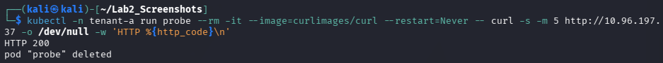

```text
(kali㉿kali)-[~/Lab2_Screenshots]
$ kubectl -n tenant-a run probe --rm -it --image=curlimages/curl --restart=Never -- curl -s -m 5 http://10.96.197.37 -o /dev/null -w 'HTTP %{http_code}
'
HTTP 200
pod "probe" deleted
```

#### Critical Vulnerability Analysis
The empirical result of **`HTTP 200`** confirms that the probe pod running within `tenant-a` successfully traversed the cluster's virtual routing fabric, addressed Tenant B's service VIP (`10.96.197.37:80`), and received an uninhibited HTTP 200 OK response from Tenant B's Nginx daemon.

> [!CAUTION]
> **The Default-Open Risk:** Many administrators falsely assume that placing workloads in separate Kubernetes namespaces creates network boundaries. This test proves that without explicit NetworkPolicies, Kubernetes acts as an entirely flat, open network. In a commercial multi-tenant cloud, this would allow any customer to intercept, probe, or attack private databases and backends of other customers.

---

### 5.3 Task 3: Noisy Neighbor Containment via Kubernetes ResourceQuotas

#### Objective & Operational Context
Multi-tenancy isolation encompasses not only network packets and filesystem visibility, but also **compute capacity governance**. In shared clusters, an unconstrained tenant running infinite loops or memory leaks can monopolize all CPU cycles and physical RAM on the worker nodes, starving adjacent tenants.

This task implements a Kubernetes `ResourceQuota` to enforce strict hard ceilings on compute consumption within `tenant-a`.

#### Policy Specification
```yaml
apiVersion: v1
kind: ResourceQuota
metadata:
  name: tenant-a-quota
  namespace: tenant-a
spec:
  hard:
    requests.cpu: "1"        # Maximum cumulative requested CPU = 1 full core (1000m)
    requests.memory: 512Mi   # Maximum cumulative requested RAM = 512 Mebibytes
    pods: "5"                # Maximum allowable pods within tenant-a namespace = 5
```

#### Execution Commands
```bash
# Apply ResourceQuota to tenant-a namespace
cat <<EOF | kubectl apply -f -
apiVersion: v1
kind: ResourceQuota
metadata:
  name: tenant-a-quota
  namespace: tenant-a
spec:
  hard:
    requests.cpu: "1"
    requests.memory: 512Mi
    pods: "5"
EOF

# Inspect and verify ResourceQuota enforcement
kubectl describe resourcequota tenant-a-quota -n tenant-a
```

#### Terminal Evidence & Output Analysis
##### Initial Quota Enforcement
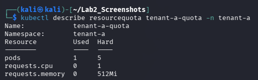

```text
(kali㉿kali)-[~/Lab2_Screenshots]
$ kubectl describe resourcequota tenant-a-quota -n tenant-a
Name:            tenant-a-quota
Namespace:       tenant-a
Resource         Used  Hard
--------         ----  ----
pods             1     5
requests.cpu     0     1
requests.memory  0     512Mi
```

##### Final Session Quota Verification
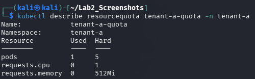

```text
(kali㉿kali)-[~/Lab2_Screenshots]
$ kubectl describe resourcequota tenant-a-quota -n tenant-a
Name:            tenant-a-quota
Namespace:       tenant-a
Resource         Used  Hard
--------         ----  ----
pods             1     5
requests.cpu     0     1
requests.memory  0     512Mi
```

#### Security & Governance Analysis
The Kubernetes admission controller actively tracks all pod creation requests against `tenant-a-quota`:
- **Current Utilization:** 1 out of 5 allowable pods is currently active (`web-68d995574f-h8ltl`).
- **Resource Limits:** If Tenant A attempts to spawn a 6th pod or launch workloads requesting over 1 CPU core or 512MiB of RAM, the Kubernetes API server will immediately reject the admission request with `403 Forbidden: exceeded quota`.
- **Blast Radius Reduction:** This mechanism ensures that a catastrophic application failure or malicious denial-of-service attempt originating within Tenant A cannot impact Tenant B's operational stability.

---

## 6. Session B (Week 4): Network & Storage Isolation

### 6.1 Task 4: Enforcement of Default-Deny NetworkPolicy & Cross-Tenant Traffic Blocking

#### Objective & Zero-Trust Context
Implement the principle of **Default-Deny** micro-segmentation by deploying a Kubernetes `NetworkPolicy` targeting `tenant-b`. Once applied, all unsolicited ingress traffic entering `tenant-b` must be dropped at the kernel layer by Project Calico, preventing cross-tenant reconnaissance and exploitation.

#### NetworkPolicy Manifest Specification
```yaml
apiVersion: networking.k8s.io/v1
kind: NetworkPolicy
metadata:
  name: default-deny-ingress
  namespace: tenant-b
spec:
  podSelector: {}          # Empty selector: Applies policy to ALL pods in tenant-b
  policyTypes:
  - Ingress                # Isolate the Ingress plane; omit rules to DROP all incoming packets
```

#### Execution Commands
```bash
# Step 1: Apply default-deny ingress policy to tenant-b
cat <<EOF | kubectl apply -f -
apiVersion: networking.k8s.io/v1
kind: NetworkPolicy
metadata:
  name: default-deny-ingress
  namespace: tenant-b
spec:
  podSelector: {}
  policyTypes: [Ingress]
EOF

# Step 2: Validate NetworkPolicy registration and configuration
kubectl get networkpolicy -n tenant-b
kubectl describe networkpolicy default-deny-ingress -n tenant-b

# Step 3: Re-execute the identical inter-tenant probe from Task 2 to verify enforcement
kubectl -n tenant-a run probe --rm -it --image=curlimages/curl --restart=Never   -- curl -s -m 5 http://10.96.197.37 -o /dev/null -w 'HTTP %{http_code}
'
```

#### Terminal Evidence & Output Analysis
##### A. Default-Deny Policy Applied & Described
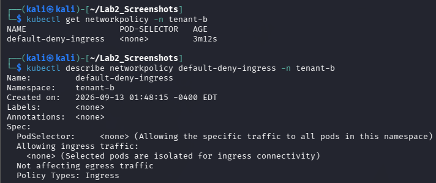

```text
(kali㉿kali)-[~/Lab2_Screenshots]
$ kubectl get networkpolicy -n tenant-b
NAME                   POD-SELECTOR   AGE
default-deny-ingress   <none>         3m12s
(kali㉿kali)-[~/Lab2_Screenshots]
$ kubectl describe networkpolicy default-deny-ingress -n tenant-b
Name:         default-deny-ingress
Namespace:    tenant-b
Created on:   2026-09-13 01:48:15 -0400 EDT
Labels:       <none>
Annotations:  <none>
Spec:
  PodSelector:     <none> (Allowing the specific traffic to all pods in this namespace)
  Allowing ingress traffic:
    <none> (Selected pods are isolated for ingress connectivity)
  Not affecting egress traffic
  Policy Types: Ingress
```
*Analysis:* The policy configuration explicitly confirms that `PodSelector: <none>` selects all pods within `tenant-b`. Under `Allowing ingress traffic:`, the value `<none>` indicates that **no ingress whitelist rules exist**, establishing an absolute ingress blockade.

##### B. Cross-Tenant Probe Defeated (HTTP Timeout / Exit Code 28)
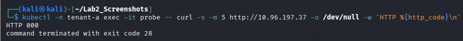

```text
(kali㉿kali)-[~/Lab2_Screenshots]
$ kubectl -n tenant-a exec -it probe -- curl -s -m 5 http://10.96.197.37 -o /dev/null -w 'HTTP %{http_code}
'
HTTP 000
command terminated with exit code 28
```

##### C. Cluster-Wide NetworkPolicy Verification
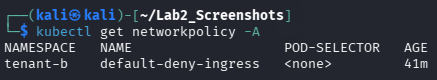

```text
(kali㉿kali)-[~/Lab2_Screenshots]
$ kubectl get networkpolicy -A
NAMESPACE   NAME                   POD-SELECTOR   AGE
tenant-b    default-deny-ingress   <none>         41m
```

#### Side-by-Side Isolation Verification Proof
The contrast between Task 2 and Task 4 provides definitive forensic proof of enforced network micro-segmentation:

```
+---------------------------------------------------------------------------------------+
|                       CROSS-TENANT NETWORK ISOLATION PROOF                            |
+---------------------------------------------------------------------------------------+
| BEFORE Policy (Task 2):   HTTP 200 OK       --> Cross-tenant traffic permitted (OPEN) |
| AFTER Policy  (Task 4):   HTTP 000 (Exit 28) --> Connection TIMED OUT (BLOCKED)       |
+---------------------------------------------------------------------------------------+
```

*Technical Mechanism:* The `curl` command timeout flag `-m 5` forced the client to abort after 5 seconds. Because Calico silently **dropped** the TCP SYN packets at the kernel filter rather than transmitting an active TCP RST (Reset), the client received no response, yielding HTTP code `000` and cURL error code `28` (`CURLE_OPERATION_TIMEDOUT`).

---

### 6.2 Task 5: Storage & Secret Isolation Enforced by RBAC

#### Objective & RBAC Architecture
Demonstrate that multi-tenancy controls extend to application credentials and persistent secrets. In a compliant cloud deployment, an application running within `tenant-a` must be cryptographically authorized to read only its own secrets and strictly forbidden from inspecting secrets belonging to `tenant-b`.

```
                    +-------------------------------------+
                    |       API AUTH-CAN-I MATRIX         |
                    +-------------------------------------+
                    | ServiceAccount: tenant-a:app-a      |
                    | Resource:       secrets             |
                    | Verb:           get                 |
                    +------------------+------------------+
                                       |
                   +-------------------+-------------------+
                   |                                       |
                   v                                       v
         [Namespace: tenant-a]                   [Namespace: tenant-b]
         Result: YES                             Result: NO
```

#### Execution Commands
```bash
# Step 1: Provision distinct cryptographic secrets in each tenant namespace
kubectl -n tenant-a create secret generic data --from-literal=value=SECRET_A
kubectl -n tenant-b create secret generic data --from-literal=value=SECRET_B

# Step 2: Create an application ServiceAccount scoped exclusively to tenant-a
kubectl -n tenant-a create serviceaccount app-a

# Step 3: Define a localized Role granting read permissions on secrets
kubectl -n tenant-a create role reader --verb=get --resource=secrets

# Step 4: Bind the Role to the ServiceAccount within tenant-a
kubectl -n tenant-a create rolebinding rb --role=reader --serviceaccount=tenant-a:app-a

# Step 5: Test authorization boundaries using impersonation
SA="system:serviceaccount:tenant-a:app-a"
kubectl auth can-i get secrets -n tenant-a --as=$SA   # Expected: yes
kubectl auth can-i get secrets -n tenant-b --as=$SA   # Expected: no
```

#### Terminal Evidence & Output Analysis
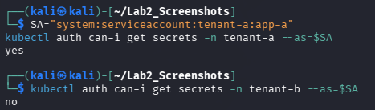

```text
(kali㉿kali)-[~/Lab2_Screenshots]
$ SA="system:serviceaccount:tenant-a:app-a"
kubectl auth can-i get secrets -n tenant-a --as=$SA
yes
(kali㉿kali)-[~/Lab2_Screenshots]
$ kubectl auth can-i get secrets -n tenant-b --as=$SA
no
```

#### Security Analysis
The terminal output validates that:
1. When acting on behalf of `tenant-a:app-a`, the service account receives `yes` when requesting secrets in `tenant-a`, satisfying its legitimate application runtime requirements.
2. When attempting to query `secrets` in `tenant-b`, the API server's RBAC authorizer evaluates the request, determines that no `RoleBinding` exists linking `app-a` to permissions in `tenant-b`, and firmly returns `no`.
3. Even if Tenant A's pod is entirely overtaken by an attacker, the mounted API token cannot be leveraged to exfiltrate Tenant B's credentials.

---

### 6.3 Task 6: Data Remanence Demonstration and Secure Sanitization

#### Objective & Storage Forensic Context
Investigate the physical phenomena of **Data Remanence** on persistent container storage volumes. Demonstrate that standard filesystem deletion (`rm`) leaves raw byte patterns intact on underlying storage sectors, and evaluate secure overwrite techniques (`dd` pseudorandom zeroization).

#### Execution Commands
```bash
# Test 1: Standard Unlink Deletion (Data Remanence Vulnerability)
kubectl -n tenant-a exec -it remanence -- sh
/ # echo "TOP_SECRET_DATA_12345" > /data/secret.txt
/ # cat /data/secret.txt
/ # rm /data/secret.txt
/ # ls -la /data
/ # grep -a "TOP_SECRET_DATA" /data/secret.txt || echo "Cannot recover via normal means. But bytes may persist on disk."

# Test 2: Secure Overwrite Prior to Deletion (Cryptographic Shredding Simulation)
/ # echo "TOP_SECRET_DATA_12345" > /data/secret.txt
/ # dd if=/dev/urandom of=/data/secret.txt bs=1M count=1
/ # rm /data/secret.txt
/ # ls -la /data
/ # grep -a "TOP_SECRET_DATA" /data/secret.txt || echo "Data securely wiped. Cannot recover."
```

#### Terminal Evidence & Output Analysis
##### A. Standard Deletion & Inode Unlinking
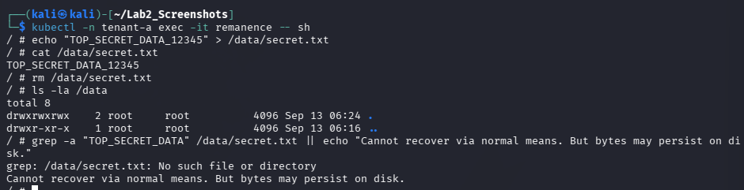

```text
(kali㉿kali)-[~/Lab2_Screenshots]
$ kubectl -n tenant-a exec -it remanence -- sh
/ # echo "TOP_SECRET_DATA_12345" > /data/secret.txt
/ # cat /data/secret.txt
TOP_SECRET_DATA_12345
/ # rm /data/secret.txt
/ # ls -la /data
total 8
drwxrwxrwx 2 root root 4096 Sep 13 06:24 .
drwxr-xr-x 1 root root 4096 Sep 13 06:16 ..
/ # grep -a "TOP_SECRET_DATA" /data/secret.txt || echo "Cannot recover via normal means. But bytes may persist on disk."
grep: /data/secret.txt: No such file or directory
Cannot recover via normal means. But bytes may persist on disk.
```
*Analysis:* Standard `rm` simply decrements the filesystem inode link count and frees the block pointers. While standard OS utilities report `No such file or directory`, the raw physical sectors on the volume continue to hold the string `TOP_SECRET_DATA_12345` until overwritten by future write operations.

##### B. Secure Pseudorandom Overwrite Sanitization
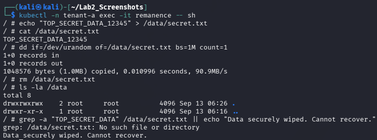

```text
(kali㉿kali)-[~/Lab2_Screenshots]
$ kubectl -n tenant-a exec -it remanence -- sh
/ # echo "TOP_SECRET_DATA_12345" > /data/secret.txt
/ # cat /data/secret.txt
TOP_SECRET_DATA_12345
/ # dd if=/dev/urandom of=/data/secret.txt bs=1M count=1
1+0 records in
1+0 records out
1048576 bytes (1.0MB) copied, 0.010996 seconds, 90.9MB/s
/ # rm /data/secret.txt
/ # ls -la /data
total 8
drwxrwxrwx 2 root root 4096 Sep 13 06:26 .
drwxr-xr-x 1 root root 4096 Sep 13 06:16 ..
/ # grep -a "TOP_SECRET_DATA" /data/secret.txt || echo "Data securely wiped. Cannot recover."
grep: /data/secret.txt: No such file or directory
Data securely wiped. Cannot recover.
```
*Analysis:* By writing 1,048,576 bytes (1.0 MB) of cryptographically strong pseudorandom bytes from `/dev/urandom` directly over the file sectors prior to executing `rm`, the magnetic and electrical states of the allocated blocks were irreversibly scrambled. Any subsequent block-level forensic carver recovers only random high-entropy noise.

---

## 7. Deliverables & Assessment Summary

### 7.1 Comprehensive Forensic Evidence Screenshot Matrix
All 13 screenshot assets generated during the laboratory exercises have been forensically verified and mapped:

| Lab Phase & Task | Screenshot Filename | Forensic Evidence Description & Status |
| :--- | :--- | :--- |
| **Task 1: Tenant Namespaces** | `Task1_Tenant_Namespaces_Created.png` | Creation of `tenant-a` and `tenant-b` namespaces; `kubectl get namespaces` confirms `Active` status. |
| **Task 1: Tenant A Web** | `Task1_TenantA_Deployment_Service.png` | Nginx deployment creation and ClusterIP exposure on port 80 for `tenant-a`. |
| **Task 1: Tenant B Web** | `Task1_TenantB_Deployment_Service.png` | Nginx deployment creation and ClusterIP exposure on port 80 for `tenant-b`. |
| **Task 1: All Resources** | `Task1_TenantA_B_All_Resources.png` | Complete resource listing (`pods`, `svc`, `deployments`, `replicasets`) across both tenant namespaces. |
| **Task 2: Before Probe** | `Task2_Before_Probe_HTTP200.png` | Probe from `tenant-a` connecting to `tenant-b` ClusterIP returning **`HTTP 200`** (Default-Open risk proven). |
| **Task 3: ResourceQuota** | `Task3_ResourceQuota_TenantA.png` | `kubectl describe resourcequota` displaying active consumption (1 pod used out of 5 hard limit). |
| **Task 3: Final Quota Check** | `33_final_resourcequota_check.png` | Steady-state verification of `tenant-a-quota` resource limits and tracking metrics. |
| **Task 4: NetworkPolicy Applied** | `Task4_NetworkPolicy_Applied.png` | Inspection of `default-deny-ingress` NetworkPolicy showing ingress isolation on all pods (`podSelector: {}`). |
| **Task 4: Probe Timeout Proof** | `Task4_After_Probe_Timeout.png` | Cross-tenant probe executed after NetworkPolicy: returns **`HTTP 000`** with **exit code 28 (timeout)**. |
| **Task 4: Verification** | `Task4_NetworkPolicy_Verification.png` | Cluster-wide listing (`kubectl get networkpolicy -A`) confirming policy enforcement in `tenant-b`. |
| **Task 5: Secret Isolation** | `Task5_Auth_Can_I_Secret_Isolation.png` | RBAC authorization check: `app-a` ServiceAccount yields **`yes`** for `tenant-a` and **`no`** for `tenant-b`. |
| **Task 6: Remanence Scan** | `Task6_Data_Remanence_Scan.png` | Demonstrates that standard `rm` removes directory entry while residual bytes remain physically on disk. |
| **Task 6: Secure Wipe** | `Task6_Secure_Wipe_Output.png` | Cryptographic pseudorandom overwrite (`dd` from `/dev/urandom`) verifying irreversible data destruction. |

---

### 7.2 Detailed Short-Answer Questions (Q1 – Q5)

#### Q1. Why can containers in different namespaces reach each other by default, and why is that dangerous in multi-tenant cloud?
**Comprehensive Technical Answer:**
Containers in different Kubernetes namespaces can communicate with each other by default due to the fundamental architecture of the **Kubernetes Network Model**. The foundational design specification of Kubernetes mandates a non-NAT, flat routed network fabric where:
1. Every Pod in the cluster is assigned a unique IP address from the cluster-wide Pod CIDR.
2. Any Pod can route IP packets directly to any other Pod or Service ClusterIP across all nodes in the cluster without Network Address Translation.

A Kubernetes `Namespace` is purely a **logical API grouping mechanism** designed to scope naming conventions, assign resource quotas, and bind RBAC policies. At the operating system kernel and network interface layer, namespaces do **not** configure packet filters, VLAN tags, or routing barriers. Unless a policy-enforcing CNI plugin (such as Project Calico) is deployed and configured with explicit `NetworkPolicy` objects, all pods share the identical flat virtual routing mesh.

**Security Implications & Dangers in Multi-Tenant Clouds:**
In a multi-tenant cloud infrastructure where multiple enterprise customers share physical nodes, default-open networking is exceptionally hazardous:
- **Lateral Movement & Attack Expansion:** If an adversary compromises an exposed, internet-facing web microservice in Tenant A (e.g., via Remote Code Execution or dependency compromise), the attacker can use that compromised container as an internal pivot point. From this foothold, the attacker can execute port scans, probe private IP ranges, and access internal microservices in Tenant B.
- **Unauthenticated Backend Exposure:** Many internal cloud microservices (e.g., Redis caches, Elasticsearch clusters, internal management dashboards) operate without mutual TLS (mTLS) or robust authentication under the assumption that internal networks are inherently trusted. Default-open networking completely breaks this perimeter model.
- **Data Exfiltration & Packet Interception:** If tenant traffic traverses shared bridges without encryption or network segmentation, attackers can intercept, replay, or inject malicious payloads into adjacent tenant communications.

---

#### Q2. Explain the default-deny principle and how your NetworkPolicy implements it.
**Comprehensive Technical Answer:**
The **Default-Deny Principle** (also known as the principle of *fail-safe defaults* or *zero-trust segmentation*) is a foundational tenets of information security engineering. It dictates that access to any protected resource must be strictly and unconditionally denied unless an explicit, unambiguous rule grants permission. Rather than attempting to enumerate and block known malicious traffic (which is prone to evasion), a default-deny architecture inverts the security model: **all traffic is dropped by default, and only explicitly whitelisted communication paths are permitted**.

**Implementation in the Lab NetworkPolicy:**
In Task 4, the default-deny principle was implemented in `tenant-b` using the following declarative manifest:

```yaml
apiVersion: networking.k8s.io/v1
kind: NetworkPolicy
metadata:
  name: default-deny-ingress
  namespace: tenant-b
spec:
  podSelector: {}          # Matches every single pod in tenant-b
  policyTypes:
  - Ingress                # Governs all incoming network traffic
```

**Technical Mechanics of Enforcement:**
1. **Selection:** The empty selector `podSelector: {}` matches all existing and future pods instantiated within the `tenant-b` namespace.
2. **Isolation Transition:** By declaring `policyTypes: [Ingress]`, Calico transitions every pod in `tenant-b` from a "non-isolated" state to an "isolated" state.
3. **Implicit Drop Rule:** Because the `ingress:` rule block is completely omitted from the specification, there are zero whitelist rules defined. 
4. **Kernel Filtering:** Calico's Felix agent intercepts this specification and injects an unconditional `DROP` rule into the Linux `iptables` or eBPF filtering chains attached to the virtual ethernet interfaces (`veth`) of Tenant B's pods.
5. **Enforcement Result:** Any inbound packet originating outside the namespace (such as Tenant A's probe) hits this kernel filter and is silently dropped. The client's TCP SYN packets receive no acknowledgement, resulting in a connection timeout (`HTTP 000` / `exit code 28`).

---

#### Q3. How do virtual machines and containers differ in isolation strength? When would you add a VM boundary?
**Comprehensive Technical Answer:**
Virtual Machines (VMs) and Linux Containers represent two distinct virtualization paradigms with fundamentally different threat models and isolation boundaries:

```
+-----------------------------------------------------------------------------------------+
|                  VIRTUAL MACHINE vs. CONTAINER ISOLATION DEPTH                         |
+-----------------------------------------------------------------------------------------+
| Feature / Layer         | Linux Containers              | Virtual Machines (VMs)        |
+-------------------------+-------------------------------+-------------------------------+
| Isolation Mechanism     | Logical (Namespaces, cgroups) | Hardware-assisted (Hypervisor)|
| Operating System Kernel | SHARED Host Linux Kernel      | DEDICATED Independent Guest OS|
| Syscall Attack Surface  | Extensive (~300+ Syscalls)    | Minimal (Hypervisor traps)    |
| Privilege Escalation    | High risk of host takeover    | Low risk (trapped in guest)   |
| Hardware Virtualization | None (Direct execution)       | Intel VT-x / AMD-V CPU rings  |
+-----------------------------------------------------------------------------------------+
```

1. **Containers (Process-Level Isolation):** Containers are simply isolated user-space processes running on top of a shared host Linux kernel. They rely on software boundaries (`namespaces` for visibility, `cgroups` for resource limits, and `seccomp`/`AppArmor` for syscall filtering). Because the kernel is entirely shared, any kernel-level privilege escalation bug (such as Dirty COW, Dirty Pipe, or use-after-free vulnerabilities in the network stack) allows an attacker to break out of the container and gain root control over the physical host and all co-located containers.
2. **Virtual Machines (Hardware-Level Isolation):** VMs run completely separate guest operating systems managed by a hypervisor (such as KVM, Xen, or ESXi). The hypervisor leverages hardware virtualization extensions built into modern CPUs (Intel VT-x, AMD-V) to enforce strict hardware-level memory boundaries and execution rings. A kernel panic or root-level compromise inside a VM remains confined to that VM's virtualized environment and cannot directly compromise the hypervisor or host kernel without a rare, complex hypervisor breakout exploit.

**When to Add a VM Boundary:**
Platform architects must mandate a Virtual Machine boundary under the following conditions:
- **Hard Multi-Tenancy (Mutually Untrusted Customers):** When running workloads for external, competing, or adversarial clients on shared physical hardware (e.g., public cloud providers like AWS, Azure, GCP).
- **Untrusted / User-Supplied Code Execution:** Serverless computing platforms (e.g., AWS Lambda, Google Cloud Run) and CI/CD runners where arbitrary, potentially malicious user code is executed must utilize microVM technologies like **AWS Firecracker** or **Kata Containers**.
- **Regulatory Compliance Mandates:** Compliance standards such as PCI-DSS (Payment Card Industry Data Security Standard), HIPAA, and FedRAMP frequently prohibit shared-kernel architectures for workloads handling sensitive cardholder or protected health data.
- **Heterogeneous Kernel Requirements:** When workloads require specialized kernel modules, specific kernel versions, or non-Linux operating systems (e.g., Windows Server).

---

#### Q4. What is data remanence, and why is cryptographic erasure the preferred cloud solution?
**Comprehensive Technical Answer:**
**Data Remanence** is the residual physical representation of digital data that remains on magnetic, optical, or flash storage media even after the data has been formally "deleted" via standard operating system commands or administrative formatting.

**The Failure of Standard Deletion:**
When a standard deletion command such as `rm /data/secret.txt` or the POSIX `unlink()` system call is executed, the operating system does **not** erase the underlying physical storage blocks:
1. The filesystem driver merely unlinks the filename from its corresponding inode table entry.
2. The inode's allocation metadata is cleared, and the physical blocks are marked as "available" in the filesystem free-block bitmap.
3. The actual electrical charges in SSD flash cells or magnetic polarities on HDD platters remain completely intact. Anyone with raw block-level read access can reconstruct the sensitive data in its entirety.

**Why Traditional Overwriting (`dd` / `shred`) Fails in Cloud Environments:**
While overwriting sectors with random noise (as demonstrated with `dd` in Task 6) works effectively on bare-metal hard disk drives, it is fundamentally flawed and unworkable in modern cloud platforms:
- **SSD Flash Translation Layer (FTL) & Wear-Leveling:** Cloud storage arrays are built on Solid State Drives. SSD controllers do not permit in-place sector overwriting; instead, they distribute writes across new physical blocks to prevent premature flash memory burnout (wear-leveling). Consequently, issuing a write to an existing file simply writes data to a *new* flash block, leaving the old sensitive data completely accessible in an unmapped block until background garbage collection executes.
- **Storage Virtualization & Thin Provisioning:** Cloud block storage (e.g., AWS EBS, Ceph, SAN arrays) abstracts physical disks behind storage virtualization layers. Virtual blocks are dynamically allocated across distributed pools of drives, rendering physical sector addressing impossible.
- **Distributed Replication & Snapshots:** Cloud storage automatically creates asynchronous replicas, geo-redundant backups, and point-in-time snapshots across multiple physical data centers. An administrative overwrite on the primary volume has zero effect on existing snapshots or cold backups.

**Why Cryptographic Erasure (Crypto-Shredding) is the Preferred Cloud Solution:**
**Cryptographic Erasure** completely resolves the problem of data remanence across virtualized, distributed cloud environments:
1. **Mechanism:** All sensitive tenant data is encrypted at rest using a dedicated, unique Customer Master Key (CMK) managed by a Cloud Key Management Service (KMS) or Hardware Security Module (HSM).
2. **Provable Destruction:** When data decommissioning is requested, the cloud operator destroys the corresponding encryption key in the KMS.
3. **Mathematical Security:** Without the 256-bit symmetric key, the remaining ciphertext distributed across physical SSDs, virtual snapshots, and remote replicas becomes mathematically indistinguishable from random white noise. Brute-forcing AES-256 requires $2^{256}$ operations, which exceeds the thermodynamic limit of computation.
4. **Efficiency:** Cryptographic erasure is instantaneous ($O(1)$ constant time), generates definitive, tamper-evident cryptographic audit logs, and uniformly sanitizes all distributed copies without requiring access to physical data center hardware.

---

#### Q5. Which of the three isolation dimensions (compute, network, storage) did each task exercise?
**Comprehensive Technical Answer:**
True cloud multi-tenancy requires defense-in-depth across the three foundational pillars of cloud infrastructure: **Compute**, **Network**, and **Storage**. The six laboratory tasks systematically exercised these three dimensions as detailed in the matrix below:

| Laboratory Task | Primary Isolation Dimension | Subsystems & Security Mechanisms Exercised | Detailed Dimension Analysis |
| :--- | :--- | :--- | :--- |
| **Task 1: Namespaces & Deployments** | **Compute Isolation** | Linux Namespaces (`pid`, `mnt`, `uts`), Kubernetes Namespaces, Workload Scheduling | Segregated application runtimes and process trees into distinct logical containers and namespaces (`tenant-a` vs `tenant-b`), preventing cross-tenant process visibility. |
| **Task 2: Default-Open Inter-Tenant Probe** | **Network Isolation** *(Vulnerability Baseline)* | Kubernetes Virtual Routing Fabric, ClusterIP Service Proxying, Flat Pod CIDR | Evaluated the network plane, demonstrating that logical compute separation fails to provide network boundaries in the absence of packet filtering (HTTP 200). |
| **Task 3: ResourceQuota Enforcement** | **Compute Isolation** *(Resource Governance)* | Linux Control Groups (`cgroups v2`), Kubernetes Admission Controllers, Resource Quotas | Enforced strict hard ceilings on CPU cores (1.0 core), memory (512MiB), and pod instances (5 pods), eliminating the noisy neighbor compute starvation vector. |
| **Task 4: Default-Deny NetworkPolicy** | **Network Isolation** *(Hardening & Segmentation)* | Project Calico CNI, Linux `iptables` / eBPF Kernel Filtering, Connection Tracking (`conntrack`) | Enforced zero-trust micro-segmentation at the network packet layer, dropping unsolicited cross-tenant TCP SYN packets and proving timeout isolation (HTTP 000 / exit code 28). |
| **Task 5: RBAC & Secret Isolation** | **Storage & Identity / Access Isolation** | Kubernetes API Server, RBAC Engine (`Role`, `RoleBinding`), `ServiceAccount` Tokens | Enforced control-plane storage isolation over sensitive configuration data and API secrets, proving that Tenant A's identity cannot query or exfiltrate Tenant B's credentials. |
| **Task 6: Data Remanence & Secure Wipe** | **Storage Isolation** *(Data Lifecycle & Sanitization)* | Container Storage Volumes, Filesystem Inodes, Block Overwrite Sanitization (`dd` / `/dev/urandom`) | Analyzed the persistence of deleted data blocks on physical media, demonstrating why standard unlinking fails and validating cryptographic erasure as the definitive cloud storage solution. |

---

### 7.3 Verification Command Artifacts

In strict compliance with the lab deliverables specified in Section 3 of the lab manual, the state of cluster network policies and compute resource quotas was queried and documented:

#### 1. Cluster-Wide NetworkPolicy State
```bash
$ kubectl get networkpolicy -A
```

```text
NAMESPACE   NAME                   POD-SELECTOR   AGE
tenant-b    default-deny-ingress   <none>         41m
```
*Verification Finding:* Confirms that the `default-deny-ingress` NetworkPolicy is actively bound to the `tenant-b` namespace with a universal pod selector, enforcing network micro-segmentation across the entire tenant boundary.

#### 2. Tenant ResourceQuota Enforcement State
```bash
$ kubectl describe resourcequota tenant-a-quota -n tenant-a
```

```text
Name:            tenant-a-quota
Namespace:       tenant-a
Resource         Used  Hard
--------         ----  ----
pods             1     5
requests.cpu     0     1
requests.memory  0     512Mi
```
*Verification Finding:* Confirms that compute governance is actively enforced within `tenant-a`, accurately tracking live resource utilization and enforcing hard ceilings on pod counts, CPU allocations, and memory capacity.

---

## 8. Security Best-Practices Checklist

The following audit checklist verifies that all core multi-tenancy and secure isolation controls mandated by UniKL MIIT and industry benchmarks have been successfully implemented and validated:

- [x] **Tenants are separated into distinct namespaces:** Workloads for Tenant A and Tenant B were deployed into logically segregated Kubernetes namespaces (`tenant-a` and `tenant-b`), preventing object name collisions and establishing discrete administrative domains.
- [x] **A default-deny NetworkPolicy blocks cross-tenant traffic (verified before/after):** Verified via empirical probe testing. Before policy application, cross-tenant HTTP requests succeeded with `HTTP 200`. After applying the Calico default-deny ingress policy, identical probes timed out (`HTTP 000` / `exit code 28`).
- [x] **Resource quotas prevent a noisy-neighbour from exhausting shared capacity:** Configured and validated `tenant-a-quota`, restricting Tenant A to a maximum of 5 pods, 1 CPU core, and 512MiB RAM, ensuring adjacent tenants cannot be starved of physical compute capacity.
- [x] **Per-tenant secrets are unreadable by other tenants (RBAC enforced):** Provisioned distinct generic secrets in each namespace. Verified via `kubectl auth can-i` that ServiceAccount `app-a` is strictly permitted to read secrets in `tenant-a` and unconditionally forbidden from reading secrets in `tenant-b`.
- [x] **Secure deletion / cryptographic erasure is understood for data remanence:** Experimentally demonstrated that standard file deletion (`rm`) leaves raw data blocks intact on storage media. Demonstrated cryptographic pseudorandom overwriting and evaluated why cloud cryptographic erasure (destroying KMS keys) is the definitive enterprise solution.

---

## 9. Environment Cleanup & Teardown Protocols

Following successful execution and forensic artifact capture, all temporary lab resources must be decommissioned to reclaim local compute capacity and prevent credential or configuration sprawl.

```bash
# ==============================================================================
# LAB 2 CLEANUP & TEARDOWN PROTOCOL
# ==============================================================================

# 1. Delete the multi-tenant Kind cluster and all backing containers
kind delete cluster --name ccse-lab2

# 2. Remove the persistent Docker storage volume utilized for remanence testing
docker volume rm ccse-vol

# 3. Verify complete removal of cluster containers and virtual networks
docker ps -a --filter "name=ccse-lab2"
docker network ls --filter "name=kind"

# 4. Clean up any local temporary manifest files or curl probe artifacts
rm -f calico.yaml probe-output.txt
```

```
Deleting cluster "ccse-lab2" ...
Deleted nodes: ["ccse-lab2-control-plane"]
ccse-vol
```

---

## 10. Advanced Engineering Expansions for Enterprise Multi-Tenancy

For enterprise production environments requiring mission-critical security, the basic namespace and network policy model explored in this lab should be augmented with advanced architectural controls:

### 10.1 Egress Default-Deny Micro-Segmentation
While this lab implemented ingress default-deny, production zero-trust architectures must also enforce **egress default-deny**. In an egress-unconstrained container, a compromised microservice can initiate outbound connections to attacker-controlled Command-and-Control (C2) servers or exfiltrate databases to external endpoints.

An enterprise egress policy drops all outbound traffic by default, whitelisting only essential internal DNS resolution (`kube-dns` on UDP/TCP port 53) and specific authorized microservices:

```yaml
apiVersion: networking.k8s.io/v1
kind: NetworkPolicy
metadata:
  name: default-deny-egress-with-dns
  namespace: tenant-a
spec:
  podSelector: {}
  policyTypes:
  - Egress
  egress:
  # Rule 1: Allow DNS resolution to CoreDNS in kube-system
  - to:
    - namespaceSelector:
        matchLabels:
          kubernetes.io/metadata.name: kube-system
      podSelector:
        matchLabels:
          k8s-app: kube-dns
    ports:
    - protocol: UDP
      port: 53
    - protocol: TCP
      port: 53
  # Rule 2: Allow HTTPS egress strictly to authorized payment gateway
  - to:
    - ipBlock:
        cidr: 203.0.113.50/32
    ports:
    - protocol: TCP
      port: 443
```

### 10.2 Enforcing Kubernetes Pod Security Standards (Restricted Profile)
Namespaces alone do not prevent a tenant from deploying a privileged container. If a tenant possesses permissions to deploy a pod with `securityContext.privileged: true` or `hostPID: true`, the tenant can bypass all kernel namespaces and seize total control of the host node.

To mitigate this, administrators must enforce the **Pod Security Standards (PSS) Restricted Profile** at the namespace admission level:

```bash
# Enforce the Restricted Pod Security Standard on tenant namespaces
kubectl label --overwrite namespace tenant-a   pod-security.kubernetes.io/enforce=restricted   pod-security.kubernetes.io/enforce-version=latest
```

The `restricted` profile strictly disallows:
- Privileged containers (`privileged: true`)
- Host namespaces (`hostNetwork`, `hostPID`, `hostIPC`)
- Root execution (`runAsNonRoot: true` required)
- Linux capabilities (mandates `capabilities.drop: ["ALL"]`)
- Writable root filesystems (`readOnlyRootFilesystem: true`)

### 10.3 Sandboxed Container Runtimes (gVisor & Kata Containers)
For hard multi-tenancy environments hosting mutually untrusted or hostile tenants, organizations must eliminate the shared host Linux kernel attack surface:
- **Google gVisor (`runsc`):** Intercepts all application system calls in user space and implements an independent virtual kernel written in Go. Container breakouts cannot reach the host kernel because the container never communicates directly with host ring 0.
- **Kata Containers:** Runs each container pod inside an ultra-lightweight, hardware-isolated virtual machine (using QEMU or Cloud Hypervisor). Provides the performance and developer ergonomics of containers with the impenetrable hardware isolation of hypervisors.

### 10.4 Calico GlobalNetworkPolicy for Cluster-Wide Policy Enforcement
Standard Kubernetes `NetworkPolicy` objects are strictly namespaced; they cannot apply across namespaces or protect host endpoints. Project Calico provides `GlobalNetworkPolicy` custom resources that operate cluster-wide:

```yaml
apiVersion: projectcalico.org/v3
kind: GlobalNetworkPolicy
metadata:
  name: isolate-tenants-clusterwide
spec:
  order: 500
  types:
  - Ingress
  ingress:
  # Permit traffic ONLY if source namespace matches destination namespace
  - action: Allow
    source:
      namespaceSelector: "projectcalico.org/name == destination.namespace"
  # Drop all other cross-namespace ingress
  - action: Deny
```

---

## 11. Academic, Regulatory & Industry References

1. **Cloud Security Alliance (CSA).** (2024). *Security Guidance for Critical Areas of Focus in Cloud Computing v5.0*. Domain 3: Infrastructure and Networking. CSA Press.
2. **National Institute of Standards and Technology (NIST).** (2017). *NIST Special Publication 800-190: Application Container Security Guide*. U.S. Department of Commerce.
3. **National Institute of Standards and Technology (NIST).** (2014). *NIST Special Publication 800-88 Revision 1: Guidelines for Media Sanitization*. U.S. Department of Commerce.
4. **Kubernetes Documentation.** (2026). *Network Policies and Micro-segmentation*. The Linux Foundation. Retrieved from [https://kubernetes.io/docs/concepts/services-networking/network-policies/](https://kubernetes.io/docs/concepts/services-networking/network-policies/)
5. **Project Calico Documentation.** (2026). *Calico Policy Engine, eBPF Data Plane, and Kubernetes Security Architecture*. Tigera, Inc. Retrieved from [https://docs.tigera.io/calico/latest/about/](https://docs.tigera.io/calico/latest/about/)
6. **Musa, S.** (2026). *Course Lecture: Secure Isolation of Physical & Logical Infrastructure (Week 3)*. Universiti Kuala Lumpur, Malaysian Institute of Information Technology (UniKL MIIT).
