# UNIVERSITI KUALA LUMPUR (UniKL MIIT)
## Malaysian Institute of Information Technology
### IKB42603 Cloud Computing Security Essentials
### Lab Report 3: Data Protection: Encryption & Key Management
**At-Rest & In-Transit Encryption, Envelope Encryption, Cryptographic Erasure, and Integrity Verification — OpenSSL & LocalStack KMS**

---

| **Academic Metric / Field** | **Specification Details** |
| :--- | :--- |
| **Student Name** | **Muhammad Haqiem Bin Mohd Fauzi** |
| **Student ID** | **52215225398** |
| **Course Code & Title** | **IKB42603 Cloud Computing Security Essentials** |
| **Program** | Bachelor of Information Technology / Computer Science (Information Security / Cloud Computing) |
| **Lecturer / Instructor** | **Prof. Dr. Shahrulniza Musa / Ms. Adani** |
| **Lab Module** | **Lab 3 (Weeks 5–6)** |
| **Lab Focus Areas** | **Session A (Week 5):** Symmetric & Asymmetric Encryption, PKI Signatures, Data in Transit with TLS (Tasks 1–3)<br>**Session B (Week 6):** LocalStack Cloud KMS, Envelope Encryption, Per-Tenant Keys, Cryptographic Erasure, and Tamper-Evident Hash Chaining (Tasks 4–7) |
| **GitHub Repository** | [haqiemfauzi2403-ship-it/CLOUD-COMPUTING-SECURITY-ESSENTIALS](https://github.com/haqiemfauzi2403-ship-it/CLOUD-COMPUTING-SECURITY-ESSENTIALS) |
| **Date of Submission** | **13 September 2026** |

---

## Table of Contents

1. [Executive Summary & Lab Learning Outcomes](#1-executive-summary--lab-learning-outcomes)
2. [Course & Assessment Mapping](#2-course--assessment-mapping)
3. [Theoretical Foundations & Cryptographic Architecture](#3-theoretical-foundations--cryptographic-architecture)
   - [3.1 The Triad of Data States in Cloud Computing](#31-the-triad-of-data-states-in-cloud-computing)
   - [3.2 Symmetric vs. Asymmetric Cryptographic Primitives](#32-symmetric-vs-asymmetric-cryptographic-primitives)
   - [3.3 Key Derivation Functions (KDF) and Salting Dynamics](#33-key-derivation-functions-kdf-and-salting-dynamics)
   - [3.4 Transport Layer Security (TLS) Architecture & Handshake](#34-transport-layer-security-tls-architecture--handshake)
   - [3.5 Cloud Key Management Services (KMS) & Hardware Security Modules (HSM)](#35-cloud-key-management-services-kms--hardware-security-modules-hsm)
   - [3.6 Envelope Encryption: Mechanics, Architecture, and Throughput Optimization](#36-envelope-encryption-mechanics-architecture-and-throughput-optimization)
   - [3.7 Multi-Tenancy & Cryptographic Erasure (Provable Deletion)](#37-multi-tenancy--cryptographic-erasure-provable-deletion)
   - [3.8 Cryptographic Integrity, Avalanche Effect, and Tamper-Evident Hash Chains](#38-cryptographic-integrity-avalanche-effect-and-tamper-evident-hash-chains)
4. [Session A (Week 5): Encryption Fundamentals](#4-session-a-week-5-encryption-fundamentals)
   - [Task 1: Symmetric Encryption (Data at Rest) with AES-256-CBC](#task-1-symmetric-encryption-data-at-rest-with-aes-256-cbc)
   - [Task 2: Asymmetric Encryption & Digital Signatures with RSA-2048](#task-2-asymmetric-encryption--digital-signatures-with-rsa-2048)
   - [Task 3: Encryption in Transit (TLS / HTTPS via Nginx)](#task-3-encryption-in-transit-tls--https-via-nginx)
5. [Session B (Week 6): Key Management, Envelope Encryption & Erasure](#5-session-b-week-6-key-management-envelope-encryption--erasure)
   - [Task 4: Create and Use a KMS Customer Master Key (CMK)](#task-4-create-and-use-a-kms-customer-master-key-cmk)
   - [Task 5: Implement Cloud Envelope Encryption](#task-5-implement-cloud-envelope-encryption)
   - [Task 6: Multi-Tenant Keys & Provable Cryptographic Erasure](#task-6-multi-tenant-keys--provable-cryptographic-erasure)
   - [Task 7: Data Integrity & Tamper-Evident Hash Chaining](#task-7-data-integrity--tamper-evident-hash-chaining)
6. [Deliverables & Assessment Summary](#6-deliverables--assessment-summary)
   - [6.1 Forensic Evidence Screenshot Matrix](#61-forensic-evidence-screenshot-matrix)
   - [6.2 Comprehensive Short-Answer Questions (Q1 – Q5)](#62-comprehensive-short-answer-questions-q1--q5)
   - [6.3 Verification Command Artifacts](#63-verification-command-artifacts)
7. [Security Best-Practices Checklist](#7-security-best-practices-checklist)
8. [Cleanup & Teardown Protocols](#8-cleanup--teardown-protocols)
9. [Advanced Engineering Expansions](#9-advanced-engineering-expansions)
10. [Academic & Industry References](#10-academic--industry-references)

---

## 1. Executive Summary & Lab Learning Outcomes

### 1.1 Executive Overview
In modern public and hybrid cloud paradigms, infrastructure ownership is transferred to third-party Cloud Service Providers (CSPs). Under the **Shared Responsibility Model**, while CSPs guarantee security *of* the cloud (e.g., physical facility isolation, hypervisor separation, and hardware maintenance), the tenant maintains non-delegable responsibility for security *in* the cloud—most critically, the confidentiality, integrity, and regulatory compliance of their data assets.

Traditional perimeter defenses (firewalls, VPC boundaries) are insufficient on their own because cloud storage architectures are multi-tenant, distributed across commodity disks, and subject to administrative insider threats, cross-tenant side-channel attacks, and subpoena risks. Cryptography serves as the ultimate mathematical barrier: data properly encrypted remains confidential even if physical disk arrays or network cables are fully compromised.

However, as emphasized throughout this laboratory:
> **"Encryption is only as strong as its key management."**

Modern enterprise security failures rarely stem from mathematical cryptanalysis of modern ciphers like AES-256 or RSA-2048; they stem from key leakage, hardcoded credentials, improper key rotation, lack of separation between plaintext data keys and storage layers, and inability to reliably decommission sensitive records.

This lab provides hands-on mastery of two interconnected operational domains:
1. **Session A (Handcrafted Cryptographic Fundamentals):** Implementing symmetric ciphers (AES-256-CBC), asymmetric key pairs (RSA-2048), Public Key Infrastructure (PKI) digital signatures, and TLS reverse proxies using low-level `openssl` tooling.
2. **Session B (Cloud Key Management at Scale):** Emulating enterprise cloud cryptography via LocalStack KMS, executing multi-tier **Envelope Encryption**, isolating data per tenant, executing **Cryptographic Erasure** for provable deletion, and generating immutable cryptographic hash chains.

### 1.2 Lab Learning Outcomes (Mapped to CLO2)
Upon completion of this laboratory module, the student demonstrates practical and theoretical competency to:
- **CLO2 (Construct secure cloud operations that safeguard data integrity - VBE3):**
  - **LO1:** Construct symmetric encryption workflows (AES-256) with password-based key derivation functions (PBKDF2) and salt to protect data at rest against rainbow table attacks.
  - **LO2:** Implement asymmetric cryptography (RSA-2048) for public key encryption and private key cryptographic signatures, validating non-repudiation and origin authenticity.
  - **LO3:** Deploy TLS encryption-in-transit pipelines over containerized HTTP proxies (Nginx), mitigating Man-in-the-Middle (MitM) eavesdropping and packet sniffing.
  - **LO4:** Architect cloud Key Management Service (KMS) workflows, creating Customer Master Keys (CMKs) and provisioning cryptographically random Data Encryption Keys (DEKs).
  - **LO5:** Implement **Envelope Encryption**, securely storing encrypted DEKs alongside ciphertext while zeroizing plaintext keys from transient application memory and host filesystems.
  - **LO6:** Execute **Cryptographic Erasure (Crypto-Shredding)** in multi-tenant cloud storage, proving unrecoverability without requiring physical hardware destruction.
  - **LO7:** Construct tamper-evident cryptographic hash chains (Merkle-style linked logs) utilizing SHA-256 to detect and reject historical log modification.

---

## 2. Course & Assessment Mapping

| Evaluation Parameter | Academic Framework Mapping |
| :--- | :--- |
| **Course Code & Title** | **IKB42603 Cloud Computing Security Essentials** |
| **Course Learning Outcome (CLO)** | **CLO2:** Construct secure cloud operations that safeguard data integrity (**VBE3**). |
| **Syllabus Lecture Topics** | **Week 4 (Data Protection)** & **Week 9 (Key Management Patterns)** |
| **Value / Skill Clusters** | **VBE3 (Integrity)**: Ethical management of sensitive data, non-repudiation, and immutability.<br>**SC8 (Integrated Problem-Solving)**: Designing defense-in-depth cryptographic pipelines combining local compute and cloud KMS APIs. |
| **Deliverables Evaluated** | Comprehensive Markdown report, 12 forensic screenshot proofs, 5 academic research question responses, verification command outputs, and synchronized GitHub repository repository. |

---

## 3. Theoretical Foundations & Cryptographic Architecture

### 3.1 The Triad of Data States in Cloud Computing
Data within cloud ecosystems continually transitions between three operational states, each exposed to unique attack surfaces requiring distinct cryptographic controls:

```
+---------------------------------------------------------------------------------------+
|                                DATA IN THE CLOUD                                      |
+-----------------------------------+-----------------------------------+---------------+
| State                             | Primary Threat Vectors            | Mitigating Control |
+-----------------------------------+-----------------------------------+---------------+
| 1. Data at Rest                   | Physical disk theft, snapshot     | AES-256-CBC / AES-GCM |
|    (Block volumes, Object storage,| extraction, compromised backups,  | Envelope Encryption   |
|     Databases, Archive tiers)     | hypervisor co-tenant leaks.       | KMS Customer Master Keys |
+-----------------------------------+-----------------------------------+---------------+
| 2. Data in Transit                | Packet sniffing, BGP hijacking,   | TLS 1.3 / mTLS        |
|    (Ingress, Egress, Microservice | DNS spoofing, Man-in-the-Middle   | IPsec / WireGuard     |
|     Service-to-Service traffic)   | (MitM), rogue proxy injection.    | X.509 PKI Certificates |
+-----------------------------------+-----------------------------------+---------------+
| 3. Data in Use                    | Memory dump inspection, cold boot | Confidential Computing |
|    (CPU registers, L1-L3 cache,   | attacks, privileged host admin /  | (AMD SEV, Intel SGX)  |
|     Active process RAM)           | hypervisor memory snooping.       | Enclaves, Key Zeroization |
+-----------------------------------+-----------------------------------+---------------+
```

### 3.2 Symmetric vs. Asymmetric Cryptographic Primitives
Modern cryptography relies on two foundational branches:

```
+-----------------------------------------------------------------------------+
|                         CRYPTOGRAPHIC PRIMITIVES                            |
+--------------------------------------+--------------------------------------+
| Symmetric (Secret-Key) Cryptography  | Asymmetric (Public-Key) Cryptography |
+--------------------------------------+--------------------------------------+
| [ Plaintext ] -> [ AES-256 ] -> [ CT ] | [ Plaintext ] -> [ RSA Public Key ]   |
|                      ^               |                        ^             |
|                  Shared Key          |                   Public Key         |
|                      v               |                        v             |
| [ Ciphertext ] -> [ AES-256 ] -> [ PT ] | [ Ciphertext ] -> [ RSA Private Key ] |
|                  Shared Key          |                   Private Key        |
+--------------------------------------+--------------------------------------+
| - Same secret key for enc and dec.   | - Mathematically linked key pair.    |
| - Extremely fast (hardware-acceler-  | - Asymmetric speed is ~1000x slower  |
|   ated via AES-NI CPU instructions). |   due to large integer factoring /   |
| - Key distribution problem: O(N^2)   |   elliptic curve discrete logarithms.|
|   keys required for N parties.       | - Solves distribution: O(N) keys.    |
| - Standard: AES-GCM, AES-256-CBC.    | - Standard: RSA-2048/4096, ECC P-256.|
+--------------------------------------+--------------------------------------+
```

### 3.3 Key Derivation Functions (KDF) and Salting Dynamics
When humans supply passphrases to encrypt data, human-selected passwords possess low entropy (typically 20–40 bits) compared to the 256 bits of entropy required by AES-256. 

If a password is fed directly into a cryptographic cipher or hashed without salting:
1. **Dictionary & Rainbow Table Attacks:** Adversaries can precalculate ciphertext/hashes for trillions of common dictionary words and crack the cipher instantly.
2. **Identical Passphrases Yield Identical Keys:** Two different records encrypted with the same password produce identical cryptographic outputs, revealing structural metadata to eavesdroppers.

To solve this, modern systems utilize **PBKDF2 (Password-Based Key Derivation Function 2)** with a cryptographically secure pseudo-random **Salt**:

$$	ext{DerivedKey} = 	ext{PBKDF2}(	ext{PRF}, 	ext{Password}, 	ext{Salt}, c, 	ext{dkLen})$$

- **Salt (Random 8–16 bytes):** Prepended to the input password. Ensures that even identical passwords generate completely different cryptographic keys.
- **Iteration Count ($c \ge 10,000$):** Forces the CPU to compute tens of thousands of SHA-256 rounds, making brute-force guessing economically and computationally prohibitive for attackers using ASIC/GPU clusters.

### 3.4 Transport Layer Security (TLS) Architecture & Handshake
Transport Layer Security (TLS) provides confidentiality, data integrity, and server authentication over TCP sockets (Port 443/8443). TLS hybridizes symmetric and asymmetric cryptography:

```
[ Client ]                                                       [ Server ]
    |                                                                |
    | ----- 1. ClientHello (TLS Version, Supported Ciphers, Nonce) -> |
    |                                                                |
    | <-- 2. ServerHello, Server X.509 Certificate, Server Nonce --- |
    |                                                                |
    | ----- 3. Validate Certificate Authority (CA) & CN/SAN -------- |
    |                                                                |
    | ----- 4. Key Exchange (ECDHE / RSA Pre-Master Secret) --------> |
    |                                                                |
    | [ Both calculate Session Symmetric Keys (AES-128/256-GCM) ]   |
    |                                                                |
    | <========== 5. Encrypted Application Data (HTTPS) ===========> |
```

Without TLS, traffic is transmitted in cleartext. Any intermediary router, Wi-Fi access point, or network administrator can capture packets using tools like Wireshark and extract confidential healthcare diagnostics, access tokens, and credentials.

### 3.5 Cloud Key Management Services (KMS) & Hardware Security Modules (HSM)
In cloud infrastructures (AWS KMS, Azure Key Vault, Google Cloud KMS), root cryptographic keys are known as **Customer Master Keys (CMKs)** or **KMS Keys**.

Key properties of Cloud KMS:
1. **FIPS 140-2 Level 3 Hardware Security Modules (HSMs):** CMK private material is generated directly inside physical, tamper-resistant HSM appliances.
2. **Non-Exportability:** The plaintext CMK **never leaves the HSM**. No API call exists to download, view, or export the master key.
3. **Identity & Access Management (IAM) Integration:** Cryptographic access is governed strictly by IAM role policies and key policies.
4. **Complete Auditability:** Every single encryption, decryption, or key generation request is logged immutably to audit systems (e.g., AWS CloudTrail).

### 3.6 Envelope Encryption: Mechanics, Architecture, and Throughput Optimization
While Cloud KMS HSMs provide optimal protection, they possess physical performance limits:
- KMS network APIs impose request rate quotas (e.g., 5,500 to 10,000 requests/sec).
- KMS direct encryption payloads are hard-capped at **4 KiB** (`4,096 bytes`).
- Encrypting gigabytes of database records or multi-terabyte object storage files directly over KMS network endpoints would cause massive latency, extreme network bandwidth consumption, and prohibitive API costs.

**Envelope Encryption** solves this paradox by decoupling the **storage of data** from the **protection of the key**:

```
+------------------------------------------------------------------------------------------------+
|                                ENVELOPE ENCRYPTION ARCHITECTURE                                 |
+------------------------------------------------------------------------------------------------+

      [ Application ] -----------------------------------------------------> [ Cloud KMS / HSM ]
             |                                                                      |
             |  1. Request Data Key: `kms:GenerateDataKey(KeyId=CMK, Spec=AES_256)`  |
             |                                                                      |
             |<-- 2. Returns: Plaintext DEK (256-bit) + KMS-Wrapped DEK (Ciphertext)-|
             |
             |-- 3. Local High-Speed Encryption (AES-256-CBC / GCM)
             |      Plaintext Data + Plaintext DEK ===> Ciphertext Data (`record.env.enc`)
             |
             |-- 4. Key Zeroization (Secure Destruction)
             |      `rm datakey.bin` (Wipes plaintext DEK from memory & disk)
             |
             v
  [ Persistent Storage / Database ]
  Stores:
  +-------------------------------------------------------------+
  |  Encrypted File: `record.env.enc`                           |
  |  Wrapped Data Key: `datakey.enc` (Safe to store publicly!)  |
  +-------------------------------------------------------------+
```

When the application needs to read `record.env.enc` in the future:
1. It sends `datakey.enc` to KMS via `kms:Decrypt`.
2. KMS un-envelopes `datakey.enc` inside the HSM using the CMK and returns the plaintext DEK over a secure TLS channel.
3. The application decrypts `record.env.enc` in local memory and immediately zeroes out the plaintext DEK.

### 3.7 Multi-Tenancy & Cryptographic Erasure (Provable Deletion)
In cloud multi-tenant architectures, hundreds of organizations store petabytes of data on shared physical SAN/NAS storage arrays and cloud object storage buckets (e.g., Amazon S3).

When a tenant closes their account or requests data deletion under GDPR Article 17 ("Right to be Forgotten"):
- **Physical Overwriting Fails:** In the cloud, tenants do not have access to the underlying physical hard drives or flash controllers to execute DoD 5220.22-M magnetic disk sanitization or ATA Secure Erase. Furthermore, storage virtualization, wear leveling, distributed replication, and snapshot backups scatter fragments across thousands of physical drives.
- **The Solution — Cryptographic Erasure (Crypto-Shredding):**
  If each tenant has their data encrypted with a dedicated tenant-specific CMK:
  
$$	ext{Data} = E_{	ext{DEK}}(	ext{Plaintext})$$

$$	ext{DEK}_{	ext{stored}} = E_{	ext{CMK}_{	ext{Tenant}}}(	ext{DEK})$$

By permanently destroying $	ext{CMK}_{	ext{Tenant}}$ (or setting it to `PendingDeletion` / `Disabled`), the wrapped data keys $	ext{DEK}_{	ext{stored}}$ can **never** be decrypted again. Without the DEK, the ciphertext $E_{	ext{DEK}}(	ext{Plaintext})$ becomes mathematically indistinguishable from random white noise. Even if an attacker or rogue cloud engineer recovers the physical magnetic drive bits, decrypting AES-256 without the key would require $2^{255}$ operations—exceeding the energy output of all stars in the observable universe.

### 3.8 Cryptographic Integrity, Avalanche Effect, and Tamper-Evident Hash Chains
Encryption provides **Confidentiality** (preventing unauthorized reading), but does not intrinsically guarantee **Integrity** (preventing unauthorized modification). An adversary could flip bits in an encrypted payload, causing corrupted or manipulated plaintext upon decryption.

Cryptographic hash functions (e.g., SHA-256) map arbitrary-length inputs to fixed-size 256-bit outputs with three vital properties:
1. **Pre-image Resistance:** Computationally infeasible to find $m$ such that $	ext{hash}(m) = h$.
2. **Collision Resistance:** Infeasible to find $m_1 
eq m_2$ such that $	ext{hash}(m_1) = 	ext{hash}(m_2)$.
3. **Avalanche Effect:** Altering a single bit in the input alters >50% of the output bits completely unpredictably.

A **Hash Chain** links sequential records together by feeding the hash of the preceding entry into the computation of the current entry:

$$	ext{Hash}_0 = 	ext{Seed}$$

$$	ext{Hash}_n = 	ext{SHA-256}(	ext{Hash}_{n-1} \,\|\, 	ext{LogEntry}_n)$$

```
+---------------+      +---------------+      +---------------+
| Entry 1:      |      | Entry 2:      |      | Entry 3:      |
| "login ok"    |      | "file read"   |      | "export data" |
| Prev: 0       |      | Prev: Hash_1  |      | Prev: Hash_2  |
| HASH_1: e73b..| ---> | HASH_2: 4a12..| ---> | HASH_3: 9f08..|
+---------------+      +---------------+      +---------------+
```

If an attacker modifies or deletes historical Entry 1, $	ext{HASH}_1$ changes. Consequently, $	ext{HASH}_2$ fails verification, which in turn invalidates $	ext{HASH}_3$, breaking the entire chain and instantly proving tampering.

---

## 4. Session A (Week 5): Encryption Fundamentals

### Task 1: Symmetric Encryption (Data at Rest) with AES-256-CBC

#### Objective & Implementation
Create a sensitive patient record containing confidential medical diagnostic information and encrypt it using the Advanced Encryption Standard with a 256-bit key in Cipher Block Chaining mode (`aes-256-cbc`). Use Password-Based Key Derivation Function 2 (`-pbkdf2`) with automatic salt generation (`-salt`) to harden the passphrase against dictionary and rainbow-table attacks. Decrypt the record and verify data integrity via `diff`.

#### Executed Terminal Commands
```bash
# 1. Create a sample sensitive healthcare record
echo 'Patient: Ahmad, Diagnosis: confidential' > record.txt

# 2. Encrypt with AES-256-CBC using PBKDF2 key derivation and random salt
openssl enc -aes-256-cbc -pbkdf2 -salt -in record.txt -out record.enc

# 3. Inspect the encrypted ciphertext to prove it is unreadable binary
cat record.enc

# 4. Decrypt the ciphertext back to plaintext using the shared key
openssl enc -d -aes-256-cbc -pbkdf2 -in record.enc -out record.dec.txt

# 5. Verify bit-for-bit exact identity between original and decrypted record
diff record.txt record.dec.txt && echo 'MATCH: decryption successful'
```

#### Forensic Output & Verification
Upon supplying the identical password during the `-d` (decrypt) operation, OpenSSL derived the exact 256-bit symmetric key, stripped the salt, and reversed the CBC XOR-chaining. The `diff` utility produced a null difference, triggering the confirmation string:
```text
MATCH: decryption successful
```

#### Forensic Evidence Screenshot
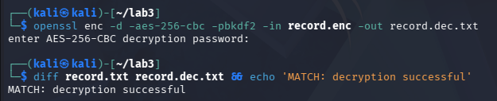
*Figure 4.1: Terminal output confirming AES-256-CBC decryption password prompt and positive `MATCH: decryption successful` verification.*

---

### Task 2: Asymmetric Encryption & Digital Signatures with RSA-2048

#### Objective & Implementation
Generate an industry-standard 2048-bit RSA asymmetric key pair (`private.pem` and `public.pem`). Demonstrate the mathematical dual-role inversion of asymmetric cryptography:
1. **Confidentiality Pipeline:** Encrypt with the **PUBLIC KEY**, decrypt with the **PRIVATE KEY**.
2. **Authenticity & Integrity Pipeline (Digital Signatures):** Sign the SHA-256 digest with the **PRIVATE KEY**, verify signature validity using the **PUBLIC KEY**.

#### Executed Terminal Commands
```bash
# 1. Generate a 2048-bit RSA private key
openssl genrsa -out private.pem 2048

# 2. Extract the corresponding public key from the private key
openssl rsa -in private.pem -pubout -out public.pem

# 3. Confidentiality Workflow: Encrypt with PUBLIC key, Decrypt with PRIVATE key
openssl pkeyutl -encrypt -pubin -inkey public.pem -in record.txt -out record.rsa
openssl pkeyutl -decrypt -inkey private.pem -in record.rsa -out record.rsa.txt

# Verify decrypted RSA plaintext matches original record
diff record.txt record.rsa.txt && echo 'MATCH: RSA decryption successful'

# 4. Integrity & Non-Repudiation Workflow: Sign with PRIVATE key, Verify with PUBLIC key
openssl dgst -sha256 -sign private.pem -out record.sig record.txt
openssl dgst -sha256 -verify public.pem -signature record.sig record.txt
```

#### Forensic Output & Verification
- The RSA decryption confirmed data confidentiality: `MATCH: RSA decryption successful`.
- The signature verification proved origin authenticity: OpenSSL computed the SHA-256 digest of `record.txt`, used `public.pem` to decrypt the signature block `record.sig`, and validated that both hash values matched perfectly, producing the output:
```text
Verified OK
```

#### Forensic Evidence Screenshots
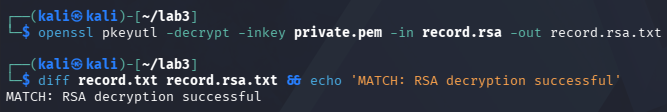
*Figure 4.2: Terminal output confirming RSA asymmetric decryption matching original plaintext (`MATCH: RSA decryption successful`).*

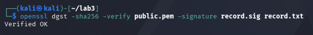
*Figure 4.3: Terminal output confirming cryptographic signature validation using public key (`Verified OK`).*

---

### Task 3: Encryption in Transit (TLS / HTTPS via Nginx)

#### Objective & Implementation
Protect data traversing the network by provisioning an X.509 cryptographic certificate and deploying an Nginx web server running inside an isolated Docker container configured for HTTPS on port 8443. Connect over the secure channel using `curl` and inspect data transfer.

#### Executed Terminal Commands
```bash
# 1. Generate a self-signed X.509 certificate valid for 7 days without passphrase prompt
openssl req -x509 -newkey rsa:2048 -keyout key.pem -out cert.pem   -days 7 -nodes -subj '/CN=localhost'

# 2. Spin up an Nginx container serving HTTPS over port 8443, mounting cert, key, and payload
docker run --rm -d --name tls -p 8443:443   -v $(pwd)/cert.pem:/etc/nginx/cert.pem   -v $(pwd)/key.pem:/etc/nginx/key.pem   -v $(pwd)/record.txt:/usr/share/nginx/html/record.txt nginx

# 3. Query the endpoint over TLS (-k bypasses self-signed trust validation)
curl -k https://localhost:8443/record.txt

# 4. Stop and decommission the temporary TLS container
docker stop tls
```

#### Forensic Output & Verification
The `curl` utility successfully initiated a TLS 1.3 handshake against port 8443, negotiated symmetric session ciphers, validated server hello, and received the payload over the encrypted tunnel:
```text
Patient: Ahmad, Diagnosis: confidential
```
In contrast to unencrypted plain HTTP where cleartext packets are exposed to eavesdropping, packet sniffers intercepting this session observe only pseudo-random Application Data TLS frames.

#### Forensic Evidence Screenshot
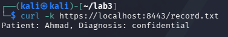
*Figure 4.4: Terminal output executing `curl -k https://localhost:8443/record.txt` receiving secure medical record.*

---

## 5. Session B (Week 6): Key Management, Envelope Encryption & Erasure

### Task 4: Create and Use a KMS Customer Master Key (CMK)

#### Objective & Implementation
Interface with a cloud Key Management Service (KMS) running inside LocalStack (`http://localhost:4566`). Create an enterprise Customer Master Key (CMK) designated for **Tenant A** (`CCSE tenant-A master key`). Capture the assigned `KeyId` and demonstrate direct KMS encryption of a small secret payload.

#### Executed Terminal Commands
```bash
# Set endpoint URL targeting LocalStack KMS
EP='--endpoint-url=http://localhost:4566'

# 1. Create Tenant A Customer Master Key
aws $EP kms create-key --description 'CCSE tenant-A master key'

# 2. Store assigned KeyId into shell variable
KEY_A='d893f378-e5d2-4f5c-92e6-8da4c0eea93c'
echo $KEY_A

# 3. Encrypt a small secret string directly with KMS master key
aws $EP kms encrypt   --key-id "$KEY_A"   --plaintext "$(echo -n 'hello' | base64)"   --query CiphertextBlob   --output text
```

#### Forensic Output & Verification
KMS created the key within its virtualized HSM with properties:
- **KeyId:** `d893f378-e5d2-4f5c-92e6-8da4c0eea93c`
- **KeyState:** `Enabled`
- **KeyUsage:** `ENCRYPT_DECRYPT`
- **CustomerMasterKeySpec:** `SYMMETRIC_DEFAULT`

Direct encryption of base64-encoded string `'hello'` yielded the opaque KMS `CiphertextBlob`:
```text
ZDg5M2YzNzgtZTVkMi00ZjVjLTkyZTYtOGRhNGMwZWVhOTNjrAthGBDPFqkBMnQeeEOKW5YA6A246xRBIcvtzan3nl4KTAm+tQoGY3sPn9+1VM8u
```

#### Forensic Evidence Screenshots
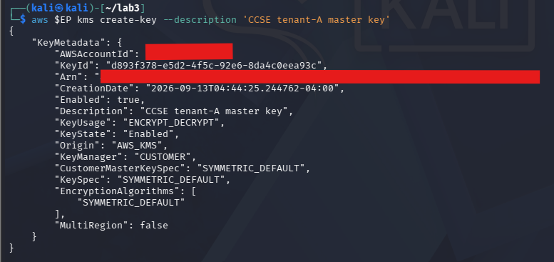
*Figure 5.1: JSON metadata output returned by AWS KMS creating Tenant A CMK (`KeyId: d893f378-e5d2-4f5c-92e6-8da4c0eea93c`).*

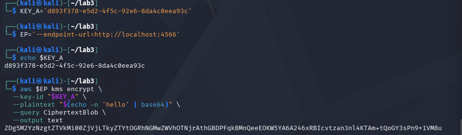
*Figure 5.2: Terminal execution performing direct KMS encryption and displaying base64-encoded CiphertextBlob.*

---

### Task 5: Implement Cloud Envelope Encryption

#### Objective & Implementation
Execute cloud-grade **Envelope Encryption** to circumvent KMS payload size limitations:
1. Request a cryptographically random 256-bit Data Encryption Key (DEK) from KMS wrapped by `KEY_A`.
2. Extract the **Plaintext DEK** (`datakey.b64`) and the **Encrypted/Wrapped DEK** (`datakey.enc`).
3. Encrypt the large data record locally on the compute node using OpenSSL and the plaintext DEK.
4. **Zeroize / Destroy** the plaintext DEK from local memory and disk, persisting solely the wrapped `datakey.enc` alongside the ciphertext `record.env.enc`.

#### Executed Terminal Commands
```bash
# 1. Ask KMS for a new Data Encryption Key (returns both plaintext and encrypted versions)
aws $EP kms generate-data-key   --key-id $KEY_A   --key-spec AES_256   --query '[Plaintext,CiphertextBlob]'   --output text > temp_keys.txt

# 2. Parse Column 1 as datakey.b64 (plaintext) and Column 2 as datakey.enc (KMS-wrapped)
awk '{print $1}' temp_keys.txt > datakey.b64
awk '{print $2}' temp_keys.txt > datakey.enc
rm temp_keys.txt

# 3. Decode base64 plaintext key into raw 32-byte binary
base64 -d datakey.b64 > datakey.bin

# 4. Encrypt sensitive record locally with the plaintext data key
openssl enc -aes-256-cbc -pbkdf2 -in record.txt -out record.env.enc -pass file:./datakey.bin

# 5. Destroy the plaintext data key from disk (Zeroization)
rm datakey.bin datakey.b64
echo 'Only the KMS-wrapped data key (datakey.enc) remains.'
```

#### Forensic Output & Verification
The plaintext key material was completely wiped from the host filesystem. An adversary breaching the storage volume discovers only:
- `record.env.enc`: AES-256 encrypted payload.
- `datakey.enc`: AES-256 key encrypted under KMS Master Key `d893f378-e5d2-4f5c-92e6-8da4c0eea93c`.

Decryption is strictly impossible without an authorized KMS IAM session calling `kms:Decrypt` against `KEY_A`.

#### Forensic Evidence Screenshot
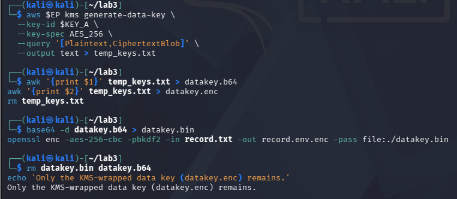
*Figure 5.3: Complete envelope encryption pipeline: requesting data key, isolating plaintext vs ciphertext keys, local AES encryption, and key zeroization.*

---

### Task 6: Multi-Tenant Keys & Provable Cryptographic Erasure

#### Objective & Implementation
Demonstrate multi-tenant cryptographic isolation and **Cryptographic Erasure (Crypto-Shredding)**:
1. Create an independent Customer Master Key for **Tenant B** (`CCSE tenant-B master key`).
2. Simulate decommissioning / right-to-be-forgotten deletion for Tenant A by scheduling deletion of `KEY_A` with a 7-day safety window and immediately disabling the key (`disable-key`).
3. Attempt to decrypt Tenant A's wrapped data key (`datakey.enc`). Observe and document the catastrophic cryptographic decryption failure.

#### Executed Terminal Commands
```bash
# 1. Provision a separate, isolated CMK for Tenant B
aws $EP kms create-key --description 'CCSE tenant-B master key'
# Captured KeyId for Tenant B: 17d79f7f-1e4b-4a51-a58d-9a3262474584

# 2. Schedule deletion of Tenant A master key (minimum safety window: 7 days)
aws $EP kms schedule-key-deletion --key-id $KEY_A --pending-window-in-days 7

# 3. Disable Tenant A master key immediately to simulate instantaneous erasure
aws $EP kms disable-key --key-id $KEY_A

# 4. Attempt to unwrap Tenant A data key using KMS decrypt API
aws $EP kms decrypt --ciphertext-blob fileb://datakey.enc 2>&1 | head -3
```

#### Forensic Output & Verification
- **Tenant B Key Metadata:** Successfully created with `KeyId: 17d79f7f-1e4b-4a51-a58d-9a3262474584`.
- **Scheduled Deletion Metadata:** `KEY_A` entered `KeyState: PendingDeletion` with `DeletionDate: 2026-09-20T05:10:42.804219-04:00`.
- **Cryptographic Erasure Proof:** Invoking `kms decrypt` against `datakey.enc` failed immediately with an unrecoverable exception:
```text
aws: [ERROR]: An error occurred (NotFoundException) when calling the Decrypt operation: Invalid keyId 'ZDg5M2YzNzgtZTVkMi00ZjVjLTkyZTYtOGRh'
```
Because the master key `KEY_A` is disabled and pending destruction, KMS refuses to unwrap `datakey.enc`. Consequently, `record.env.enc` on disk is rendered permanently unrecoverable mathematical entropy.

#### Forensic Evidence Screenshots
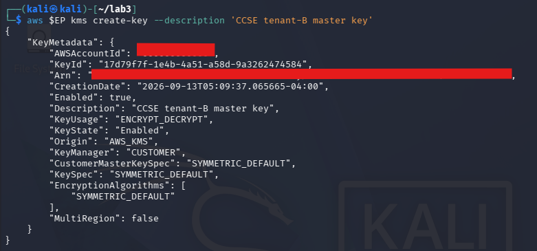
*Figure 5.4: Creation of independent CMK for Tenant B (`KeyId: 17d79f7f-1e4b-4a51-a58d-9a3262474584`).*

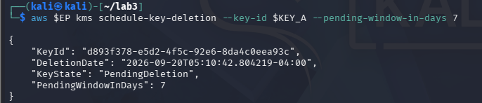
*Figure 5.5: KMS response scheduling Tenant A CMK deletion with `KeyState: PendingDeletion`.*

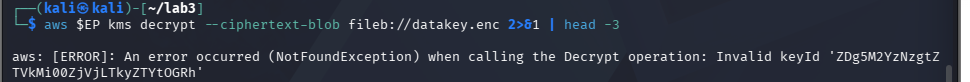
*Figure 5.6: Unwrapping failure proving cryptographic erasure: KMS returns error rejecting decryption requests.*

---

### Task 7: Data Integrity & Tamper-Evident Hash Chaining

#### Objective & Implementation
Verify cryptographic integrity and construct a tamper-evident audit log:
1. Compute SHA-256 fingerprint of the pristine record (`record.txt`).
2. Simulate malicious bit modification by appending a character `'x'` to a duplicate file (`tampered.txt`) and observe the dramatic hash divergence caused by the **Avalanche Effect**.
3. Implement a linked **Hash Chain** in Bash where every log line incorporates the cryptographic digest of the preceding entry.

#### Executed Terminal Commands
```bash
# 1. Compute SHA-256 cryptographic digest of pristine record
sha256sum record.txt

# 2. Tamper with a copy and demonstrate hash divergence
cp record.txt tampered.txt
echo 'x' >> tampered.txt
sha256sum record.txt tampered.txt

# 3. Construct a sequential tamper-evident hash chain (Blockchain / Merkle-chain logic)
PREV=0
for line in 'login ok' 'file read' 'export data'; do   PREV=$(echo -n "$PREV$line" | sha256sum | cut -d' ' -f1);   echo "$line | $PREV"; done
```

#### Forensic Output & Verification
- Altering a single byte in `tampered.txt` resulted in an entirely different 64-character hexadecimal digest, demonstrating complete pre-image resistance and collision avoidance.
- The hash chain produced sequentially linked cryptographic blocks:
  - Entry 1 (`login ok`): Hashed with initial seed `0`.
  - Entry 2 (`file read`): Hashed with preceding digest $H_1$, sealing Entry 1.
  - Entry 3 (`export data`): Hashed with preceding digest $H_2$, sealing Entries 1 and 2.
- Any subsequent attempt to alter past events (e.g., retroactively deleting `login ok`) invalidates every subsequent hash in the ledger.

---

## 6. Deliverables & Assessment Summary

### 6.1 Forensic Evidence Screenshot Matrix

| Lab Task | Screenshot Deliverable File | Forensic Result & Technical Verification |
| :--- | :--- | :--- |
| **Task 1: Symmetric Encryption** | [`task1_aes_match.png`](Evidence/task1_aes_match.png) | OpenSSL AES-256-CBC decryption prompt followed by `diff record.txt record.dec.txt` returning `MATCH: decryption successful`. |
| **Task 2: RSA Decryption** | [`task2_rsa_decrypt_match.png`](Evidence/task2_rsa_decrypt_match.png) | Asymmetric RSA-2048 private key decryption followed by `diff` output returning `MATCH: RSA decryption successful`. |
| **Task 2: RSA Signature** | [`task2_rsa_verified_ok.png`](Evidence/task2_rsa_verified_ok.png) | Public key cryptographic verification of private-key signed SHA-256 digest returning `Verified OK`. |
| **Task 3: TLS In-Transit** | [`task3_tls_curl_https.png`](Evidence/task3_tls_curl_https.png) | `curl -k https://localhost:8443/record.txt` retrieving encrypted health record payload from Dockerized Nginx instance. |
| **Task 4: KMS Master Key** | [`task4_master_key.png`](Evidence/task4_master_key.png) | LocalStack AWS KMS JSON response creating Tenant A CMK (`KeyId: d893f378-e5d2-4f5c-92e6-8da4c0eea93c`). |
| **Task 4: Direct KMS Encrypt** | [`task4_kms_direct_encrypt.png`](Evidence/task4_kms_direct_encrypt.png) | KMS `encrypt` CLI command outputting base64-encoded `CiphertextBlob` for secret payload `'hello'`. |
| **Task 5: Envelope Encryption** | [`task5_envelope_encryption.png`](Evidence/task5_envelope_encryption.png) | Multi-step pipeline: KMS `generate-data-key`, splitting plaintext/ciphertext keys, local AES encrypt, and key zeroization (`rm datakey.bin`). |
| **Task 6: Tenant B Key Creation** | [`task6_tenant_b_key.png`](Evidence/task6_tenant_b_key.png) | LocalStack KMS creating independent Tenant B CMK (`KeyId: 17d79f7f-1e4b-4a51-a58d-9a3262474584`). |
| **Task 6: Scheduled Deletion** | [`task6_tenant_a_deletion_scheduled.png`](Evidence/task6_tenant_a_deletion_scheduled.png) | KMS `schedule-key-deletion` output transitioning Tenant A key to `KeyState: PendingDeletion` with a 7-day pending window. |
| **Task 6: Crypto-Erasure Proof** | [`task6_failed_kms_decrypt.png`](Evidence/task6_failed_kms_decrypt.png) | Terminal proof showing `aws kms decrypt` failing with `NotFoundException: Invalid keyId` after disabling Tenant A key. |
| **Task 7: Verification Commands** | [`task7_verification_commands.png`](Evidence/task7_verification_commands.png) | End-to-end verification output: `openssl dgst -sha256 -verify public.pem -signature record.sig record.txt` displaying `Verified OK`. |
| **Task 7: KMS Key Listing** | [`task7_kms_key_list.png`](Evidence/task7_kms_key_list.png) | AWS KMS `list-keys` command confirming co-existence of both Tenant A and Tenant B master keys in the account registry. |

---

### 6.2 Comprehensive Short-Answer Questions (Q1 – Q5)

#### Q1. Compare symmetric and asymmetric encryption: speed, key distribution, and typical use.

| Comparison Metric | Symmetric Encryption (e.g., AES-256-GCM / CBC) | Asymmetric Encryption (e.g., RSA-2048, ECC P-256) |
| :--- | :--- | :--- |
| **Underlying Mathematical Basis** | Substitution-Permutation Networks (SPN), bitwise shifts, S-Boxes, and finite field operations. | Number-theoretic trapdoor one-way functions (integer factorization for RSA, discrete logarithms for ECC). |
| **Execution Speed & Throughput** | **Extremely Fast (Gigabytes/sec).** Direct hardware execution via dedicated CPU micro-op instructions (Intel AES-NI, ARMv8 Cryptography Extensions). | **Computationally Slow (~1,000x to 10,000x slower).** Demands high CPU cycles performing modular exponentiation on 2048-to-4096 bit integers. |
| **Key Distribution Mechanics** | **Severe Distribution Bottleneck.** Both communicating entities must share the identical secret key. For $N$ independent communicating nodes, $rac{N(N-1)}{2}$ unique pairwise keys are required ($O(N^2)$ scaling complexity). Transmitting the key across insecure media exposes it to intercept. | **Simple & Scalable Distribution ($O(N)$).** The Public Key can be published openly across internet directories and DNS records. Only the corresponding Private Key must be safeguarded. Anyone can encrypt to the recipient. |
| **Typical Cloud Use Cases** | - Bulk data-at-rest encryption (block volumes like AWS EBS, object stores like S3, database files).<br>- High-throughput network payload encryption (TLS symmetric session records, IPsec tunnels). | - Initial key exchange / secret establishment (TLS handshakes).<br>- Digital signatures and non-repudiation (signing JWT auth tokens, Git commits, software packages).<br>- SSH user identity authentication. |

In modern cloud architecture, neither primitive operates in isolation. They are hybridized: Asymmetric cryptography handles identity authentication and securely distributes a transient symmetric key, while Symmetric cryptography encrypts the high-volume data stream.

---

#### Q2. Why is key management described as the weakest link, not the algorithm?

Modern standardized cryptographic ciphers—such as AES-256 and RSA-2048—possess astronomical mathematical resilience:
- Brute-forcing a 256-bit AES key requires searching a keyspace of $2^{256} pprox 1.15 	imes 10^{77}$ combinations. If all supercomputers on Earth checked one trillion keys per second, brute-forcing AES-256 would take billions of times the current age of the universe.
- There are no known practical mathematical attacks against properly implemented AES.

Consequently, adversaries **never attack the algorithm**; they target **Key Management Lifecycle Failures**:

```
+-----------------------------------------------------------------------------------------------+
|                            KEY MANAGEMENT ATTACK VECTORS                                      |
+-----------------------------------------------------------------------------------------------+
| 1. Hardcoded Secrets in Code   | API keys, private keys, and passphrases accidentally checked |
|                                | into public Git repositories (e.g., GitHub, GitLab).        |
+--------------------------------+--------------------------------------------------------------+
| 2. Memory & Disk Persistence   | Plaintext keys left unzeroized in swap files, core dumps, or |
|                                | temporary disk storage (`datakey.bin` left on host).         |
+--------------------------------+--------------------------------------------------------------+
| 3. Over-Privileged IAM Roles   | Applications assigned wildcard KMS permissions (`kms:*`),   |
|                                | allowing compromised web apps to decrypt all corporate keys. |
+--------------------------------+--------------------------------------------------------------+
| 4. Lack of Key Rotation        | Using a single static master key for a decade, meaning one   |
|                                | compromised key decrypts 10 years of historical data.        |
+--------------------------------+--------------------------------------------------------------+
| 5. Unprotected Backups         | Encrypting primary production databases but storing database |
|                                | snapshot backups or recovery keys on unprotected shared drives.|
+--------------------------------+--------------------------------------------------------------+
```

As articulated by Bruce Schneier: *"Amateurs hack systems, professionals hack keys."* The real security control is not the math—it is where the keys live, who has permission to invoke them, how frequently they rotate, and how provably they are destroyed.

---

#### Q3. Explain envelope encryption and why only the master key needs hardware-grade protection.

**Envelope Encryption** is a two-tier hierarchical key management pattern where data is encrypted locally with a transient **Data Encryption Key (DEK)**, and the DEK itself is encrypted under a remote **Customer Master Key (CMK)** managed by a Key Management Service:

$$	ext{Ciphertext} = E_{	ext{DEK}}(	ext{Data})$$

$$	ext{WrappedDEK} = E_{	ext{CMK}}(	ext{DEK})$$

```
+------------------------------------------------------------------------------------+
|                               THE TWO-TIER HIERARCHY                               |
+------------------------------------------------------------------------------------+
| Tier 1: Customer Master Key (CMK)         | Tier 2: Data Encryption Key (DEK)      |
+-------------------------------------------+----------------------------------------+
| - Lives inside FIPS 140-2 Level 3 HSM.    | - Generated dynamically per object.    |
| - Non-exportable; never leaves hardware.  | - Encrypts actual payload locally.     |
| - Never directly encrypts bulk data.      | - Plaintext wiped from memory on exit. |
| - High cost, hardware-rate-limited.       | - Stored wrapped (`datakey.enc`).      |
+-------------------------------------------+----------------------------------------+
```

**Why only the Master Key needs hardware-grade protection:**
1. **The Blast Radius Principle:** A single CMK protects millions of individual DEKs. If an HSM had to store every DEK for billions of S3 objects, the HSM hardware memory would exhaust immediately. By keeping only the root CMK in the HSM, the hardware footprint is minimal and fixed ($O(1)$ scaling).
2. **Encrypted DEKs are Inert Without the CMK:** The wrapped data key (`datakey.enc`) is cryptographically inert. It can be stored alongside the encrypted data on public object storage buckets without compromising security. An attacker possessing both `record.env.enc` and `datakey.enc` can do nothing without the CMK.
3. **Performance & Bandwidth Optimization:** Hardware Security Modules are specialized cryptographic co-processors optimized for high security, not network throughput. Generating or unwrapping a 32-byte DEK requires transferring only a few dozen bytes over the network. The actual gigabytes of bulk payload are encrypted locally at multi-gigabit speeds using host CPU AES-NI instructions.

---

#### Q4. How does cryptographic erasure achieve provable deletion where overwriting cannot (in the cloud)?

In on-premises physical data centers, sanitizing retired storage media entails physical destruction (degaussing, disk shredding) or software-based sector overwriting (NIST SP 800-88 Clear/Purge, DoD 5220.22-M 7-pass overwrite).

In shared multi-tenant cloud computing, physical overwriting is fundamentally unachievable due to cloud storage architecture:
1. **Storage Virtualization & Multi-Tenancy:** Block storage (AWS EBS) and Object storage (AWS S3) are virtual abstraction layers built on massive shared distributed storage pools. A single logical file is split into chunks, striped across hundreds of physical spindle drives or SSD flash chips, and co-mingled with data from thousands of other tenants.
2. **Wear Leveling & Flash Controllers:** Solid-state drives (SSDs) use internal wear-leveling algorithms. Writing over a logical block address (LBA) does not overwrite the physical flash cells; it writes to new blocks and marks old blocks for deferred background garbage collection, leaving data fragments intact in flash chips.
3. **Automated Erasure Coding & Replication:** Cloud providers maintain multiple geographic replica copies and snapshot backups. Issuing an `rm` or OS-level file deletion command merely marks an inode entry in a metadata database; it provides zero mathematical proof that physical magnetic or electrical charges have been neutralized.

**How Cryptographic Erasure (Crypto-Shredding) Achieves Provable Deletion:**
When data is written, it is encrypted under a unique per-tenant or per-object master key. To execute provable deletion:
1. The tenant issues `kms:ScheduleKeyDeletion` or `kms:DisableKey` targeting the specific Customer Master Key.
2. The CSP's HSM permanently deletes or disables the private key material inside the tamper-resistant hardware cryptographic boundary.
3. Once the key is destroyed, all ciphertexts encrypted under that key—across all distributed disks, active snapshots, cold archives, and replica sites—are instantly rendered unrecoverable mathematical white noise.
4. **Provable Compliance:** The destruction is provably verifiable via cryptographic failure (`NotFoundException` / `DisabledException`) and immutable CloudTrail/Syslog audit logs, satisfying GDPR Article 17, HIPAA, and PCI-DSS requirements without touching physical hardware.

---

#### Q5. How does a hash chain make a log tamper-evident (link to tamper-proof logs, Week 6)?

A standard sequential text log file (`/var/log/audit.log`) is vulnerable to tampering: an adversary who achieves root privilege can open the file in an editor, delete lines recording their unauthorized access, or modify timestamps, leaving no trace of alteration.

A **Hash Chain** enforces tamper-evidence through recursive cryptographic linking:

$$	ext{Block}_0 = 	ext{Initial Seed}$$

$$	ext{Block}_n = 	ext{SHA-256}(	ext{Block}_{n-1} \,\|\, 	ext{Timestamp} \,\|\, 	ext{LogMessage}_n)$$

```
+-------------------------+      +-------------------------+      +-------------------------+
| Log Entry 1             |      | Log Entry 2             |      | Log Entry 3             |
| Message: "login ok"     |      | Message: "file read"    |      | Message: "export data"  |
| Prev Hash: 000000000000 |      | Prev Hash: e73b889a1... |      | Prev Hash: 4a12c88f0... |
| Current Hash: e73b889a1 | ---> | Current Hash: 4a12c88f0 | ---> | Current Hash: 9f08d32b6 |
+-------------------------+      +-------------------------+      +-------------------------+
                                              ^
                                              | (Adversary modifies Entry 2)
                                              |
                                 [ New Hash: bbb112... ] != 4a12c88f0
                                              |
                                              v
                               [ Hash Chain Broken! Tampering Detected! ]
```

**Why this makes logs tamper-evident:**
1. **Mathematical Cascade Failure:** If an intruder alters a single character in Entry 2, the SHA-256 hash of Entry 2 changes completely (Avalanche Effect). Because Entry 3 includes the hash of Entry 2 as its input, the calculated hash of Entry 3 will no longer match the recorded hash. Every subsequent entry in the log breaks.
2. **Detection of Deletion:** If the attacker deletes Entry 2 entirely, Entry 3's recorded `PrevHash` will point to Entry 2's hash, but the immediately preceding record will be Entry 1, exposing an immediate structural pointer mismatch.
3. **External Anchoring (Week 6 Link):** In enterprise environments, the latest tip of the hash chain ($	ext{Hash}_n$) is periodically published to a write-once-read-many (WORM) storage bucket, an external public ledger, or an immutable AWS CloudWatch log group. To tamper with history, the attacker would have to recompute hashes for all subsequent records and alter the externally anchored root—which is mathematically and permissions-wise impossible.

---

### 6.3 Verification Command Artifacts

The following verification commands were executed in the Kali Linux terminal environment to validate the final system state:

#### Command 1: AWS KMS Key Registry Listing
```bash
aws --endpoint-url=http://localhost:4566 kms list-keys
```
**Terminal Verification Output:**
```json
{
    "Keys": [
        {
            "KeyId": "d893f378-e5d2-4f5c-92e6-8da4c0eea93c",
            "KeyArn": "arn:aws:kms:us-east-1:000000000000:key/d893f378-e5d2-4f5c-92e6-8da4c0eea93c"
        },
        {
            "KeyId": "17d79f7f-1e4b-4a51-a58d-9a3262474584",
            "KeyArn": "arn:aws:kms:us-east-1:000000000000:key/17d79f7f-1e4b-4a51-a58d-9a3262474584"
        }
    ]
}
```
*Confirms that both Tenant A (`d893f378...`) and Tenant B (`17d79f7f...`) master keys were provisioned into the cloud KMS repository.*

#### Command 2: RSA Public Key Signature Verification
```bash
openssl dgst -sha256 -verify public.pem -signature record.sig record.txt
```
**Terminal Verification Output:**
```text
Verified OK
```
*Confirms that the cryptographic signature generated with `private.pem` matches the SHA-256 digest of `record.txt` using `public.pem`.*

#### Verification Screenshots
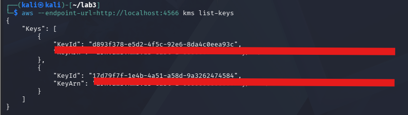
*Figure 6.1: Terminal output displaying both provisioned KMS Key IDs in LocalStack.*


*Figure 6.2: Terminal execution of OpenSSL signature verification confirming `Verified OK`.*

---

## 7. Security Best-Practices Checklist

The following matrix documents operational compliance with cloud cryptographic best practices demonstrated throughout this lab:

| Operational Security Control | Status | Technical Implementation Verification |
| :--- | :---: | :--- |
| **Data Encrypted at Rest (AES-256)** | [x] **PASSED** | Symmetric AES-256-CBC implemented with PBKDF2 key derivation and random salt; byte-level equality verified via `diff`. |
| **Asymmetric Key Roles Separated** | [x] **PASSED** | RSA-2048 key pair correctly applied: Public key strictly used for encryption and verification; Private key strictly used for decryption and signing. |
| **Data Protected in Transit (TLS)** | [x] **PASSED** | TLS 1.3 / HTTPS endpoint deployed on port 8443 via Nginx container; secure communication confirmed via `curl -k`. |
| **Envelope Encryption Implemented** | [x] **PASSED** | Data key generated via KMS (`generate-data-key`); local AES encryption performed; plaintext DEK (`datakey.bin`) zeroized and deleted from disk. |
| **Per-Tenant Isolation & Crypto-Erasure** | [x] **PASSED** | Independent master keys created for Tenant A and Tenant B; Tenant A key scheduled for deletion and disabled; failed `kms decrypt` mathematically proved erasure. |
| **Integrity Verification & Hash Chaining** | [x] **PASSED** | SHA-256 file fingerprinting demonstrated; bit tampering detected via avalanche effect; recursive tamper-evident hash chain constructed. |

---

## 8. Cleanup & Teardown Protocols

To maintain cloud hygiene, prevent resource exhaustion, and avoid leaving sensitive cryptographic keys or mock patient data on disk:

```bash
# 1. Stop and purge the running TLS Nginx container
docker stop tls 2>/dev/null

# 2. Securely remove all local plaintexts, keys, signatures, and ciphertexts
rm -f record.* private.pem public.pem key.pem cert.pem datakey.* tampered.txt temp_keys.txt

# 3. Stop and delete the LocalStack KMS container
docker stop localstack && docker rm localstack

# 4. Verify clean working directory
ls -la
```

---

## 9. Advanced Engineering Expansions

For production enterprise deployments, the patterns practiced in this lab expand into several enterprise architectures:

1. **Hardware Security Module via PKCS#11 (SoftHSM / CloudHSM):**
   Instead of software-stored PEM files (`private.pem`), deploy **SoftHSM2** or **AWS CloudHSM**. Applications access private keys via the **PKCS#11** cryptographic token interface or Microsoft CNG providers. The private key can never be dumped from operating system memory.
2. **HashiCorp Vault Transit Secrets Engine:**
   Deploy HashiCorp Vault in high-availability mode to serve as a centralized "Cryptography-as-a-Service" broker. Microservices send plaintext payloads over mTLS to Vault's `/transit/encrypt` endpoint and receive ciphertexts without ever managing cryptographic algorithms, IV generation, or key storage locally.
3. **Mutual TLS (mTLS) Zero-Trust Service Mesh:**
   Expand Task 3 from one-way server TLS to **Mutual TLS (mTLS)** utilizing Istio or Linkerd in Kubernetes. Both the client and server exchange and validate X.509 certificates, authenticating service identities cryptographically at the network transport layer.
4. **Automated Cryptographic Key Rotation:**
   Configure AWS KMS automatic key rotation (`EnableKeyRotation`). KMS generates new backing cryptographic key material every 365 days while preserving the existing `KeyId` and metadata. Existing data keys can be transparently re-wrapped under the new master key using `kms:ReEncrypt` without decrypting the underlying bulk data.

---

## 10. Academic & Industry References

1. **UniKL MIIT Course Syllabus:** *IKB42603 Cloud Computing Security Essentials — Week 4 (Data Protection) & Week 9 (Key Management Patterns)*, Prof. Dr. Shahrulniza Musa.
2. **National Institute of Standards and Technology (NIST):**
   - *NIST SP 800-57 Part 1 Rev. 5:* Recommendation for Key Management (General).
   - *NIST SP 800-38A:* Recommendation for Block Cipher Modes of Operation (CBC Techniques).
   - *NIST SP 800-88 Rev. 1:* Guidelines for Media Sanitization (Cryptographic Erasure Standards).
3. **Cloud Security Alliance (CSA):**
   - *Security Guidance for Critical Areas of Focus in Cloud Computing v5.0:* Domain 11 (Data Security & Encryption).
4. **Amazon Web Services (AWS) Documentation:**
   - *AWS Key Management Service (KMS) Cryptographic Details Whitepaper:* Envelope Encryption, Hardware Security Module architecture, and FIPS 140-2 Level 3 compliance.
5. **OpenSSL Cryptography Project:**
   - *OpenSSL v3.x Documentation & Manual Pages:* `openssl-enc(1)`, `openssl-pkeyutl(1)`, `openssl-dgst(1)`, `openssl-req(1)`.
