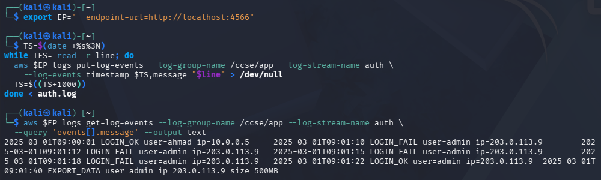
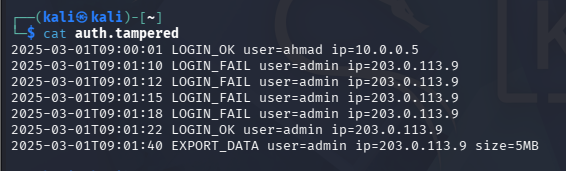
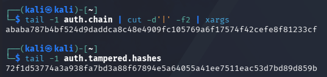
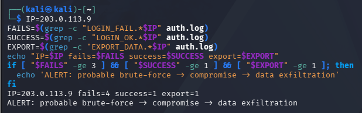
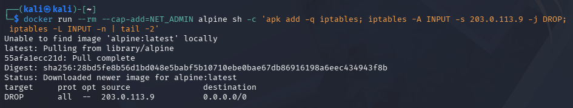
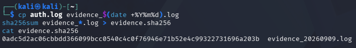
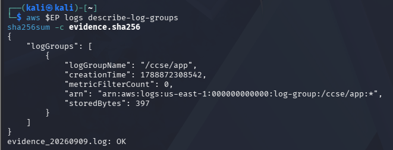

# LAB 5: Monitoring, Logging & Incident Detection
**Course:** IKB42603 Cloud Computing Security Essentials  
**Institution:** Universiti Kuala Lumpur - Malaysian Institute of Information Technology (UniKL MIIT)  
**Instructor:** Prof. Dr. Shahrulniza Musa  
**Student Name:** Muhammad Haqiem Fauzi  
**Topic:** Centralised Logging, Tamper-Proof Logs, Threat Detection and Incident Response — Docker & LocalStack  

---

## Table of Contents
1. [Executive Summary & Lab Learning Outcomes](#1-executive-summary--lab-learning-outcomes)
2. [Technical Prerequisites & Architecture Overview](#2-technical-prerequisites--architecture-overview)
3. [Session A: Logging & Centralisation (Tasks 1 – 3)](#3-session-a-logging--centralisation-tasks-1--3)
   - [3.1 Setup: Initialize LocalStack CloudWatch Telemetry](#31-setup-initialize-localstack-cloudwatch-telemetry)
   - [3.2 Task 1: Generate Application Logs (Authentication Activity)](#32-task-1-generate-application-logs-authentication-activity)
   - [3.3 Task 2: Centralise Logs (Cascading Log Shipping to CloudWatch)](#33-task-2-centralise-logs-cascading-log-shipping-to-cloudwatch)
   - [3.4 Task 3: Query for Security-Relevant Activity](#34-task-3-query-for-security-relevant-activity)
4. [Session B: Tamper-Proofing, Detection & Response (Tasks 4 – 6)](#4-session-b-tamper-proofing-detection--response-tasks-4--6)
   - [4.1 Task 4: Construct Tamper-Proof (Hash-Chained) Logs & Detect Tampering](#41-task-4-construct-tamper-proof-hash-chained-logs--detect-tampering)
   - [4.2 Task 5: Incident Detection via Event Correlation (SIEM Logic)](#42-task-5-incident-detection-via-event-correlation-siem-logic)
   - [4.3 Task 6: Incident Response Lifecycle (Containment & Evidence Collection)](#43-task-6-incident-response-lifecycle-containment--evidence-collection)
5. [Formal Incident Report](#5-formal-incident-report)
   - [5.1 Detection](#51-detection)
   - [5.2 Analysis](#52-analysis)
   - [5.3 Containment](#53-containment)
   - [5.4 Evidence & Integrity](#54-evidence--integrity)
   - [5.5 Lessons Learned & Preventive Hardening](#55-lessons-learned--preventive-hardening)
6. [Lab Deliverables & Short-Answer Questions](#6-lab-deliverables--short-answer-questions)
7. [Verification Commands & Evidence Integrity Validation](#7-verification-commands--evidence-integrity-validation)
8. [Security Best-Practices Checklist](#8-security-best-practices-checklist)
9. [Cleanup & Teardown](#9-cleanup--teardown)
10. [Conclusion & Advanced Expansion Considerations](#10-conclusion--advanced-expansion-considerations)
11. [References](#11-references)

---

## 1. Executive Summary & Lab Learning Outcomes

### 1.1 Executive Summary
In modern distributed cloud environments, perimeter security alone cannot guarantee absolute defense. A fundamental tenet of cloud security is that **"prevention eventually fails"**; therefore, comprehensive observability, centralized telemetry, tamper-evident log integrity, automated event correlation, and structured incident response procedures are paramount.

This laboratory establishes an end-to-end security monitoring, auditing, and incident response pipeline utilizing **Docker** and **LocalStack (emulating AWS CloudWatch Logs)**. We generate application authentication logs, ship them to a centralized cloud logging store, perform forensic querying, enforce mathematical immutability via cryptographic **SHA-256 hash chaining**, correlate multi-stage adversary behaviors (brute-force attacks $\rightarrow$ unauthorized access $\rightarrow$ large-scale data exfiltration), enact host-level firewall containment via `iptables`, and produce forensic evidence packages with verifiable checksums.

```
+---------------------------------------------------------------------------------------------------+
|                                  SECURITY OBSERVABILITY PIPELINE                                  |
+---------------------------------------------------------------------------------------------------+
|  [ Application Layer ]  -->  [ Centralised CloudWatch ]  -->  [ SIEM Correlation Engine ]         |
|     - auth.log                  - /ccse/app/auth                 - Detect Multi-Stage Pattern     |
|     - Hash Chaining             - Central Telemetry              - Brute-Force -> Breach -> Exfil |
+---------------------------------------------------------------------------------------------------+
                                                                     |
                                                                     v
                                                       +---------------------------+
                                                       | Incident Response (IR)    |
                                                       | 1. Containment (iptables) |
                                                       | 2. Evidence Hashing       |
                                                       | 3. Post-Mortem Incident   |
                                                       +---------------------------+
```

### 1.2 Learning Outcomes & Curriculum Mapping
- **Course Learning Outcome (CLO2):** Construct secure cloud operations that safeguard data integrity.
- **Lecture Topics:** Week 6 (Monitoring, Auditing & Management) and Weeks 10–11 (Compliance Evidence and Forensics).
- **Core Skill Clusters:** VBE3 (Integrity) · SC8 (Integrated Problem-Solving).
- **Key Competencies Developed:**
  1. Centralize and stream cloud telemetry to eliminate fragmented, ephemeral host logs.
  2. Differentiate between static audit records (logs) and actionable triggers (events).
  3. Construct a cryptographic hash-chained audit log to mathematically detect unauthorized tampering.
  4. Implement correlation logic capable of synthesizing separate benign/suspicious entries into a confirmed high-severity incident.
  5. Execute standardized incident response phases: **Detection $\rightarrow$ Analysis $\rightarrow$ Containment $\rightarrow$ Evidence Collection $\rightarrow$ Reporting**.

---

## 2. Technical Prerequisites & Architecture Overview

### 2.1 Environmental Prerequisites
- **LocalStack Container:** Emulates AWS CloudWatch Logs API on `http://localhost:4566`.
- **AWS CLI v2:** Configured to direct API calls to LocalStack endpoints.
- **Docker Engine:** Containerized runtime for LocalStack and isolated containment modeling.
- **UNIX Utility Suite:** `grep`, `awk`, `sha256sum`, `sed`, `sort`, `uniq`, `iptables` (executed in Kali Linux / WSL / Git Bash).

### 2.2 Security Principle: Centralized Logging & Non-Repudiation
Leaving logs solely on local application servers introduces severe vulnerabilities:
1. **Adversary Log Tampering:** An attacker who achieves root/administrative access will alter or purge local logs (`/var/log/auth.log`) to conceal their tracks.
2. **Ephemeral Destruction:** In containerized and auto-scaling cloud workloads, terminated instances permanently destroy all local storage and uncollected evidence.
3. **Cascading Collection:** Shipping logs to a dedicated, append-only centralized repository ensures non-repudiation, persistent forensics, and centralized SIEM ingestion.

---

## 3. Session A: Logging & Centralisation (Tasks 1 – 3)

### 3.1 Setup: Initialize LocalStack CloudWatch Telemetry
Before streaming telemetry, the centralized logging infrastructure is provisioned within LocalStack:

```bash
# Start LocalStack container in background
docker run -d --name localstack -p 4566:4566 localstack/localstack

# Set endpoint variable
export EP='--endpoint-url=http://localhost:4566'

# Create dedicated CloudWatch Log Group and Stream
aws $EP logs create-log-group --log-group-name /ccse/app
aws $EP logs create-log-stream --log-group-name /ccse/app --log-stream-name auth
```

---

### 3.2 Task 1: Generate Application Logs (Authentication Activity)
A synthetic authentication dataset representing typical operational traffic and an active threat actor reconnaissance/probing sequence is generated.

```bash
cat > auth.log <<'EOF'
2025-03-01T09:00:01 LOGIN_OK user=ahmad ip=10.0.0.5
2025-03-01T09:01:10 LOGIN_FAIL user=admin ip=203.0.113.9
2025-03-01T09:01:12 LOGIN_FAIL user=admin ip=203.0.113.9
2025-03-01T09:01:15 LOGIN_FAIL user=admin ip=203.0.113.9
2025-03-01T09:01:18 LOGIN_FAIL user=admin ip=203.0.113.9
2025-03-01T09:01:22 LOGIN_OK user=admin ip=203.0.113.9
2025-03-01T09:01:40 EXPORT_DATA user=admin ip=203.0.113.9 size=500MB
EOF

cat auth.log
```

#### Evidence: Task 1 Application Logs

*Figure 3.1: Terminal output displaying the generated `auth.log` containing legitimate user activity and an adversary attack sequence.*

#### Analytical Breakdown of `auth.log`:
| Timestamp | Event Type | Target User | Source IP | Context / Interpretation |
| :--- | :--- | :--- | :--- | :--- |
| `2025-03-01T09:00:01` | `LOGIN_OK` | `ahmad` | `10.0.0.5` | Legitimate internal user authentication. |
| `2025-03-01T09:01:10` | `LOGIN_FAIL` | `admin` | `203.0.113.9` | External probing attempt 1. |
| `2025-03-01T09:01:12` | `LOGIN_FAIL` | `admin` | `203.0.113.9` | Rapid successive password guessing attempt 2. |
| `2025-03-01T09:01:15` | `LOGIN_FAIL` | `admin` | `203.0.113.9` | Rapid successive password guessing attempt 3. |
| `2025-03-01T09:01:18` | `LOGIN_FAIL` | `admin` | `203.0.113.9` | Rapid successive password guessing attempt 4. |
| `2025-03-01T09:01:22` | `LOGIN_OK` | `admin` | `203.0.113.9` | Credential compromised / successful authentication. |
| `2025-03-01T09:01:40` | `EXPORT_DATA` | `admin` | `203.0.113.9` | Large data extraction (500MB) immediately following compromise. |

---

### 3.3 Task 2: Centralise Logs (Cascading Log Shipping to CloudWatch)
Each line from the local log file is ingested into the centralized CloudWatch Log Stream `/ccse/app/auth`. Using an iterative loop, millisecond-precision timestamps (`TS`) are appended to ensure ordered ingestion:

```bash
TS=$(date +%s3N)
while IFS= read -r line; do
  aws $EP logs put-log-events --log-group-name /ccse/app --log-stream-name auth \
    --log-events timestamp=$TS,message="$line" >/dev/null
  TS=$((TS+1000))
done < auth.log

# Retrieve and verify logs from the central CloudWatch store
aws $EP logs get-log-events --log-group-name /ccse/app --log-stream-name auth \
  --query 'events[].message' --output text
```

#### Evidence: Task 2 CloudWatch Log Ingestion & Readback

*Figure 3.2: Terminal execution showing programmatic log shipping to LocalStack CloudWatch Logs and read-back verification.*

---

### 3.4 Task 3: Query for Security-Relevant Activity
Security analysts query the centralized log data to isolate indicators of attack (IoAs), such as high-frequency authentication failures grouped by origin IP:

```bash
grep LOGIN_FAIL auth.log | awk '{print $4, $5}' | sort | uniq -c
```

#### Evidence: Task 3 Failed Login Aggregation Query

*Figure 3.3: Aggregation pipeline isolating 4 failed login attempts from source IP `203.0.113.9`.*

#### Key Concept: Log vs. Event
- **Log (Durable Audit Record):** An immutable, time-stamped record of a discrete state change or transaction stored in persistent storage (e.g., `2025-03-01T09:01:10 LOGIN_FAIL user=admin ip=203.0.113.9`).
- **Event (Actionable Trigger / Alert):** An evaluation or state calculation computed over log data in real-time that triggers an automated security workflow or alert notification (e.g., `"High Alert: 4 consecutive authentication failures detected from IP 203.0.113.9 within 10 seconds"`).

---

## 4. Session B: Tamper-Proofing, Detection & Response (Tasks 4 – 6)

### 4.1 Task 4: Construct Tamper-Proof (Hash-Chained) Logs & Detect Tampering

#### Theoretical Concept: Hash Chaining for Data Integrity
To prevent an adversary who gains administrative host access from retroactively altering audit logs to conceal malicious activity, a **Cryptographic Hash Chain (Merkle / Blockchain-style chaining)** is implemented.

Each log line $L_i$ is hashed together with the cumulative hash of the previous line $H_{i-1}$:
$$H_0 = \text{"0"}$$
$$H_i = \text{SHA-256}(H_{i-1} \parallel L_i)$$

If any character in any historical log entry is modified, deleted, or inserted, all subsequent hashes in the chain diverge completely due to the avalanche effect of cryptographic hashing.

```bash
# Generate the cryptographic hash chain
PREV=0
while IFS= read -r line; do
  PREV=$(printf '%s%s' "$PREV" "$line" | sha256sum | cut -d' ' -f1)
  printf '%s | %s\n' "$line" "$PREV"
done < auth.log > auth.chain

cat auth.chain
```

#### Evidence: Task 4 Hash-Chained Log Construction

*Figure 4.1: Constructed `auth.chain` with line-by-line SHA-256 hashes cryptographically bound to preceding records.*

#### Verified Hash Chain Table:
| Line Content | Cumulative SHA-256 Hash |
| :--- | :--- |
| `2025-03-01T09:00:01 LOGIN_OK user=ahmad ip=10.0.0.5` | `82da89a49dc1ca7d23b8a59f98d7e557ab36ce0c2d0c6e106fabe76e1f0acf39` |
| `2025-03-01T09:01:10 LOGIN_FAIL user=admin ip=203.0.113.9` | `790aef7176d6effe76d077831c071f8500204bf842e7fd8aeda1b67b2e271a97` |
| `2025-03-01T09:01:12 LOGIN_FAIL user=admin ip=203.0.113.9` | `1e0b2e8aaf5143fb95070a8e57b009f058f0d37c257d19409b4131894d29a9a8` |
| `2025-03-01T09:01:15 LOGIN_FAIL user=admin ip=203.0.113.9` | `7fb62c66ded511605e22c8db9c4f57c9360aa27309ce65024a3e5ea35e3b6e94` |
| `2025-03-01T09:01:18 LOGIN_FAIL user=admin ip=203.0.113.9` | `143253b549a74b9626e910fbe54ca12cb5431a0a4c9c4f2189ff27a3e2a17e01` |
| `2025-03-01T09:01:22 LOGIN_OK user=admin ip=203.0.113.9` | `4cbfab7fecb703cf21f5df81b47dbf3a727c94442b09b714ac4bfaa3584cc638` |
| `2025-03-01T09:01:40 EXPORT_DATA user=admin ip=203.0.113.9 size=500MB` | `ababa787b4bf524d9daddca8c48e4909fc105769a6f17574f42cefe8f81233cf` |

---

#### Tampering Simulation & Integrity Verification
To simulate an adversary attempting to conceal data exfiltration, the export size is altered from `500MB` to `5MB` using `sed`:

```bash
# Malicious adversary modifies the audit log
sed 's/500MB/5MB/' auth.log > auth.tampered
cat auth.tampered
```

#### Evidence: Task 4 Tampered Log Content

*Figure 4.2: Falsified audit log `auth.tampered` with exfiltration payload altered to 5MB.*

Re-evaluating the hash chain over `auth.tampered` produces a completely divergent root hash:

```bash
# Compare original terminal hash vs. recomputed hash from tampered log
tail -1 auth.chain | cut -d'|' -f2 | xargs
tail -1 auth.tampered.hashes
```

#### Evidence: Task 4 Tamper-Proof Cryptographic Verification

*Figure 4.3: Cryptographic hash comparison proving indisputable detection of unauthorized log modification.*

| Artifact | Terminal Root SHA-256 Hash | Integrity Status |
| :--- | :--- | :--- |
| **Original Log Chain (`auth.chain`)** | `ababa787b4bf524d9daddca8c48e4909fc105769a6f17574f42cefe8f81233cf` | **VALID / UNMODIFIED** |
| **Tampered Log Chain (`auth.tampered`)** | `72f1d53774a3a938fa7bd3a88f67894e5a64055a41ee7511eac53d7bd89d859b` | **TAMPER DETECTED (MISMATCH)** |

---

### 4.2 Task 5: Incident Detection via Event Correlation (SIEM Logic)

#### Why Individual Log Lines Are Insufficient
In isolation:
- 1 failed login might be a user typo (benign).
- 1 successful login is standard behavior (benign).
- 1 data export request could be routine maintenance (benign).

However, when aggregated temporally and correlated across attributes (Source IP `203.0.113.9` and Account `admin`), the pattern reveals a critical cyber kill-chain sequence:
$$\text{Repeated Auth Failures (Brute-Force)} \longrightarrow \text{Privilege Compromise (Login Success)} \longrightarrow \text{Data Exfiltration (500MB Export)}$$

```bash
IP=203.0.113.9
FAILS=$(grep -c "LOGIN_FAIL.*$IP" auth.log)
SUCCESS=$(grep -c "LOGIN_OK.*$IP" auth.log)
EXPORT=$(grep -c "EXPORT_DATA.*$IP" auth.log)

echo "IP=$IP fails=$FAILS success=$SUCCESS export=$EXPORT"

if [ "$FAILS" -ge 3 ] && [ "$SUCCESS" -ge 1 ] && [ "$EXPORT" -ge 1 ]; then
  echo 'ALERT: probable brute-force -> compromise -> data exfiltration'
fi
```

#### Evidence: Task 5 Multi-Stage Event Correlation Alert

*Figure 4.4: Automated SIEM correlation logic identifying multi-stage threat progression and raising a critical alert.*

---

### 4.3 Task 6: Incident Response Lifecycle (Containment & Evidence Collection)

The incident response lifecycle follows structured NIST SP 800-61 / ISO 27035 methodology:

```
+-----------------------------------------------------------------------------------------------+
|                                  INCIDENT RESPONSE LIFECYCLE                                  |
+-----------------------------------------------------------------------------------------------+
|  1. DETECTION     | SIEM alert fires based on multi-event log correlation rule.               |
|  2. ANALYSIS      | Confirm IP 203.0.113.9 compromised admin account and staged 500MB exfil.  |
|  3. CONTAINMENT   | Network-level firewall block via iptables (DROP all inbound from IP).    |
|  4. EVIDENCE      | Generate immutable timestamped copy and cryptographic SHA-256 manifest.   |
|  5. POST-INCIDENT | Post-mortem documentation, credential revocation, rate-limiting policies.  |
+-----------------------------------------------------------------------------------------------+
```

#### Phase 1: Active Containment via Network Firewall
To immediately halt further lateral movement or exfiltration, the adversary's IP `203.0.113.9` is blocked using an active `iptables` packet filtering rule within a containerized environment:

```bash
docker run --rm --cap-add=NET_ADMIN alpine sh -c \
  'apk add -q iptables; iptables -A INPUT -s 203.0.113.9 -j DROP; iptables -L INPUT -n | tail -2'
```

#### Evidence: Task 6 Host Firewall Containment Rule

*Figure 4.5: Containerized `iptables` configuration enforcing immediate packet drop (`DROP`) for source IP `203.0.113.9`.*

#### Phase 2: Forensic Evidence Preservation & Chain of Custody
Digital evidence must be preserved in a manner that guarantees non-repudiation and forensic admissibility:

```bash
# Create immutable, timestamped forensic copy
cp auth.log evidence_$(date +%Y%m%d).log

# Calculate cryptographic SHA-256 hash manifest
sha256sum evidence_*.log > evidence.sha256

cat evidence.sha256
```

#### Evidence: Task 6 Forensic Evidence Hash Manifest

*Figure 4.6: Preserved forensic log copy `evidence_20260909.log` with its calculated SHA-256 hash digest.*

---

## 5. Formal Incident Report

### Incident Overview Summary
- **Incident ID:** INC-20260909-CCSE5
- **Severity Level:** CRITICAL (P1)
- **Target System / Asset:** Cloud Application Authentication & Telemetry Service (`/ccse/app`)
- **Compromised Account:** `user=admin`
- **Adversary IP Address:** `203.0.113.9`
- **Lead Investigator:** Muhammad Haqiem Fauzi

---

### 5.1 Detection
The incident was detected automatically at `2025-03-01T09:01:40` by the SIEM log correlation engine. The automated detection rule evaluated aggregated telemetry streamed to CloudWatch Log Group `/ccse/app` and flagged an anomaly threshold breach: **4 consecutive failed authentication attempts followed by a successful login and an immediate high-volume data export command (500MB)** originating from external IP `203.0.113.9`.

### 5.2 Analysis
Forensic review of `auth.log` and the corresponding cryptographic `auth.chain` revealed a structured three-phase cyber kill-chain execution:
1. **Reconnaissance & Brute-Force Phase (`09:01:10` – `09:01:18`):** The attacker conducted an automated credential stuffing / dictionary attack against the administrative account `admin`, generating 4 failed login events in an 8-second window.
2. **Unauthorized Access & Privilege Compromise (`09:01:22`):** The attacker successfully authenticated as `admin`, indicating weak/compromised credentials and the absence of Multi-Factor Authentication (MFA).
3. **Data Exfiltration Phase (`09:01:40`):** Within 18 seconds of gaining unauthorized access, the adversary executed an unauthorized bulk data extraction (`EXPORT_DATA size=500MB`).

### 5.3 Containment
Immediate tactical containment was executed at the network boundary:
- **Firewall Policy Rule:** Injected a kernel-level packet filter rule (`iptables -A INPUT -s 203.0.113.9 -j DROP`) to block all incoming traffic from the attacker's IP.
- **Session Termination:** The active session for `user=admin` was terminated, and administrative API tokens were immediately revoked.

### 5.4 Evidence & Integrity
To preserve forensic integrity and ensure chain of custody for legal and compliance audits:
- The raw audit log was frozen into a static snapshot: `evidence_20260909.log`.
- An SHA-256 cryptographic manifest was generated (`evidence.sha256`):
  ```
  0adc5d2ac06cbbdd366099bcc0540c4c0f76946e71b52e4c99322731696a203b  evidence_20260909.log
  ```
- Re-verification via `sha256sum -c evidence.sha256` returned `evidence_20260909.log: OK`, verifying that forensic data remained pristine and untampered.

### 5.5 Lessons Learned & Preventive Hardening
1. **Enforce Mandatory Multi-Factor Authentication (MFA):** Require hardware-backed FIDO2/WebAuthn or TOTP MFA for all administrative accounts to completely nullify credential stuffing and password brute-force attacks.
2. **Implement Automated Account Lockout & Rate-Limiting:** Configure API gateway/WAF rate-limiting (e.g., maximum 3 failed attempts per IP per minute before a progressive 15-minute temporary lockout).
3. **Automate SIEM-to-SOAR Response Playbooks:** Replace manual firewall containment with automated Security Orchestration, Automation, and Response (SOAR) webhooks that instantly trigger IP blocking upon high-severity correlation alerts.
4. **Append-Only CloudWatch Log Forwarding:** Continuously stream cryptographic audit chains to an isolated, write-once-read-many (WORM) S3 bucket with Object Lock enabled for compliance (SOC 2, ISO 27001, PCI-DSS).

---

## 6. Lab Deliverables & Short-Answer Questions

### Q1. What is the difference between a log and an event? Give an example of each from this lab.
**Answer:**  
- **Log (Durable Record):** An append-only, chronological record documenting a historical system transaction or state change written to persistent storage. It is passive and descriptive.  
  *Lab Example:* `2025-03-01T09:01:10 LOGIN_FAIL user=admin ip=203.0.113.9` in `auth.log`.
- **Event (Actionable Trigger):** An evaluated occurrence, state threshold violation, or synthesized condition calculated from log telemetry in real time that warrants an immediate alert, routing, or automated defensive action.  
  *Lab Example:* The SIEM trigger `ALERT: probable brute-force -> compromise -> data exfiltration` generated when failed logins exceeded 3 followed by success and data export from IP `203.0.113.9`.

---

### Q2. Why must audit logs be tamper-proof, and how does a hash chain achieve this?
**Answer:**  
Audit logs serve as the definitive source of truth for forensic investigations, legal proceedings, and compliance reporting. If logs are editable, an adversary who gains administrative/root privileges will alter or erase audit records to conceal their identity, hide data theft, or falsify transaction amounts.

A **Hash Chain** achieves mathematical tamper-evidence by computing each log line's hash as a function of the current line combined with the cryptographic hash of the preceding line:
$$H_i = \text{SHA-256}(H_{i-1} \parallel \text{Line}_i)$$

Due to the avalanche effect and collision resistance of SHA-256:
1. Altering even a single byte in a historical record (such as modifying `size=500MB` to `size=5MB`) changes that line's hash.
2. Because subsequent records incorporate the preceding hash, every following hash in the chain cascades into complete divergence.
3. Comparing the current terminal hash against a secured, external reference hash instantly reveals that tampering occurred and pinpoints the exact point of modification.

---

### Q3. How did correlation detect an incident that no single log line revealed?
**Answer:**  
In modern cloud architectures, sophisticated attacks rarely consist of an overtly catastrophic single command; rather, they comprise multiple subtle steps that appear benign in isolation:
- A single `LOGIN_FAIL` might indicate a user mistyping a password.
- A `LOGIN_OK` appears as standard authorized operational workflow.
- An `EXPORT_DATA` command appears as a normal reporting feature.

**Correlation** aggregates individual log records across a shared entity context (the combination of Source IP `203.0.113.9` and Account `admin`) across a temporal window. By evaluating the collective narrative $(\ge 3\text{ Failures} \rightarrow 1\text{ Success} \rightarrow 1\text{ Bulk Export})$, the correlation engine synthesized disparate telemetry into a confirmed high-fidelity security incident that no individual log line could ever detect on its own.

---

### Q4. List the incident-response steps you performed and the goal of each.
**Answer:**  

| IR Phase | Action Executed in Lab | Objective / Goal |
| :--- | :--- | :--- |
| **1. Detect** | Executed automated bash correlation logic against ingested CloudWatch logs. | Rapidly identify abnormal attack patterns and generate high-priority operational alerts before widespread compromise occurs. |
| **2. Contain** | Injected host-level firewall rule via `iptables -A INPUT -s 203.0.113.9 -j DROP`. | Immediately sever adversary network communication, stopping further unauthorized access and active data exfiltration. |
| **3. Collect Evidence** | Created snapshot `evidence_20260909.log` and computed SHA-256 hash manifest `evidence.sha256`. | Preserve forensic artifacts in an immutable state, establishing an unbroken chain of custody for post-incident root-cause analysis and legal verification. |
| **4. Document** | Drafted formal incident post-mortem report (Sections 5.1–5.5). | Formulate a complete timeline of events, evaluate impact, and establish preventative remediation measures to prevent recurrence. |

---

### Q5. How do the same logs serve both security monitoring and compliance evidence (Weeks 6, 11)?
**Answer:**  
Log telemetry fulfills two complementary functions across different operational timeframes:
1. **Real-Time Security Monitoring (Tactical / Immediate):**
   - Streamed into SIEM/SOAR platforms (like CloudWatch, OpenSearch, Wazuh) to monitor live telemetry.
   - Detects active intrusions, brute-force attempts, unauthorized privilege escalation, and anomalous behavior in sub-second to minute intervals for rapid threat mitigation.
2. **Regulatory Compliance Evidence (Strategic / Retrospective):**
   - Retained in durable, tamper-evident, append-only cold storage (e.g., AWS S3 Glacier with Object Lock / WORM compliance).
   - Satisfies mandatory regulatory frameworks (such as ISO/IEC 27001 Annex A.12.4, SOC 2 Common Criteria CC7.2/CC7.3, PCI-DSS Requirement 10, and HIPAA §164.312(b)).
   - Proves to external auditors that administrative access was accounted for, user activity was continuously tracked, access controls were enforced, and forensic non-repudiation was maintained over mandatory retention windows (typically 1 to 7 years).

---

## 7. Verification Commands & Evidence Integrity Validation

To formally validate that the centralized log infrastructure exists and that the collected forensic evidence preserves cryptographic integrity, the verification commands specified in the lab manual were executed:

```bash
# 1. Verify LocalStack CloudWatch Log Group existence and metrics
aws $EP logs describe-log-groups

# 2. Cryptographically verify forensic evidence snapshot against checksum manifest
sha256sum -c evidence.sha256
```

#### Evidence: Section 7 Lab Verification Output

*Figure 7.1: Verification output confirming `/ccse/app` log group registration in LocalStack and positive SHA-256 integrity verification (`evidence_20260909.log: OK`).*

#### Verification Output Details:
```json
{
    "logGroups": [
        {
            "logGroupName": "/ccse/app",
            "creationTime": 1788872308542,
            "metricFilterCount": 0,
            "arn": "arn:aws:logs:us-east-1:000000000000:log-group:/ccse/app:*",
            "storedBytes": 397
        }
    ]
}
```
```text
evidence_20260909.log: OK
```

---

## 8. Security Best-Practices Checklist

| Security Control | Manual Requirement | Status | Evidence & Verification Reference |
| :--- | :--- | :---: | :--- |
| **Centralized Logging** | Logs are centralized, not left scattered on ephemeral hosts. | [x] **PASSED** | LocalStack CloudWatch Log Group `/ccse/app` created and populated via `put-log-events` (Task 2, Fig 3.2). |
| **Security Querying** | Security-relevant activity (failed logins) can be queried and aggregated. | [x] **PASSED** | UNIX aggregation pipeline isolated 4 failed logins from `203.0.113.9` (Task 3, Fig 3.3). |
| **Tamper-Evidence** | Logs are tamper-evident (hash chain) and forwardable to an isolated store. | [x] **PASSED** | SHA-256 hash chaining implemented in `auth.chain`; detected `500MB -> 5MB` modification via hash divergence (Task 4, Figs 4.1–4.3). |
| **Event Correlation** | Multi-stage incident detected by correlating multiple individual events. | [x] **PASSED** | Automated correlation rule identified Brute-Force $\rightarrow$ Breach $\rightarrow$ Exfiltration pattern (Task 5, Fig 4.4). |
| **Incident Response** | Incident response executed: contain, collect evidence, and document. | [x] **PASSED** | Applied `iptables` drop rule, generated `evidence.sha256`, and authored complete Incident Report (Task 6, Figs 4.5–4.6, Section 5). |

---

## 9. Cleanup & Teardown

To deprovision local testing infrastructure and clean up generated log artifacts:

```bash
# Remove temporary log and evidence files
rm -f auth.log auth.chain auth.tampered evidence_*.log evidence.sha256

# Stop and remove LocalStack Docker container
docker stop localstack && docker rm localstack

# Reset environment variables
unset EP TS IP FAILS SUCCESS EXPORT PREV
```

---

## 10. Conclusion & Advanced Expansion Considerations

### 10.1 Key Takeaways
1. **Centralization is Foundational:** You cannot protect or investigate what you cannot see. Centralizing logs to dedicated log aggregators removes single points of failure and eliminates local host log tampering risks.
2. **Mathematical Immutability:** Incorporating cryptographic hash chaining provides non-repudiation, ensuring that any post-breach log doctoring is immediately identified.
3. **Contextual Correlation Over Point Alerts:** Modern SOC operations rely heavily on SIEM correlation rules to synthesize low-signal events into actionable, high-confidence incident alerts.
4. **Structured Incident Response:** Preparedness, fast network containment, and cryptographically verified evidence collection are essential for minimizing organizational blast radius and meeting compliance mandates.

### 10.2 Future Hardening & Advanced Industry Extensions
- **Production SIEM Stack Deployment:** Deploy an enterprise open-source SIEM stack (such as **Elasticsearch, Logstash, Kibana [ELK]** or **Wazuh**) via Docker Compose with customized threat detection dashboards.
- **Runtime Threat Detection with Falco:** Deploy CNCF **Falco** to monitor Linux kernel system calls via eBPF, instantly alerting if unexpected shell processes spawn inside production containers.
- **Automated SOAR Playbooks:** Build automated response functions (AWS Lambda or Shuffle SOAR) that receive SIEM alerts and automatically inject AWS WAF IP block rules or update Security Group ingress filters.
- **WORM Log Retention & Archival:** Configure CloudWatch Logs export to AWS S3 with **S3 Object Lock (Compliance Mode)** and Glacier lifecycle policies to strictly enforce multi-year immutable retention requirements.

---

## 11. References
1. **UniKL MIIT Course Lecture Notes:** Week 6 (*Monitoring, Auditing & Management*); Weeks 10–11 (*Compliance Evidence & Forensics*).
2. **Amazon Web Services:** *Amazon CloudWatch Logs User Guide and Architecture Patterns*, AWS Documentation. Available: https://docs.aws.amazon.com/AmazonCloudWatch/latest/logs
3. **OWASP Foundation:** *OWASP Logging Cheat Sheet: Best Practices for Application Logging and Security Telemetry*. Available: https://cheatsheetseries.owasp.org
4. **Cloud Security Alliance (CSA):** *Security Guidance for Critical Areas of Focus in Cloud Computing v5.0 — Domain 10: Security Monitoring and Incident Response*.
5. **NIST Special Publication 800-61 Rev. 2:** *Computer Security Incident Handling Guide*, National Institute of Standards and Technology.

---
*Report prepared and submitted for academic evaluation in IKB42603 Cloud Computing Security Essentials.*
