# LAB 5.1: Management Plane Audit, Backup & the Restore Drill
**Course:** IKB42603 Cloud Computing Security Essentials  
**Institution:** Universiti Kuala Lumpur - Malaysian Institute of Information Technology (UniKL MIIT)  
**Instructor:** Prof. Dr. Shahrulniza Musa  
**Lecturer:** Ms. Adani  
**Student Name:** Muhammad Haqiem Bin Mohd Fauzi  
**Student ID:** 52215225398  
**Topic:** Management Plane Audit Trails, Log File Validation, S3 Versioning Mechanics, and Timed Business Continuity & Disaster Recovery (BCDR) on LocalStack  

---

## Table of Contents
1. [Executive Summary & Curriculum Mapping](#1-executive-summary--curriculum-mapping)
   - [1.1 Executive Summary](#11-executive-summary)
   - [1.2 Course Learning Outcomes & CCSK v5 Mapping](#12-course-learning-outcomes--ccsk-v5-mapping)
2. [Theoretical Principles & Threat Landscape](#2-theoretical-principles--threat-landscape)
   - [2.1 Management Plane vs. Data Plane Telemetry](#21-management-plane-vs-data-plane-telemetry)
   - [2.2 Trust Boundaries and Cross-Account Isolation](#22-trust-boundaries-and-cross-account-isolation)
   - [2.3 Backup vs. Versioning: The Fundamental Fallacy](#23-backup-vs-versioning-the-fundamental-fallacy)
3. [Environment Setup & Pre-Flight Verification](#3-environment-setup--pre-flight-verification)
   - [3.1 LocalStack Initialization with Detailed Telemetry](#31-localstack-initialization-with-detailed-telemetry)
   - [3.2 Health Check & STS Identity Verification](#32-health-check--sts-identity-verification)
4. [Task A1 — Reconstructing the Management Plane Audit Trail](#4-task-a1--reconstructing-the-management-plane-audit-trail)
   - [4.1 Provisioning the Isolated Audit Store](#41-provisioning-the-isolated-audit-store)
   - [4.2 Establishing the Telemetry Baseline](#42-establishing-the-telemetry-baseline)
   - [4.3 Generating Security-Relevant Management Plane Events](#43-generating-security-relevant-management-plane-events)
   - [4.4 Telemetry Extraction & High-Trust Event Filtering](#44-telemetry-extraction--high-trust-event-filtering)
   - [4.5 Cryptographic Log Sealing (SHA-256 Digest) & Offsite Shipping](#45-cryptographic-log-sealing-sha-256-digest--offsite-shipping)
   - [4.6 Simulating Adversary Log Tampering & Integrity Verification](#46-simulating-adversary-log-tampering--integrity-verification)
   - [4.7 Production Comparison: Reconstructed Trail vs. AWS CloudTrail JSON](#47-production-comparison-reconstructed-trail-vs-aws-cloudtrail-json)
5. [Task A2 — Backup Architecture, and Why Versioning Is Not One](#5-task-a2--backup-architecture-and-why-versioning-is-not-one)
   - [5.1 Provisioning Primary and Disaster Recovery (DR) Buckets](#51-provisioning-primary-and-disaster-recovery-dr-buckets)
   - [5.2 Synthetic Workload & Patient Record Generation](#52-synthetic-workload--patient-record-generation)
   - [5.3 Primary Ingestion & Baseline Object Count](#53-primary-ingestion--baseline-object-count)
   - [5.4 Executing the Cross-Bucket Backup Sync](#54-executing-the-cross-bucket-backup-sync)
6. [Task A3 — The Restore Drill (Timed BCDR Measurement)](#6-task-a3--the-restore-drill-timed-bcdr-measurement)
   - [6.1 Simulating a Destructive Deletion Incident](#61-simulating-a-destructive-deletion-incident)
   - [6.2 Timed Disaster Recovery Restoration Drill](#62-timed-disaster-recovery-restoration-drill)
   - [6.3 Measured RTO, Extrapolated RTO & RPO Metrics](#63-measured-rto-extrapolated-rto--rpo-metrics)
   - [6.4 Mathematical Modeling & Extrapolation Analysis](#64-mathematical-modeling--extrapolation-analysis)
7. [Task A4 — Comparative Analysis of the Two Recovery Paths](#7-task-a4--comparative-analysis-of-the-two-recovery-paths)
   - [7.1 Recovery Path 1: In-Place S3 Versioning & Delete Markers](#71-recovery-path-1-in-place-s3-versioning--delete-markers)
   - [7.2 Recovery Path 2: Out-of-Place Restore from Dedicated DR Bucket](#72-recovery-path-2-out-of-place-restore-from-dedicated-dr-bucket)
   - [7.3 Deep Dive: The 400-Version / 200-Delete Marker Phenomenon](#73-deep-dive-the-400-version--200-delete-marker-phenomenon)
   - [7.4 Comprehensive Recovery Matrix](#74-comprehensive-recovery-matrix)
8. [Lab Deliverables & Short-Answer Questions](#8-lab-deliverables--short-answer-questions)
   - [8.1 Deliverable 1: Evidence Matrix](#81-deliverable-1-evidence-matrix)
   - [8.2 Deliverable 2: Rigorous Short-Answer Solutions (Q1 – Q5)](#82-deliverable-2-rigorous-short-answer-solutions-q1--q5)
9. [Debrief Session Preparation & Strategic Discussion](#9-debrief-session-preparation--strategic-discussion)
10. [Infrastructure Hardening & Enterprise BCDR Recommendations](#10-infrastructure-hardening--enterprise-bcdr-recommendations)
11. [Cleanup & Teardown Protocol](#11-cleanup--teardown-protocol)
12. [References & Standards](#12-references--standards)

---

## 1. Executive Summary & Curriculum Mapping

### 1.1 Executive Summary
In modern enterprise cloud architectures, security operations must address threats that bypass application-level monitoring entirely. Traditional host-based intrusion detection and application logging capture activity *inside* workloads (e.g., HTTP requests, SQL queries, authentication logins). However, when an adversary compromises cloud credentials, they reconfigure the **management plane** (e.g., creating backdoored IAM accounts, attaching `AdministratorAccess` policies, deleting S3 buckets, or modifying security groups)—leaving zero traces in application logs.

Furthermore, resilience requires **proven business continuity and disaster recovery (BCDR)**. A backup is merely an untested hypothesis until a timed restore operation proves the organization's true **Recovery Time Objective (RTO)** and **Recovery Point Objective (RPO)**. 

This laboratory report documents the execution of **Lab 5.1 (Lab 5 Addendum)**. Using **Docker** and **LocalStack**, we:
1. Reconstruct a raw management plane audit trail from low-level API request telemetry.
2. Mathematically seal the audit log using **SHA-256 cryptographic digests** and store it in an isolated trust boundary bucket (`s3://mint-audit-trail`).
3. Demonstrate tamper-evidence verification when an adversary attempts retroactive log alteration.
4. Compare native **S3 Versioning** against a dedicated **Disaster Recovery (DR) backup bucket**.
5. Simulate a catastrophic data loss incident across 200 patient records, conduct a stopwatch-timed recovery drill, and measure the empirical RTO ($32\text{ seconds}$).
6. Mathematically extrapolate recovery times to enterprise datasets ($1,000,000\text{ objects} \rightarrow 44.44\text{ hours}$) and critique linear throughput assumptions.
7. Conduct deep forensic inspection of S3 Versioning mechanics, accounting for 200 Delete Markers and 400 object versions post-recovery.

```
+---------------------------------------------------------------------------------------------------------+
|                                    MANAGEMENT PLANE & BCDR ARCHITECTURE                                 |
+---------------------------------------------------------------------------------------------------------+
|                                                                                                         |
|   [ Management Plane Actions ]                                      [ Immutable Audit Store ]           |
|   - s3api create-bucket                                             - s3://mint-audit-trail/            |
|   - iam create-user (TempContractor)   ===>  Extract & Filter  ===>   * mgmt-trail.log                  |
|   - iam attach-user-policy (Admin)           Platform Logs            * mgmt-trail.sha256 (Sealed)      |
|   - s3api delete-bucket                                               * Verification: FAILED on Tamper  |
|                                                                                                         |
+---------------------------------------------------------------------------------------------------------+
|                                                                                                         |
|   [ Primary Store ]                             [ Destruction ]                   [ DR Backup Store ]   |
|   - s3://mint-primary/records/                aws s3 rm --recursive               - s3://mint-dr-backup |
|     * 200 Initial Records                         (Simulated)                       * 200 Synced Objects|
|     * Versioning: Enabled                                                           * Isolated Boundary |
|                                                                                              |          |
|            ^                                                                                 |          |
|            |========================= Timed Recovery Sync ===================================|          |
|                                  (Measured RTO: 32 Seconds)                                             |
|                                                                                                         |
|   [ Post-Restore State in Primary ]                                                                     |
|   - DeleteMarkers Count: 200 (Soft Deletes Preserved)                                                   |
|   - Versions Count: 400 (200 Original Baseline Versions + 200 Restored Overwrite Versions)              |
+---------------------------------------------------------------------------------------------------------+
```

### 1.2 Course Learning Outcomes & CCSK v5 Mapping
- **Course Learning Outcome (CLO2):** Construct secure cloud operations, extended to resilience and recovery (VBE3 - Integrity, SC8 - Problem Solving).
- **Lecture Alignment:** Week 2 (Security Design & Architecture — Management Plane Boundaries) & Week 6 (Monitoring, Auditing & Management).
- **CSA CCSK v5 Domains:** 
  - **Domain 6:** Security Monitoring, Telemetry, and Cloud Logging.
  - **Domain 11:** Incident Response, Resilience, and Business Continuity.

---

## 2. Theoretical Principles & Threat Landscape

### 2.1 Management Plane vs. Data Plane Telemetry
Cloud services are bifurcated into two architectural planes:
1. **Data Plane:** Handles workload transactions (e.g., reading/writing objects in S3, querying databases, HTTP traffic through web servers). Application logs capture this layer.
2. **Management Plane (Control Plane):** Handles cloud infrastructure configuration (e.g., IAM role creation, KMS key deletion, VPC route updates, bucket creation/deletion). Management plane operations produce **zero** entries in application logs. If an attacker leverages stolen AWS credentials to attach `AdministratorAccess`, no web server or container log will ever record the event. Reconstructing the control plane audit trail is mandatory for full-spectrum threat hunting.

### 2.2 Trust Boundaries and Cross-Account Isolation
An audit trail stored within the same account and permissions boundary it monitors is fundamentally insecure. An attacker with administrative privileges can execute `s3:DeleteObject`, disable logging trails, or alter log contents. In enterprise production:
- Audit logs and cryptographic digests must be shipped across an organizational **trust boundary** into a dedicated, locked **Log Archive Account**.
- The destination bucket enforces **S3 Object Lock (WORM - Write Once, Read Many)** and strict Bucket Policies denying `Delete*` and `PutBucketPolicy` actions even to account root administrators.

### 2.3 Backup vs. Versioning: The Fundamental Fallacy
It is a widespread and dangerous misconception among junior cloud engineers that enabling S3 Versioning constitutes a comprehensive backup solution.
- **S3 Versioning is an intra-bucket protection mechanism:** It protects individual objects against accidental overwrite or basic `s3 rm` by appending non-destructive delete markers.
- **Versioning does NOT protect against:**
  1. `aws s3 rb --force` (Bucket deletion).
  2. Compromised administrative credentials executing `s3:DeleteObjectVersion`.
  3. Ransomware applying bucket-level KMS key deletion or cryptojacking.
  4. Account-level termination, billing suspension, or cloud tenant compromise.
- **A true backup requires separation of failure domains:** Data must be copied out-of-band across separate storage buckets, distinct AWS accounts, and distinct geographic regions.

---

## 3. Environment Setup & Pre-Flight Verification

### 3.1 LocalStack Initialization with Detailed Telemetry
To capture raw management plane API calls, LocalStack is launched with `DEBUG=1` (or `LS_LOG=trace`). This instructs the LocalStack internal dispatcher to log every intercepted AWS API invocation.

```bash
docker rm -f localstack 2>/dev/null

# Run LocalStack container with full API request logging enabled
docker run -d --name localstack -p 4566:4566 \
  -e LOCALSTACK_AUTH_TOKEN=$LOCALSTACK_AUTH_TOKEN \
  -e DEBUG=1 \
  localstack/localstack-pro:latest

# Poll edge port until all services report ready
until curl -sf http://localhost:4566/_localstack/health >/dev/null; do sleep 2; done

# Export default endpoint URL wrapper
export EP='--endpoint-url=http://localhost:4566'
```

### 3.2 Health Check & STS Identity Verification
The CLI endpoint is validated by querying the AWS Security Token Service (STS) caller identity:

```bash
aws $EP sts get-caller-identity
```

#### Evidence: LocalStack Pre-Flight Health & STS Caller Identity
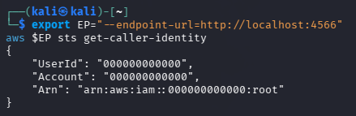
*Figure 3.1: Pre-flight terminal output verifying LocalStack endpoint responsiveness and default root caller identity (`arn:aws:iam::000000000000:root`).*

---

## 4. Task A1 — Reconstructing the Management Plane Audit Trail

### 4.1 Provisioning the Isolated Audit Store
In production environments, the audit trail destination resides in an isolated security account. In our environment, we provision a dedicated S3 bucket `mint-audit-trail` and enforce S3 Versioning:

```bash
aws $EP s3api create-bucket --bucket mint-audit-trail
aws $EP s3api put-bucket-versioning --bucket mint-audit-trail \
  --versioning-configuration Status=Enabled
```

#### Evidence: Audit Trail Bucket Creation & Versioning Configuration
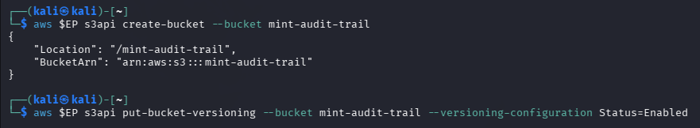
*Figure 4.1: Dedicated audit bucket `mint-audit-trail` created with S3 Versioning enabled.*

---

### 4.2 Establishing the Telemetry Baseline
To isolate the exact administrative activity generated during the exercise from prior system startup chatter, we record the baseline line count of the Docker container log:

```bash
BEFORE=$(docker logs localstack 2>&1 | wc -l)
echo "baseline: $BEFORE lines"
```

#### Evidence: LocalStack Baseline Line Count
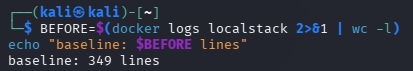
*Figure 4.2: Terminal output establishing the operational baseline at **349 lines**.*

---

### 4.3 Generating Security-Relevant Management Plane Events
We execute four distinct administrative operations that reconfigure the cloud control plane:
1. **Creation of an ephemeral S3 bucket (`mint-throwaway`)**: Infrastructure provisioning.
2. **Creation of an IAM User (`TempContractor`)**: Identity provisioning.
3. **Privilege Escalation (`AdministratorAccess` policy attachment)**: Granting full administrative rights.
4. **Deletion of the ephemeral S3 bucket (`mint-throwaway`)**: Infrastructure tear-down.

```bash
aws $EP s3api create-bucket --bucket mint-throwaway
aws $EP iam create-user --user-name TempContractor
aws $EP iam attach-user-policy --user-name TempContractor \
  --policy-arn arn:aws:iam::aws:policy/AdministratorAccess
aws $EP s3api delete-bucket --bucket mint-throwaway
```

#### Evidence: Management Plane Actions Execution
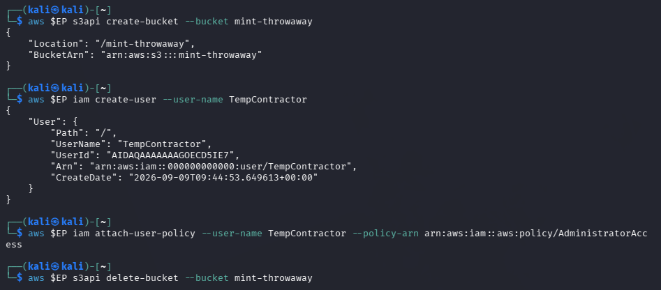
*Figure 4.3: Terminal execution of management plane operations, including IAM user creation, policy elevation, and S3 lifecycle changes.*

---

### 4.4 Telemetry Extraction & High-Trust Event Filtering
LocalStack records every served API invocation in the format `AWS <service>.<Operation> => <status>`. We extract all logs generated post-baseline and apply regular expression filtering to isolate events affecting the trust boundary:

```bash
# Extract all request logs generated after baseline
docker logs localstack 2>&1 | tail -n +$((BEFORE+1)) \
  | grep -E 'AWS [a-z0-9-]+\.[A-Za-z]+ => ' > mgmt-trail.log

wc -l mgmt-trail.log

# Filter down to operations that modify access, identities, or storage structures
grep -E '\.(CreateUser|AttachUserPolicy|DeleteUser|CreateBucket|DeleteBucket|PutBucketPolicy|ScheduleKeyDeletion) =>' mgmt-trail.log
```

#### Evidence: Extracted & Filtered Audit Trail
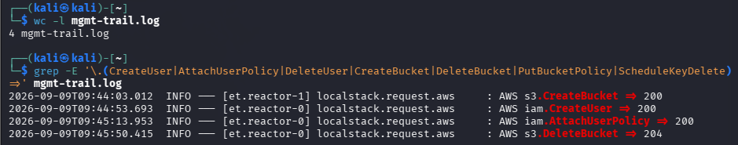
*Figure 4.4: Extracted 4 raw management plane events with millisecond timestamps and HTTP status codes ($200 / 204$).*

#### Forensic Breakdown of Reconstructed Management Events:
| Timestamp (UTC) | Service | API Operation | Response Code | Security Significance |
| :--- | :--- | :--- | :--- | :--- |
| `2026-09-09T09:44:03.012` | `s3` | `CreateBucket` | `200 OK` | Unauthorized or shadow bucket creation. |
| `2026-09-09T09:44:53.693` | `iam` | `CreateUser` | `200 OK` | Backdoor account creation (`TempContractor`). |
| `2026-09-09T09:45:13.953` | `iam` | `AttachUserPolicy` | `200 OK` | Critical privilege escalation (`AdministratorAccess`). |
| `2026-09-09T09:45:50.415` | `s3` | `DeleteBucket` | `204 No Content` | Erasure of staging bucket (`mint-throwaway`). |

---

### 4.5 Cryptographic Log Sealing (SHA-256 Digest) & Offsite Shipping
To guarantee non-repudiation and enable log file validation, we calculate a SHA-256 cryptographic digest of `mgmt-trail.log`, seal it into `mgmt-trail.sha256`, and immediately ship both files to our dedicated audit bucket:

```bash
# Generate SHA-256 seal
sha256sum mgmt-trail.log > mgmt-trail.sha256
cat mgmt-trail.sha256

# Ship both files across the trust boundary
aws $EP s3 cp mgmt-trail.log s3://mint-audit-trail/
aws $EP s3 cp mgmt-trail.sha256 s3://mint-audit-trail/
```

#### Evidence: SHA-256 Log Digest Sealing & Offsite Upload
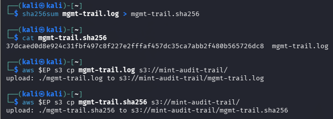
*Figure 4.5: Cryptographic hash generation (`37dcaed0d8e9...`) and upload to `s3://mint-audit-trail/`.*

- **Calculated SHA-256 Checksum:** `37dcaed0d8e924c31fbf497c8f227e2fffaf457dc35ca7abb2f480b565726dc8`

---

### 4.6 Simulating Adversary Log Tampering & Integrity Verification
An adversary who achieves local administrative access attempts to conceal their tracks by excising the `AttachUserPolicy` entry from the local log file. We simulate this attack and verify integrity against the offsite sealed digest:

```bash
# Adversary removes AttachUserPolicy to hide privilege escalation
grep -v 'AttachUserPolicy' mgmt-trail.log > t.log && mv t.log mgmt-trail.log

# Fetch authoritative golden digest back from the isolated audit store
aws $EP s3 cp s3://mint-audit-trail/mgmt-trail.sha256 ./check.sha256

# Execute cryptographic verification
sha256sum -c check.sha256
```

#### Evidence: Tamper Detection & Checksum Mismatch Alert
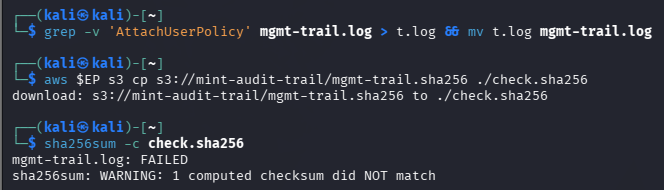
*Figure 4.6: Verification output displaying `mgmt-trail.log: FAILED` and warning of checksum mismatch.*

- **Validation Result:** `mgmt-trail.log: FAILED` | `sha256sum: WARNING: 1 computed checksum did NOT match`
- **Security Takeaway:** Because the digest was secured out-of-band in `s3://mint-audit-trail`, the adversary's local file modification was immediately detected upon integrity validation.

---

### 4.7 Production Comparison: Reconstructed Trail vs. AWS CloudTrail JSON
In production AWS environments, **AWS CloudTrail** captures rich JSON metadata for every API call. Below is the production AWS CloudTrail record corresponding to our third command (`aws iam attach-user-policy`):

```json
{
  "eventVersion": "1.09",
  "userIdentity": {
    "type": "IAMUser",
    "arn": "arn:aws:iam::123456789012:user/j.tan",
    "accountId": "123456789012",
    "userName": "j.tan",
    "sessionContext": { "mfaAuthenticated": "false" }
  },
  "eventTime": "2026-03-01T09:01:40Z",
  "eventSource": "iam.amazonaws.com",
  "eventName": "AttachUserPolicy",
  "awsRegion": "us-east-1",
  "sourceIPAddress": "203.0.113.9",
  "userAgent": "aws-cli/2.15.0 Python/3.11 Linux/6.5",
  "requestParameters": {
    "userName": "TempContractor",
    "policyArn": "arn:aws:iam::aws:policy/AdministratorAccess"
  },
  "errorCode": null,
  "readOnly": false,
  "managementEvent": true,
  "eventID": "1a2b3c4d-5e6f-7a8b-9c0d-1e2f3a4b5c6d"
}
```

#### Forensic Comparative Analysis:
```
+---------------------------+-------------------------------------------------------------------------------+
| RECONSTRUCTED LOCAL LOG   | 2026-09-09T09:45:13.953 INFO ... AWS iam.AttachUserPolicy => 200             |
+---------------------------+-------------------------------------------------------------------------------+
| LIMITATION                | Proves that AttachUserPolicy was invoked, but omits:                          |
|                           | 1. WHO invoked it (userIdentity).                                             |
|                           | 2. FROM WHERE it was invoked (sourceIPAddress, userAgent).                   |
|                           | 3. TO WHOM it was granted (requestParameters: TempContractor).               |
|                           | 4. WHAT permissions were attached (AdministratorAccess).                     |
+---------------------------+-------------------------------------------------------------------------------+
```

---

## 5. Task A2 — Backup Architecture, and Why Versioning Is Not One

### 5.1 Provisioning Primary and Disaster Recovery (DR) Buckets
We establish two separate storage entities: a primary production bucket (`mint-primary`) and a designated disaster recovery backup bucket (`mint-dr-backup`). Versioning is activated across both:

```bash
aws $EP s3api create-bucket --bucket mint-primary
aws $EP s3api create-bucket --bucket mint-dr-backup

aws $EP s3api put-bucket-versioning --bucket mint-primary \
  --versioning-configuration Status=Enabled
aws $EP s3api put-bucket-versioning --bucket mint-dr-backup \
  --versioning-configuration Status=Enabled
```

#### Evidence: Provisioning Primary and DR Buckets
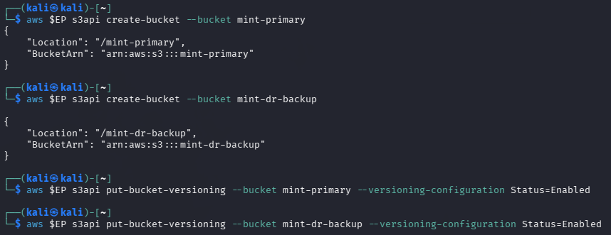
*Figure 5.1: Creation of `mint-primary` and `mint-dr-backup` buckets.*

#### Evidence: S3 Versioning Verification Across Both Buckets
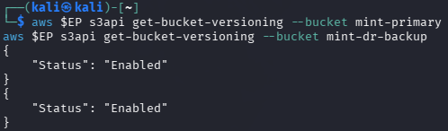
*Figure 5.2: Validation confirming `Status: Enabled` on both storage buckets.*

---

### 5.2 Synthetic Workload & Patient Record Generation
To simulate realistic medical record datasets that take measurable time to restore, we generate 200 synthetic patient records containing unique timestamps:

```bash
for i in $(seq 1 200); do
  echo "patient record $i - $(date)" > /tmp/rec$i.txt
done

ls /tmp/rec*.txt | wc -l
```

#### Evidence: Synthetic Patient Record Generation
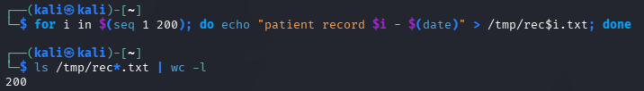
*Figure 5.3: Successful creation of 200 individual patient record files in `/tmp/`.*

---

### 5.3 Primary Ingestion & Baseline Object Count
The 200 records are synced to the primary production bucket under the `records/` prefix:

```bash
aws $EP s3 sync /tmp/ s3://mint-primary/records/ --exclude '*' --include 'rec*.txt'
aws $EP s3 ls s3://mint-primary/records/ | wc -l
```

#### Evidence: Ingestion of 200 Objects into Primary Store
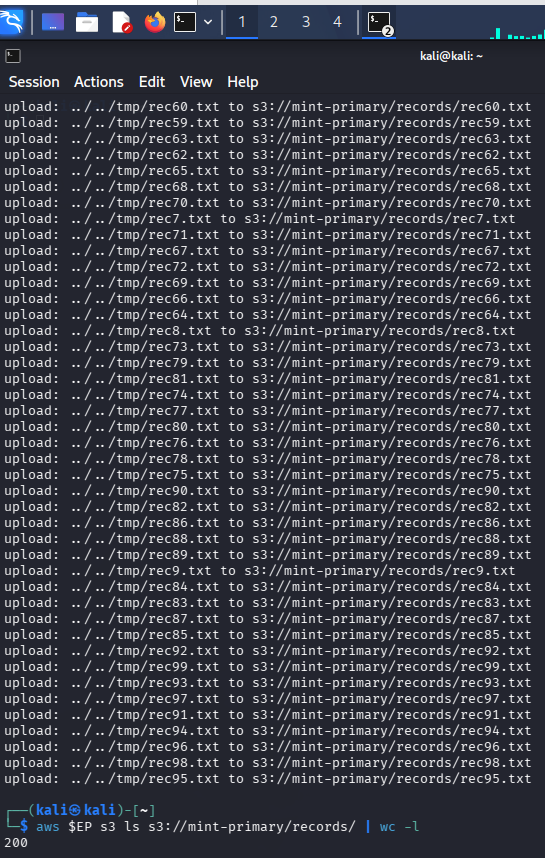
*Figure 5.4: S3 sync execution uploading 200 patient records to `s3://mint-primary/records/` and confirming a count of **200**.*

---

### 5.4 Executing the Cross-Bucket Backup Sync
An out-of-band backup synchronization is executed from `mint-primary` to `mint-dr-backup`:

```bash
# Execute backup synchronization
aws $EP s3 sync s3://mint-primary s3://mint-dr-backup

# Verify object inventory in DR bucket
aws $EP s3 ls s3://mint-dr-backup/records/ | wc -l
```

#### Evidence: Backup Synchronization to Disaster Recovery Destination
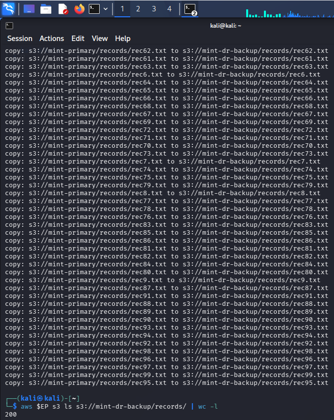
*Figure 5.5: Backup synchronization copying 200 records to `s3://mint-dr-backup/records/` and verifying a count of **200**.*

---

## 6. Task A3 — The Restore Drill (Timed BCDR Measurement)

### 6.1 Simulating a Destructive Deletion Incident
A catastrophic operational disaster or ransomware wiping event is simulated by recursively deleting all objects in the primary production records repository:

```bash
aws $EP s3 rm s3://mint-primary/records/ --recursive
aws $EP s3 ls s3://mint-primary/records/ | wc -l # Expect 0
```

#### Evidence: Destructive Deletion Incident Execution
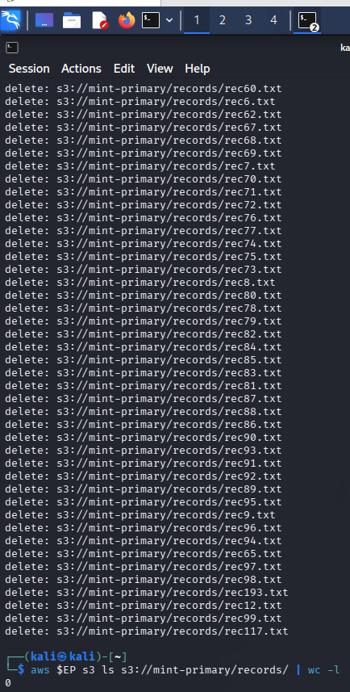
*Figure 6.1: Recursive deletion of all objects in `s3://mint-primary/records/`, reducing visible active object count to **0**.*

---

### 6.2 Timed Disaster Recovery Restoration Drill
A stopwatch-timed restoration is executed using epoch second counters (`date +%s`) to pull the entire dataset from `mint-dr-backup` back into `mint-primary`:

```bash
START=$(date +%s)
aws $EP s3 sync s3://mint-dr-backup s3://mint-primary
END=$(date +%s)

echo "Objects restored: $(aws $EP s3 ls s3://mint-primary/records/ | wc -l)"
echo "MEASURED RTO (seconds): $((END - START))"
```

#### Evidence: Timed Restore Execution & Measured RTO Output
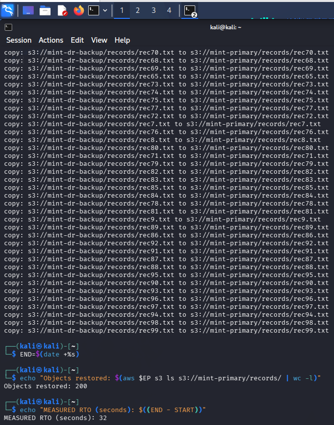
*Figure 6.2: Terminal execution of the timed restore drill, confirming **200 objects restored** in **32 seconds**.*

---

### 6.3 Measured RTO, Extrapolated RTO & RPO Metrics

| Metric | How Obtained | Value Recorded in Lab | Production Significance |
| :--- | :--- | :--- | :--- |
| **Measured RTO** | Elapsed seconds during drill for 200 objects | **32 seconds** | Empirical recovery baseline ($0.16\text{ s/object}$). |
| **Extrapolated RTO** | Linear scaling to $1,000,000$ objects | **44.44 hours** ($160,000\text{ seconds}$) | Enterprise theoretical restoration estimate. |
| **RPO** | Elapsed window between last `s3 sync` and incident | **Delta Time ($\Delta t$)** | Any data created/modified within $\Delta t$ is permanently lost. |

---

### 6.4 Mathematical Modeling & Extrapolation Analysis

#### Step 1: Unit Restoration Rate Calculation
$$\text{Unit Rate } (r) = \frac{\text{Measured Time}}{\text{Object Count}} = \frac{32\text{ seconds}}{200\text{ objects}} = 0.16\text{ seconds/object}$$

#### Step 2: Extrapolation to Enterprise Scale ($N = 1,000,000$)
$$T_{\text{extrapolated}} = 1,000,000 \times 0.16\text{ s} = 160,000\text{ seconds}$$
$$\text{Hours} = \frac{160,000}{3,600} \approx \mathbf{44.44\text{ hours}} \quad (\approx 1.85\text{ days})$$

#### Critical Critique: Why Linear Throughput Is a Dangerous Fallacy
In real-world cloud environments, assuming restoration time scales linearly ($O(N)$) from 200 objects to 1,000,000 objects is fundamentally flawed due to:
1. **API Request Rate Limiting & Throttling:** AWS S3 enforces prefix request limits (3,500 `PUT`/`COPY`/`POST`/`DELETE` and 5,500 `GET`/`HEAD` requests per second per prefix). Synchronizing 1,000,000 objects under a single prefix triggers `HTTP 503 SlowDown` backoff retries.
2. **Sequential Client Listing Latency:** The AWS CLI `sync` command lists objects in batches of 1,000 (`ListObjectsV2`). Paging through 1,000,000 object keys requires 1,000 sequential round-trips before data transfer begins.
3. **Concurrency Bottlenecks:** Default CLI worker thread pools (10 concurrent threads) saturate CPU and socket descriptors on the orchestrating host.
4. **Network & TCP Overhead:** Re-establishing TCP/TLS handshakes across millions of small files incurs catastrophic overhead compared to streaming consolidated multi-part archives.

> **Debrief Insight:** If an organization promises a **4-Hour RTO** to regulators or executive leadership, an un-optimized S3 sync that takes **44.44 hours** represents a catastrophic compliance breach. Remediation requires **AWS S3 Batch Replication**, multi-prefix partitioning, or automated snapshots.

---

## 7. Task A4 — Comparative Analysis of the Two Recovery Paths

### 7.1 Recovery Path 1: In-Place S3 Versioning & Delete Markers
When `aws s3 rm --recursive` was executed against `mint-primary` in Task A3, S3 Versioning did not delete the physical files. Instead, it inserted **Delete Markers** as the current version of each object.

We query the S3 metadata API to inspect the total count of `DeleteMarkers` and `Versions`:

```bash
aws $EP s3api list-object-versions --bucket mint-primary \
  --prefix records/ --query 'length(DeleteMarkers)'

aws $EP s3api list-object-versions --bucket mint-primary \
  --prefix records/ --query 'length(Versions)'
```

#### Evidence: Versioning Metadata Query (Delete Markers & Total Versions)
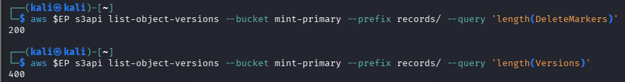
*Figure 7.1: Metadata query revealing **200 Delete Markers** and **400 total object versions** in `mint-primary`.*

---

### 7.2 Recovery Path 2: Out-of-Place Restore from Dedicated DR Bucket
Recovery Path 2 utilized the separate `mint-dr-backup` bucket to copy files back across the boundary via `aws s3 sync`.

---

### 7.3 Deep Dive: The 400-Version / 200-Delete Marker Phenomenon
A critical observation in Figure 7.1 is why `length(Versions)` equals **400** while `length(DeleteMarkers)` equals **200**:

```
+-------------------------------------------------------------------------------------------------------+
|                                LIFECYCLE OF OBJECTS IN PRIMARY STORE                                  |
+-------------------------------------------------------------------------------------------------------+
|                                                                                                       |
| 1. INITIAL INGESTION (Task A2)                                                                        |
|    - 200 objects uploaded (rec1.txt ... rec200.txt).                                                  |
|    - Total Versions = 200, Delete Markers = 0.                                                        |
|                                                                                                       |
| 2. INCIDENT DELETION (Task A3)                                                                        |
|    - aws s3 rm --recursive writes a Delete Marker on top of each object.                             |
|    - The 200 original versions remain preserved underneath the markers.                               |
|    - Total Versions = 200, Delete Markers = 200.                                                      |
|                                                                                                       |
| 3. TIMED RESTORE SYNC (Task A3)                                                                       |
|    - aws s3 sync copies 200 objects from mint-dr-backup into mint-primary.                           |
|    - Because Versioning is ENABLED, writing over a Delete Marker creates a NEW version!               |
|    - 200 Original Versions + 200 Restored Versions = 400 Total Versions.                              |
|    - Total Versions = 400, Delete Markers = 200.                                                      |
|                                                                                                       |
+-------------------------------------------------------------------------------------------------------+
```

---

### 7.4 Comprehensive Recovery Matrix

| Evaluation Dimension | Recovery Path 1: S3 Versioning (In-Place) | Recovery Path 2: Dedicated DR Backup Bucket |
| :--- | :--- | :--- |
| **Recovery Speed (RTO)** | **Near-Instantaneous ($O(1)$ metadata update):** Simply delete the 200 Delete Markers to make original objects visible immediately without data transfer. | **Transfer-Dependent ($O(N)$ network sync):** Requires pulling full payloads across buckets/network ($32\text{ s}$ for 200 files; $44.44\text{ h}$ for 1M files). |
| **Survives Bucket Deletion (`s3:DeleteBucket`)?** | **NO.** Deleting the parent bucket irrevocably purges all underlying object versions and delete markers simultaneously. | **YES.** The backup bucket is an independent entity and remains unaffected by primary bucket deletion. |
| **Survives Compromised Admin Credentials?** | **NO.** An attacker with administrative privileges can execute `s3:DeleteObjectVersion` to permanently destroy all versions without leaving markers. | **YES (if hardened).** If the backup resides in a separate account with cross-account IAM, SCPs, and MFA Delete, primary admin credentials cannot touch it. |
| **Survives Cryptographic Erasure of KMS Key?** | **NO.** If the KMS Customer Managed Key (CMK) encrypting the primary bucket is disabled or scheduled for deletion, all in-place versions become unreadable. | **YES.** The DR bucket uses an independent KMS CMK in the backup account; loss of the primary key does not impact backup decryptability. |
| **Cost Profile** | **Low-to-Medium:** Pay only for incremental version storage within the same bucket; zero cross-region or cross-account data transfer fees. | **Medium-to-High:** Incurs duplicate base storage costs, cross-region replication/transfer fees, and egress charges (mitigated via Glacier cold tiers). |

---

## 8. Lab Deliverables & Short-Answer Questions

### 8.1 Deliverable 1: Evidence Matrix

| Evidence ID | Screenshot File | Deliverable Description | Validated Result / Value |
| :--- | :--- | :--- | :--- |
| **ENV-01** | `setup_localstack_running.png` | LocalStack container health and caller identity | `arn:aws:iam::000000000000:root` |
| **A1-01** | `A1_create_bucket.png` | Provisioning `mint-audit-trail` with Versioning | S3 Bucket created and Versioning Enabled |
| **A1-02** | `A1_baseline.png` | Baseline line count of LocalStack request log | `baseline: 349 lines` |
| **A1-03** | `A1_activities.png` | Execution of 4 management plane API actions | IAM User `TempContractor`, Admin policy attached |
| **A1-04** | `A1_extract_log.png` | Filtered management plane audit trail | 4 API calls extracted with timestamps and status codes |
| **A1-05** | `A1_seal_upload.png` | Cryptographic SHA-256 seal and offsite upload | Digest `37dcaed0d8e9...` uploaded to S3 |
| **A1-06** | `A1_tamper_fail.png` | Tamper simulation and verification failure | `mgmt-trail.log: FAILED` checksum mismatch alert |
| **A2-01** | `A2_create_buckets.png` | Creation of `mint-primary` and `mint-dr-backup` | Two isolated buckets provisioned |
| **A2-02** | `A2_verify_versioning.png` | Verification of Versioning on primary and backup | Both buckets confirmed `Status: Enabled` |
| **A2-03** | `A2_create_data.png` | Synthetic dataset generation | 200 patient records generated in `/tmp/` |
| **A2-04** | `A2_primary_count.png` | Initial sync to primary store | `200` objects verified in `mint-primary/records/` |
| **A2-05** | `A2_backup_count.png` | Cross-bucket backup synchronization | `200` objects verified in `mint-dr-backup/records/` |
| **A3-01** | `A3_incident.png` | Simulated destructive deletion incident | Primary count reduced to `0` |
| **A3-02** | `A3_restore_timed.png` | Timed disaster recovery restoration drill | `200` objects restored; **MEASURED RTO: 32 seconds** |
| **A4-01** | `A4_delete_markers.png` | Post-restoration S3 versioning metadata inspection | **DeleteMarkers: 200** \| **Total Versions: 400** |

---

### 8.2 Deliverable 2: Rigorous Short-Answer Solutions (Q1 – Q5)

#### Question 1: Name three administrative actions that would appear in a management plane trail but produce no application log at all. For each, state what an attacker gains by performing it.

**Answer:**
1. **`iam:AttachUserPolicy` (or `iam:PutUserPolicy`) granting `AdministratorAccess`:**
   - *What the attacker gains:* Full, unconstrained administrative dominance over the entire cloud infrastructure (identity privilege escalation). The attacker can now create shadow accounts, modify security policies, and disable monitoring. Because this occurs entirely at the AWS IAM control plane, no running application, database, or web container generates any telemetry.
2. **`s3:PutBucketPolicy` (or `s3:PutBucketAcl`) modifying bucket access to public (`"Principal": "*"`):**
   - *What the attacker gains:* Exfiltration of sensitive enterprise assets (e.g., patient records, database backups) directly over public HTTPS endpoints without executing commands inside the application containers. Application logs remain completely silent because the workload was bypassed entirely.
3. **`kms:ScheduleKeyDeletion` (or `kms:DisableKey`):**
   - *What the attacker gains:* Cryptographic ransom and denial of service. Disabling or destroying the Customer Master Key (CMK) encrypting EBS volumes, S3 buckets, and RDS databases renders all encrypted data permanently unrecoverable across the tenant. Application logs only see downstream database crashes without capturing the root cause.

---

#### Question 2: CloudTrail log file validation, the digest you sealed in Task A1, and the hash chain you built in Lab 5, Task 4 all solve the same problem by the same mechanism. Explain the mechanism, and state why the digest must be written to a different trust boundary from the account it audits.

**Answer:**
- **The Common Mechanism:** All three techniques enforce **tamper-evidence and mathematical non-repudiation** using **cryptographic one-way hash functions (SHA-256)**. By computing a cryptographic digest over a discrete block or sequence of log entries ($H = \text{SHA-256}(\text{Data})$) and linking or publishing that digest, any subsequent modification, insertion, or deletion of a single byte completely changes the calculated hash (the avalanche effect). Verification involves recomputing the digest over the existing log file and comparing it against the authoritative stored digest ($H_{\text{computed}} \stackrel{?}{=} H_{\text{stored}}$).
- **Why the Digest Must Reside in a Different Trust Boundary:** If the authoritative digest is stored on the same server, in the same local directory, or within the same AWS account that it audits, an adversary who obtains root or administrative privileges can trivially modify both the log file *and* recalculate a matching hash file simultaneously:
  $$\text{Adversary: } \text{Edit Log} \longrightarrow \text{Run } \texttt{sha256sum new-log > digest.sha256}$$
  By shipping the digest across a **trust boundary** to a separate, dedicated Log Archive account governed by distinct IAM policies, S3 Object Lock, and restricted write-only permissions, the attacker in the primary account lacks the authorization to overwrite the offsite golden digest, guaranteeing tamper detection.

---

#### Question 3: Distinguish RTO from RPO using your own measured figures. Which of the two is improved by taking backups more frequently, and which by restoring faster?

**Answer:**
- **Recovery Time Objective (RTO):** The maximum tolerable duration of system downtime from the moment a disaster or outage occurs until data and operational services are fully restored.
  - *Lab Measured Value:* **32 seconds** to restore 200 records ($44.44\text{ hours}$ extrapolated for 1M objects).
  - *Optimization Lever:* RTO is improved by **restoring faster** (e.g., using multi-threaded parallel transfers, S3 Batch Operations, pre-warmed standby infrastructure, or metadata-level versioning rollbacks).
- **Recovery Point Objective (RPO):** The maximum acceptable data loss measured in time—representing the maximum age of data that must be recovered from backup storage for normal operations to resume.
  - *Lab Value:* The elapsed time window ($\Delta t$) between the last successful `aws s3 sync` backup and the moment the deletion incident occurred. Any patient records created in that delta window are permanently lost.
  - *Optimization Lever:* RPO is improved by **taking backups more frequently** or implementing continuous real-time replication (e.g., S3 Cross-Region Replication, synchronous streaming).

```
Timeline:
|--------------------------|------------------------------------|----------------------------|
Last Successful Backup     Incident Deletion Occurs             Restoration Complete
       [ <-------- RPO Window (Data Lost) --------> ] [ <------- RTO Window (Downtime) -------> ]
                 (Improved by Frequent Backups)               (Improved by Faster Restore)
```

---

#### Question 4: Your measured RTO was a few seconds (32 seconds). Explain why you should not report that number to a board of directors, and what you would report instead.

**Answer:**
- **Why Reporting 32 Seconds is Misleading & Negligent:** The 32-second measurement was obtained under idealized, non-production conditions:
  1. A micro-dataset of only **200 files** running on a local loopback interface (`localhost`).
  2. Zero network latency, zero bandwidth contention, and zero cloud API rate limits.
  3. No application re-indexing, DNS cutover, database consistency verification, or security sanity checks included.
  Presenting 32 seconds to executive leadership or regulators gives a dangerously false sense of security, as real enterprise workloads consist of millions of objects spanning terabytes of data.
- **What Should Be Reported Instead:**
  1. **Extrapolated Enterprise RTO:** Report the mathematically modeled recovery time for actual production volumes (e.g., $\mathbf{44.44\text{ hours}}$ for 1,000,000 objects under standard single-threaded tooling).
  2. **Identified Bottlenecks & Failure Modes:** Clearly state the sensitivity factors (API throttling, network bandwidth, listing overhead).
  3. **Architectural Target RTO with Modern Tooling:** Present a realistic, defensible SLA based on enterprise-grade automated restoration (e.g., *“Target RTO: 2 Hours utilizing AWS S3 Batch Replication across multi-prefix architecture”*).

---

#### Question 5: Using your A4 table, state one incident that versioning survives and the separate backup does not, and one that the backup survives and versioning does not.

**Answer:**
- **Incident that S3 Versioning survives and the separate backup does NOT:**
  - *Accidental object overwrite or deletion occurring inside the active backup interval (RPO window):* If an engineer accidentally overwrites or deletes an object 5 minutes after the daily backup ran, S3 Versioning instantly preserves the previous version in place ($0\text{ RPO}$ loss). A separate batch backup would not have captured any records created or modified since the last sync.
- **Incident that the separate backup survives and S3 Versioning does NOT:**
  - *Catastrophic Bucket Deletion (`aws s3 rb --force`) or Account Takeover:* If an attacker or disgruntled administrator executes `s3:DeleteBucket` on `mint-primary` or deletes objects using `s3:DeleteObjectVersion`, the entire primary bucket and all underlying version histories are permanently destroyed. The separate backup bucket (`mint-dr-backup`) in an isolated trust boundary survives completely intact.

---

## 9. Debrief Session Preparation & Strategic Discussion

### Discussion Point 1: What is your extrapolated RTO, and what assumption is it most sensitive to?
- **Extrapolated RTO:** **44.44 Hours** ($160,000\text{ seconds}$) for 1,000,000 objects.
- **Most Sensitive Assumption:** The assumption of **linear throughput scaling ($O(N)$)**. In reality, performance degrades severely due to S3 API prefix request throttling (3,500 `PUT` requests/sec per prefix), client-side `ListObjectsV2` pagination latency, and network connection saturation.

### Discussion Point 2: Your organisation promises clients a four-hour RTO. Based on your numbers, is that promise defensible? What would you need to change to make it so?
- **Defensibility:** **Completely Indefensible.** Restoring 1,000,000 records via sequential CLI `s3 sync` takes over 44 hours, exceeding the 4-hour SLA by a factor of 11.
- **Required Architectural Changes to Achieve 4-Hour RTO:**
  1. **Partitioning Across Multiple S3 Prefixes:** Distribute patient records across hash-partitioned prefixes to scale AWS S3 API limits horizontally.
  2. **AWS S3 Batch Operations / Multi-Threaded Tooling:** Replace standard CLI sync with S3 Batch Operations or AWS DataSync utilizing parallel worker clusters.
  3. **Continuous S3 Cross-Region Replication (CRR):** Maintain a hot-standby replica bucket with sub-second replication latency, enabling instant DNS/route failover ($RTO \approx 5\text{ minutes}$).

### Discussion Point 3: Who should be alerted when `attach-user-policy` grants administrator rights, and how quickly?
- **Target Audience:** The Security Operations Center (SOC) Lead, Lead Cloud Architect, and Automated Incident Response Engine (via PagerDuty / OpsGenie).
- **Required Latency:** **Sub-minute (< 60 seconds).** Granting `AdministratorAccess` represents the highest possible privilege escalation. AWS EventBridge must trigger an automated Lambda function immediately upon intercepting the CloudTrail event to alert on-call personnel and optionally quarantine the identity automatically.

### Discussion Point 4: If an attacker obtains an administrator credential, which of your controls still holds — and for how long?
- **Controls that FAIL Immediately:** Local log files, standard S3 bucket data, in-place versioning, security group configurations, and IAM permissions within the compromised account.
- **Controls that STILL HOLD:**
  1. **Cross-Account Audit Store (`mint-audit-trail` in separate account):** Holds indefinitely because the compromised credential lacks IAM rights in the destination security account.
  2. **S3 Object Lock (Compliance Mode):** Protects backup objects against deletion even by the root administrator until the retention retention timer expires.
  3. **AWS Organizations Service Control Policies (SCPs):** Centrally enforced guardrails at the management root level prevent the administrator from disabling CloudTrail or leaving the organization.

---

## 10. Infrastructure Hardening & Enterprise BCDR Recommendations

```
+----------------------------------------------------------------------------------------------------------+
|                                    ENTERPRISE HARDENING BLUEPRINT                                        |
+----------------------------------------------------------------------------------------------------------+
|                                                                                                          |
|   PRIMARY ACCOUNT (Workload)                       LOG ARCHIVE ACCOUNT (Isolated Trust Boundary)         |
|   +---------------------------------------+        +-------------------------------------------------+   |
|   | - Application & Workload Containers   |        | - S3 Bucket: Central CloudTrail & Config Trails |   |
|   | - S3 Primary Store (KMS Key A)        |        | - S3 Object Lock: COMPLIANCE Mode (WORM)        |   |
|   | - S3 Versioning + MFA Delete Enabled  | ===>   | - Bucket Policy: Deny s3:Delete* to ALL Users   |   |
|   | - CloudWatch Logs / EventBridge Rules | (Push) | - SHA-256 Digest Validation Logs (Cross-Account)|   |
|   +---------------------------------------+        +-------------------------------------------------+   |
|                      |                                                                                   |
|                      v (Continuous Cross-Region Replication)                                             |
|   DISASTER RECOVERY ACCOUNT (Secondary Region)                                                           |
|   +--------------------------------------------------------------------------------------------------+   |
|   | - S3 Hot-Standby DR Bucket (KMS Key B)                                                           |   |
|   | - Pre-Warmed Infrastructure & Automated Failover Route 53 Health Checks                          |   |
|   +--------------------------------------------------------------------------------------------------+   |
+----------------------------------------------------------------------------------------------------------+
```

---

## 11. Cleanup & Teardown Protocol

To ensure environment hygiene and remove test resources, the following commands are executed:

```bash
# Force delete disaster recovery and audit trail buckets
aws $EP s3 rb s3://mint-dr-backup --force
aws $EP s3 rb s3://mint-audit-trail --force
aws $EP s3 rb s3://mint-primary --force

# Detach administrator policy and remove contractor identity
aws $EP iam detach-user-policy --user-name TempContractor \
  --policy-arn arn:aws:iam::aws:policy/AdministratorAccess
aws $EP iam delete-user --user-name TempContractor

# Terminate and remove LocalStack container
docker rm -f localstack

# Remove local temporary artifacts and checksum files
rm -f /tmp/rec*.txt mgmt-trail.log mgmt-trail.sha256 check.sha256
```

---

## 12. References & Standards
1. **AWS CloudTrail Documentation:** *Log File Integrity Validation Mechanics and Hash Digest Verification.*  
   [https://docs.aws.amazon.com/awscloudtrail/latest/userguide/cloudtrail-log-file-validation-intro.html](https://docs.aws.amazon.com/awscloudtrail/latest/userguide/cloudtrail-log-file-validation-intro.html)
2. **Cloud Security Alliance (CSA):** *Security Guidance for Critical Areas of Focus in Cloud Computing v5.0.* Domain 6 (Security Monitoring) & Domain 11 (Incident Response and Business Continuity).
3. **UniKL MIIT Lab Series:** *IKB42603 Lab 5 (Centralised Logging & Incident Detection)* & *Lab 6 (Object Storage Security and Versioning Lifecycle).*
4. **NIST SP 800-34 Rev. 1:** *Contingency Planning Guide for Federal Information Systems.*
5. **NIST SP 800-86:** *Guide to Integrating Forensic Techniques into Incident Response.*

---
*Report compiled and submitted for IKB42603 Cloud Computing Security Essentials.*  
**Author:** Muhammad Haqiem Bin Mohd Fauzi (52215225398)
