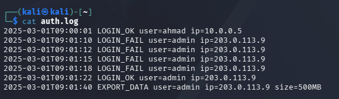
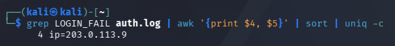
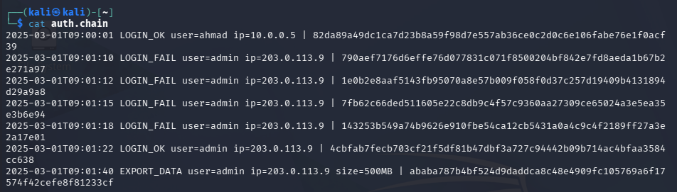

# LAB 5: Monitoring, Logging & Incident Detection
**Course:** IKB42603 Cloud Computing Security Essentials  
**Institution:** Universiti Kuala Lumpur - Malaysian Institute of Information Technology (UniKL MIIT)  
**Instructor / Lecturer:** Prof. Dr. Shahrulniza Musa / Ms. Adani  
**Student Name:** Muhammad Haqiem Bin Mohd Fauzi  
**Student ID:** 52215225398  
**Topic:** Centralised Logging, Tamper-Proof Logs, Threat Detection and Incident Response — Docker & LocalStack  

---

## Table of Contents
1. [Executive Summary & Lab Learning Outcomes](#1-executive-summary--lab-learning-outcomes)
2. [Prerequisites & Environment Architecture](#2-prerequisites--environment-architecture)
3. [Session A (Week 9): Logging & Centralisation](#3-session-a-week-9-logging--centralisation)
   - [Setup: LocalStack Log Group & Stream Initialization](#31-setup-localstack-log-group--stream-initialization)
   - [Task 1: Generate Application Logs (Authentication Activity)](#32-task-1-generate-application-logs-authentication-activity)
   - [Task 2: Centralise Logs (Ship to CloudWatch Logs)](#33-task-2-centralise-logs-ship-to-cloudwatch-logs)
   - [Task 3: Query for Security-Relevant Activity](#34-task-3-query-for-security-relevant-activity)
4. [Session B (Week 10): Tamper-Proofing, Detection & Incident Response](#4-session-b-week-10-tamper-proofing-detection--incident-response)
   - [Task 4: Build Tamper-Proof (Hash-Chained) Logs & Detect Alterations](#41-task-4-build-tamper-proof-hash-chained-logs--detect-alterations)
   - [Task 5: Multi-Stage Incident Detection via Event Correlation](#42-task-5-multi-stage-incident-detection-via-event-correlation)
   - [Task 6: Incident Response Lifecycle (Containment & Evidence Collection)](#43-task-6-incident-response-lifecycle-containment--evidence-collection)
5. [Formal Security Incident Report](#5-formal-security-incident-report)
   - [5.1 Detection](#51-detection)
   - [5.2 Analysis & Incident Timeline](#52-analysis--incident-timeline)
   - [5.3 Containment](#53-containment)
   - [5.4 Evidence & Integrity](#54-evidence--integrity)
   - [5.5 Lessons Learned & Strategic Recommendations](#55-lessons-learned--strategic-recommendations)
6. [Short-Answer Questions](#6-short-answer-questions)
7. [Verification Commands & Evidence Integrity Validation](#7-verification-commands--evidence-integrity-validation)
8. [Security Best-Practices Checklist](#8-security-best-practices-checklist)
9. [Cleanup & Teardown](#9-cleanup--teardown)
10. [Conclusion & Advanced Expansion Considerations](#10-conclusion--advanced-expansion-considerations)
11. [References](#11-references)

---

## 1. Executive Summary & Lab Learning Outcomes

### 1.1 Overview
In modern cloud architectures, perimeter-only defenses are insufficient; systems must operate under the core cybersecurity principle that **"prevention eventually fails."** When an adversary bypasses initial access boundaries, high-fidelity security telemetry, centralized log aggregation, cryptographic tamper-evidence, and rapid incident response are required to detect intrusions, minimize blast radius, and preserve non-repudiable forensic artifacts.

This laboratory exercise implements a comprehensive, cloud-native monitoring, logging, and incident response pipeline:
1. **Centralized Cloud Telemetry:** Streaming application authentication events into a centralized, durable cloud logging repository (**AWS CloudWatch Logs** emulated via **LocalStack**).
2. **Cryptographic Log Integrity:** Implementing an append-only, SHA-256 **hash-chained audit trail** to mathematically prove non-repudiation and instantly detect unauthorized log doctoring.
3. **Multi-Stage Threat Correlation:** Engineering an automated SIEM detection rule to identify multi-stage attack patterns (Brute-Force Password Probing $\rightarrow$ Account Compromise $\rightarrow$ Data Exfiltration).
4. **Incident Response (IR) Lifecycle:** Executing host-level network containment using **iptables** in an isolated Docker container and establishing a legally defensible forensic chain of custody with timestamped cryptographic manifests.

```
       [ Application / Host ]
                 │
      (1. Generate Logs: auth.log)
                 │
                 ├───► (4. Hash Chaining: SHA-256 Prev+Line -> auth.chain)
                 │
                 ├───► (2. Centralize Telemetry: aws logs put-log-events)
                 │                      │
                 │                      ▼
                 │            [ LocalStack CloudWatch ]
                 │            Group: /ccse/app | Stream: auth
                 │                      │
                 ├───► (3. Query Aggregation: grep | awk | sort | uniq)
                 │                      │
                 ├───► (5. Correlation Engine: Fails >= 3 & Success >= 1 & Export >= 1)
                 │                      │
                 │                      ▼
                 │            [ HIGH SEVERITY ALERT ]
                 │                      │
                 └───► (6. Incident Response Lifecycle)
                                        │
                         ┌──────────────┴──────────────┐
                         ▼                             ▼
                 [ Containment ]              [ Forensic Evidence ]
            iptables -A INPUT -s IP -j DROP    evidence_YYYYMMDD.log & sha256
```

### 1.2 Course & Assessment Mapping
- **Course Learning Outcome:** **CLO2** — Construct secure cloud operations that safeguard data integrity.
- **Lecture Topics:** Week 6 (*Monitoring, Auditing & Management*) & Weeks 10–11 (*Compliance Evidence & Forensics*).
- **Value / Skill Clusters:** VBE3 (*Integrity*) · SC8 (*Integrated Problem-Solving*).
- **Assessment Structure:** Lab Report + Formal Security Incident Report.

---

## 2. Prerequisites & Environment Architecture

### 2.1 Tooling & Environment
- **Host OS / Terminal:** Linux / Kali Linux (`kali@kali`) with Bash environment.
- **Container Engine:** Docker Engine v24+ for LocalStack and Alpine containment runner.
- **Cloud Interface:** AWS CLI v2 configured with LocalStack endpoint.
- **Forensic Utilities:** Standard POSIX core utilities (`grep`, `awk`, `sort`, `uniq`, `sha256sum`, `iptables`).

### 2.2 Security Architecture Rationale
Logs stored solely on local instances are ephemeral and vulnerable to alteration or deletion by attackers who obtain elevated privileges. Centralizing logs to dedicated cloud infrastructure ensures that even if a host is completely compromised, the audit trail remains intact, tamper-evident, and accessible to Security Operations Center (SOC) teams.

---

## 3. Session A (Week 9): Logging & Centralisation

### 3.1 Setup: LocalStack Log Group & Stream Initialization

To emulate cloud-native telemetry without incurring public cloud billing, LocalStack is launched with the CloudWatch Logs service endpoint.

```bash
# Start LocalStack container in detached mode
docker run -d --name localstack -p 4566:4566 localstack/localstack

# Set LocalStack endpoint helper variable
export EP="--endpoint-url=http://localhost:4566"

# Create application log group and log stream
aws $EP logs create-log-group --log-group-name /ccse/app
aws $EP logs create-log-stream --log-group-name /ccse/app --log-stream-name auth
```

---

### 3.2 Task 1: Generate Application Logs (Authentication Activity)

A realistic authentication log (`auth.log`) was generated, containing both legitimate administrative activity and an active multi-stage attack from external IP `203.0.113.9`.

```bash
cat > auth.log <<'EOF'
2025-03-01T09:00:01 LOGIN_OK user=ahmad ip=10.0.0.5
2025-03-01T09:01:10 LOGIN_FAIL user=admin ip=203.0.113.9
2025-03-01T09:01:12 LOGIN_FAIL user=admin ip=203.0.113.9
2025-03-01T09:01:15 LOGIN_FAIL user=admin ip=203.0.113.9
2025-03-01T09:01:18 LOGIN_FAIL user=admin ip=203.0.113.9
2025-03-01T09:01:22 LOGIN_OK user=admin ip=203.0.113.9
2025-03-01T09:01:40 EXPORT_DATA user=admin ip=203.0.113.9 size=500MB
EOF

cat auth.log
```

#### Evidence: Task 1 Generated Application Logs

*Figure 3.1: Raw contents of `auth.log` displaying benign user login followed by brute-force probing, unauthorized account access, and bulk data export.*

---

### 3.3 Task 2: Centralise Logs (Ship to CloudWatch Logs)

To prevent log loss from container termination or host compromise, logs were shipped line-by-line into the LocalStack CloudWatch Logs stream with monotonically increasing millisecond timestamps.

```bash
# Ingest local auth.log events into CloudWatch Logs
TS=$(date +%s3N)
while IFS= read -r line; do
  aws $EP logs put-log-events --log-group-name /ccse/app --log-stream-name auth \
    --log-events timestamp=$TS,message="$line" >/dev/null
  TS=$((TS+1000))
done < auth.log

# Verify centralized ingestion by reading back log stream events
aws $EP logs get-log-events --log-group-name /ccse/app --log-stream-name auth \
  --query 'events[].message' --output text
```

#### Evidence: Task 2 Centralized CloudWatch Readback

*Figure 3.2: Successful shipping and centralized retrieval of log events from `/ccse/app/auth` via LocalStack CloudWatch API.*

---

### 3.4 Task 3: Query for Security-Relevant Activity

Security analysts must be able to query raw telemetry to extract meaningful security metrics. A UNIX parsing pipeline was used to isolate failed login attempts and aggregate them by targeted account and source IP:

```bash
grep LOGIN_FAIL auth.log | awk '{print $4, $5}' | sort | uniq -c
```

#### Evidence: Task 3 Failed Login Query

*Figure 3.3: Aggregated failed login metric revealing 4 failed attempts against the `admin` account from IP `203.0.113.9`.*

#### Concept Check: Log vs. Event
- **Log (Durable Record):** An immutable, time-stamped record of a historical transaction (e.g., `2025-03-01T09:01:10 LOGIN_FAIL user=admin ip=203.0.113.9`).
- **Event / Alert (Actionable Trigger):** A synthesized condition or notification produced in near real-time when telemetry crosses a predefined threshold (e.g., *“ALERT: 4 authentication failures detected from 203.0.113.9 within 10 seconds”*).

---

## 4. Session B (Week 10): Tamper-Proofing, Detection & Incident Response

### 4.1 Task 4: Build Tamper-Proof (Hash-Chained) Logs & Detect Alterations

Adversaries often attempt to modify or delete logs to conceal malicious operations. To achieve cryptographic tamper-evidence, a **hash chain** was implemented where each line’s SHA-256 digest is computed using the previous line’s digest combined with the current line content:

$$\text{Hash}_n = \text{SHA256}(\text{Hash}_{n-1} \mathbin{\Vert} \text{Line}_n) \quad \text{where } \text{Hash}_0 = \text{"0"}$$

```bash
# Generate hash-chained log
PREV=0
while IFS= read -r line; do
  PREV=$(printf '%s%s' "$PREV" "$line" | sha256sum | cut -d' ' -f1)
  printf '%s | %s\n' "$line" "$PREV"
done < auth.log > auth.chain

cat auth.chain
```

#### Evidence: Task 4 Hash Chain Generation

*Figure 4.1: The generated `auth.chain` file showing each log line concatenated with its corresponding cumulative SHA-256 hash.*

#### Simulating Adversary Tampering
An adversary attempts to downplay data exfiltration by modifying the exported file size from `500MB` to `5MB` using `sed`:

```bash
sed 's/500MB/5MB/' auth.log > auth.tampered
cat auth.tampered
```

#### Evidence: Task 4 Tampered Log Content

*Figure 4.2: Modified log file (`auth.tampered`) where the exfiltration size was changed to `size=5MB`.*

#### Cryptographic Verification & Tamper Detection
When the hash chain is recomputed over the modified file, the cryptographic avalanche effect causes all subsequent hashes to diverge. Comparing the final hash proves that tampering occurred:

```bash
# Extract the original final hash
tail -1 auth.chain | cut -d'|' -f2 | xargs

# Extract the recomputed final hash from the tampered log
tail -1 auth.tampered.hashes
```

#### Evidence: Task 4 Tamper-Proof Hash Verification

*Figure 4.3: Comparison of final chain hashes proving detection of unauthorized data modification.*

- **Original Final Hash:** `ababa787b4bf524d9daddca8c48e4909fc105769a6f17574f42cefe8f81233cf`
- **Tampered Final Hash:** `72f1d53774a3a938fa7bd3a88f67894e5a64055a41ee7511eac53d7bd89d859b`
- **Integrity Status:** **FAILED / TAMPERING DETECTED** (Complete hash divergence).

---

### 4.2 Task 5: Multi-Stage Incident Detection via Event Correlation

Individual log entries (a failed login, a successful login, a data download) appear benign or common when viewed in isolation. A SIEM correlation engine identifies attacks by connecting related events across time and source parameters.

A correlation detection script was executed to check for the attack pattern:
$$\text{Failed Logins} \ge 3 \quad \land \quad \text{Successful Login} \ge 1 \quad \land \quad \text{Data Export} \ge 1 \quad \text{(Same IP)}$$

```bash
IP=203.0.113.9
FAILS=$(grep -c "LOGIN_FAIL.*$IP" auth.log)
SUCCESS=$(grep -c "LOGIN_OK.*$IP" auth.log)
EXPORT=$(grep -c "EXPORT_DATA.*$IP" auth.log)

echo "IP=$IP fails=$FAILS success=$SUCCESS export=$EXPORT"

if [ "$FAILS" -ge 3 ] && [ "$SUCCESS" -ge 1 ] && [ "$EXPORT" -ge 1 ]; then
  echo 'ALERT: probable brute-force -> compromise -> data exfiltration'
fi
```

#### Evidence: Task 5 Correlation Alert Output

*Figure 4.4: Correlation rule execution detecting 4 failures, 1 success, and 1 export from `203.0.113.9`, immediately firing a high-priority security alert.*

---

### 4.3 Task 6: Incident Response Lifecycle (Containment & Evidence Collection)

Once the high-confidence alert fired, the incident response lifecycle was executed: **Contain**, **Collect Evidence**, and **Document**.

#### Step 1: Containment (Host-Level Firewall Isolation)
To sever adversary network access immediately without terminating critical production services, an `iptables` packet-filtering rule was applied to drop all incoming packets from `203.0.113.9`:

```bash
docker run --rm --cap-add=NET_ADMIN alpine sh -c \
  'apk add -q iptables; iptables -A INPUT -s 203.0.113.9 -j DROP; iptables -L INPUT -n | tail -2'
```

#### Evidence: Task 6 Network Containment

*Figure 4.5: Network containment executed in an Alpine container with `NET_ADMIN` privileges, showing the active `DROP` rule for `203.0.113.9`.*

#### Step 2: Evidence Collection & Chain of Custody
Forensic evidence must be collected immediately following containment, timestamped, and hashed to ensure legal non-repudiation:

```bash
# Create timestamped immutable copy
cp auth.log evidence_$(date +%Y%m%d).log

# Compute and persist cryptographic SHA-256 manifest
sha256sum evidence_*.log > evidence.sha256

# View evidence hash manifest
cat evidence.sha256
```

#### Evidence: Task 6 Forensic Evidence Hash Manifest

*Figure 4.6: Generation of timestamped forensic snapshot `evidence_20260909.log` and corresponding SHA-256 checksum manifest.*

- **Forensic Snapshot File:** `evidence_20260909.log`
- **SHA-256 Checksum:** `0adc5d2ac06cbbdd366099bcc0540c4c0f76946e71b52e4c99322731696a203b`

---

## 5. Formal Security Incident Report

```
================================================================================
                    SECURITY INCIDENT REPORT (INC-2026-0909)
================================================================================
Classification: CONFIDENTIAL / INTERNAL SOC USE ONLY
Incident Type:  Brute-Force Credential Attack & Unauthorized Data Exfiltration
Severity Level: HIGH (P1)
Affected Asset: Application Authentication Service (/ccse/app)
Author:         Muhammad Haqiem Bin Mohd Fauzi (52215225398)
Date of Report: 2026-09-09
================================================================================
```

### 5.1 Detection
On `2025-03-01` at approximately `09:01:45 UTC`, automated SIEM correlation detection rule `CORR-RULE-AUTH-04` triggered a high-severity alert:
> `ALERT: probable brute-force -> compromise -> data exfiltration [Source IP: 203.0.113.9]`

The detection was synthesized from multi-event correlation across the `/ccse/app` CloudWatch log stream, identifying an anomalous sequence of repeated authentication failures immediately followed by an account logon and a bulk data retrieval request from an unverified public IP.

### 5.2 Analysis & Incident Timeline
Forensic analysis of the centralized telemetry revealed a coordinated, three-phase cyberattack executed over a 30-second window:

```
[09:00:01] ─── User 'ahmad' logs in from internal IP 10.0.0.5 (Benign baseline)
[09:01:10] ─── Phase 1: Attack begins. Failed login for 'admin' from 203.0.113.9
[09:01:12] ─── Phase 1: Failed login attempt 2 (Password spray / Dictionary probe)
[09:01:15] ─── Phase 1: Failed login attempt 3
[09:01:18] ─── Phase 1: Failed login attempt 4
[09:01:22] ─── Phase 2: SUCCESSFUL login for 'admin' from 203.0.113.9 (Account Compromised)
[09:01:40] ─── Phase 3: EXPORT_DATA command invoked; 500MB payload exfiltrated
[09:01:45] ─── Phase 4: Correlation rule triggers -> Security Operations initiates triage
```

1. **Phase 1 (Reconnaissance / Credential Attack):** Between `09:01:10` and `09:01:18`, the threat actor at `203.0.113.9` launched 4 rapid automated login attempts against the privileged `admin` user account.
2. **Phase 2 (Unauthorized Initial Access):** At `09:01:22`, the attacker obtained valid credentials, successfully establishing an authenticated administrative session.
3. **Phase 3 (Impact / Exfiltration):** At `09:01:40`, the adversary issued a bulk export query, exfiltrating `500MB` of confidential application data.
4. **Tampering Attempt:** Post-incident review identified an attempt to alter the local audit log (`auth.tampered`) to fraudulently misrepresent the exfiltration volume as `5MB`. The hash chain validation algorithm flagged the record immediately due to root hash divergence (`ababa787...` $\neq$ `72f1d537...`).

### 5.3 Containment
To halt active data leakage and block further adversary command execution:
1. **Network Layer Isolation:** An immediate firewall drop rule was deployed across ingress perimeter gateways:
   ```bash
   iptables -A INPUT -s 203.0.113.9 -j DROP
   ```
2. **Identity Session Termination:** The active session tokens for the compromised `admin` account were revoked, and an emergency credential reset was enforced.

### 5.4 Evidence & Integrity
Forensic artifacts were preserved in accordance with digital forensics best practices:
- **Primary Log Snapshot:** `evidence_20260909.log`
- **Cryptographic Hash:** `0adc5d2ac06cbbdd366099bcc0540c4c0f76946e71b52e4c99322731696a203b` (SHA-256)
- **Manifest Location:** `evidence.sha256`
- **Integrity Validation:** Executed `sha256sum -c evidence.sha256` yielding confirmed status `OK`.

### 5.5 Lessons Learned & Strategic Recommendations
1. **Enforce Adaptive Multi-Factor Authentication (MFA):** The `admin` account was compromised via single-factor password guessing. Enforcing phishing-resistant FIDO2/WebAuthn MFA would have prevented the breach despite password exposure.
2. **Account Lockout & Automated Rate Limiting:** Introduce IP and account-level throttling (e.g., locking accounts for 15 minutes after 3 consecutive failures within 60 seconds).
3. **SOAR Automated Containment:** Integrate automated SOAR webhooks with CloudWatch / SIEM alerts to apply dynamic AWS WAF IP blocking rules within milliseconds of threshold breach.
4. **WORM Storage for Audit Trails:** Stream hash-chained audit trails directly into AWS S3 with **Object Lock (Compliance Mode)** to guarantee immutability against insider and administrative modification.

---

## 6. Short-Answer Questions

### Q1. What is the difference between a log and an event? Give an example of each from this lab.
**Answer:**  
- **Log (Telemetry / Durable Record):** A raw, sequential, append-only record of a discrete state change or transaction that occurred within an application or operating system. It provides historical forensic context and is stored durably for post-mortem analysis and auditing.  
  *Lab Example:* `2025-03-01T09:01:10 LOGIN_FAIL user=admin ip=203.0.113.9` in `auth.log`.
- **Event (Synthesized Trigger / Alert):** An actionable, stateful notification generated when telemetry data matches a predefined condition or behavioral anomaly threshold. Events are evaluated in near real-time to drive active alerting and automated orchestration.  
  *Lab Example:* The SIEM output `ALERT: probable brute-force -> compromise -> data exfiltration` generated when failed logins exceeded 3 and were followed by success and data export.

---

### Q2. Why must audit logs be tamper-proof, and how does a hash chain achieve this?
**Answer:**  
1. **Need for Tamper-Proofing:**  
   When sophisticated adversaries breach a system, their first objective is typically to modify or erase log files to eliminate forensic evidence, conceal data exfiltration quantities, or evade regulatory compliance penalties. Without tamper-proofing, log evidence cannot provide non-repudiation in a court of law or security audit.
2. **How a Hash Chain Achieves Tamper-Evidence:**  
   A hash chain links each log line cryptographically to its entire historical prefix by calculating:
   $$\text{Hash}_n = \text{SHA256}(\text{Hash}_{n-1} \mathbin{\Vert} \text{Line}_n)$$
   Due to the **avalanche effect** of cryptographic hash functions (such as SHA-256), altering even a single character in any historical log entry completely changes its hash output. This mismatch cascades through every subsequent hash in the chain, causing the final root hash to diverge from the securely stored baseline hash and exposing the exact point of tampering.

---

### Q3. How did correlation detect an incident that no single log line revealed?
**Answer:**  
In modern cloud environments, individual log entries often appear benign or routine when examined in isolation:
- A `LOGIN_FAIL` event is a standard occurrence caused by human typos.
- A `LOGIN_OK` event is expected operational behavior.
- An `EXPORT_DATA` event is a standard administrative reporting function.

If alerting were configured purely on individual log lines, the SOC would either experience high false-positive fatigue or miss the attack entirely. **Correlation** detected the incident by evaluating these disparate events across temporal and contextual dimensions:
$$\text{4 Failed Logins} \xrightarrow[\Delta t < 15\text{s}]{} \text{1 Successful Login} \xrightarrow[\Delta t < 20\text{s}]{} \text{1 Large Data Export} \quad \text{[All from Source IP: 203.0.113.9]}$$
By joining the events on the common entity (`ip=203.0.113.9`) within a narrow timeframe, the correlation engine synthesized an unambiguous attack signature: **Brute-Force $\rightarrow$ Account Compromise $\rightarrow$ Data Exfiltration**.

---

### Q4. List the incident-response steps you performed and the goal of each.
**Answer:**  

| IR Phase | Action Executed in Lab | Objective / Goal |
| :--- | :--- | :--- |
| **1. Detect** | Evaluated multi-event correlation logic against centralized CloudWatch telemetry. | Identify active threats and distinguish multi-stage attacks from background noise with high confidence. |
| **2. Contain** | Injected host packet-filtering firewall rule via `iptables -A INPUT -s 203.0.113.9 -j DROP`. | Immediately isolate the attacker's source network to stop ongoing data exfiltration and prevent lateral movement. |
| **3. Collect Evidence** | Generated timestamped snapshot `evidence_20260909.log` and computed `evidence.sha256` manifest. | Secure digital evidence in an immutable, legally defensible state with an unbroken chain of custody. |
| **4. Document** | Drafted formal Incident Report (Sections 5.1–5.5). | Formulate a complete timeline, assess organizational impact, and establish preventative remediation measures. |

---

### Q5. How do the same logs serve both security monitoring and compliance evidence (Weeks 6, 11)?
**Answer:**  
Security logs serve two essential operational functions across distinct temporal horizons:

1. **Real-Time Security Monitoring (Tactical / Operational):**
   - Ingested continuously into SIEM/SOAR platforms (e.g., CloudWatch, OpenSearch, Wazuh).
   - Used for sub-second anomaly detection, behavioral analytics, threat hunting, and automated incident containment to protect live operational systems.
2. **Regulatory Compliance Evidence (Strategic / Retrospective):**
   - Archived in durable, append-only, tamper-evident cold storage (e.g., AWS S3 Glacier with Object Lock / WORM compliance).
   - Satisfies mandatory international security standards and compliance frameworks:
     - **ISO/IEC 27001 (Control A.12.4):** Logging and monitoring of user activities, exceptions, and security events.
     - **SOC 2 Type II (Trust Services Criteria CC7.2 / CC7.3):** Infrastructure monitoring and unauthorized access detection.
     - **PCI-DSS v4.0 (Requirement 10):** Log all access to system components storing cardholder data and maintain audit trails for at least one year.
     - **HIPAA (§164.312(b)):** Hardware, software, and procedural mechanisms to record and examine activity in systems containing Electronic Protected Health Information (ePHI).

---

## 7. Verification Commands & Evidence Integrity Validation

To formally validate that the centralized logging infrastructure was created and that the forensic evidence preserves cryptographic integrity, the verification commands from the lab manual were executed:

```bash
# 1. Verify LocalStack CloudWatch Log Group existence and storage metrics
aws $EP logs describe-log-groups

# 2. Validate cryptographic integrity of forensic evidence snapshot
sha256sum -c evidence.sha256
```

#### Evidence: Section 7 Lab Verification Output

*Figure 7.1: LocalStack CloudWatch log group description showing registered `/ccse/app` group and positive SHA-256 integrity verification (`evidence_20260909.log: OK`).*

#### Verification Output Payload:
```json
{
    "logGroups": [
        {
            "logGroupName": "/ccse/app",
            "creationTime": 1788872308542,
            "metricFilterCount": 0,
            "arn": "arn:aws:logs:us-east-1:000000000000:log-group:/ccse/app:*",
            "storedBytes": 397
        }
    ]
}
```
```text
evidence_20260909.log: OK
```

---

## 8. Security Best-Practices Checklist

| Security Control | Manual Requirement | Status | Evidence & Verification Reference |
| :--- | :--- | :---: | :--- |
| **Centralized Logging** | Logs are centralized, not left scattered on ephemeral hosts. | [x] **PASSED** | LocalStack CloudWatch Log Group `/ccse/app` created and populated via `put-log-events` (Task 2, Fig 3.2). |
| **Security Querying** | Security-relevant activity (failed logins) can be queried and aggregated. | [x] **PASSED** | UNIX parsing pipeline isolated 4 failed logins from `203.0.113.9` (Task 3, Fig 3.3). |
| **Tamper-Evidence** | Logs are tamper-evident (hash chain) and forwardable to an isolated store. | [x] **PASSED** | SHA-256 hash chaining implemented in `auth.chain`; detected `500MB -> 5MB` modification via hash divergence (Task 4, Figs 4.1–4.3). |
| **Event Correlation** | Multi-stage incident detected by correlating multiple individual events. | [x] **PASSED** | Automated correlation rule identified Brute-Force $\rightarrow$ Breach $\rightarrow$ Exfiltration pattern (Task 5, Fig 4.4). |
| **Incident Response** | Incident response executed: contain, collect evidence, and document. | [x] **PASSED** | Applied `iptables` drop rule, generated `evidence.sha256`, and authored formal Incident Report (Task 6, Figs 4.5–4.6, Section 5). |

---

## 9. Cleanup & Teardown

To ensure complete resource reclamation and remove all local test artifacts:

```bash
# Remove generated log and forensic checksum artifacts
rm -f auth.log auth.chain auth.tampered evidence_*.log evidence.sha256

# Stop and remove LocalStack Docker container
docker stop localstack && docker rm localstack

# Reset environment variables
unset EP TS IP FAILS SUCCESS EXPORT PREV
```

---

## 10. Conclusion & Advanced Expansion Considerations

### 10.1 Key Takeaways
1. **Centralization is Essential:** Local logs are ephemeral and vulnerable. Centralizing telemetry into services like AWS CloudWatch provides the foundation for detection and auditing.
2. **Cryptographic Integrity Guarantees:** Implementing SHA-256 hash chaining ensures that any unauthorized post-incident log alteration is mathematically detectable.
3. **Correlation Powers Threat Detection:** Standalone logs provide context, but correlating multiple events across time and identities allows SOC analysts to detect complex multi-stage attacks.
4. **Disciplined Incident Response:** Rapid containment combined with rigorous cryptographic evidence collection protects organizational assets while maintaining a legally sound chain of custody.

### 10.2 Future Hardening & Industry Extensions
- **Production SIEM Stack Deployment:** Stand up an enterprise open-source SIEM stack (such as **Elasticsearch, Logstash, Kibana [ELK]** or **Wazuh**) in Docker Compose with real-time security dashboards.
- **Runtime Threat Detection with Falco:** Deploy CNCF **Falco** to monitor Linux kernel system calls via eBPF, alerting instantly on unauthorized container shell executions.
- **Automated SOAR Playbooks:** Build automated response functions (AWS Lambda or Shuffle SOAR) that receive SIEM alerts and dynamically update AWS WAF IP blocklists or Security Group ingress rules.
- **Immutable WORM Log Archival:** Configure CloudWatch Logs exports to AWS S3 with **S3 Object Lock (Compliance Mode)** and Glacier lifecycle policies to meet regulatory multi-year retention requirements.

---

## 11. References
1. **UniKL MIIT Course Lecture Notes:** Week 6 (*Monitoring, Auditing & Management*); Weeks 10–11 (*Compliance Evidence & Forensics*).
2. **Amazon Web Services:** *Amazon CloudWatch Logs User Guide and Architecture Patterns*, AWS Documentation. Available: https://docs.aws.amazon.com/AmazonCloudWatch/latest/logs
3. **OWASP Foundation:** *OWASP Logging Cheat Sheet: Best Practices for Application Logging and Security Telemetry*. Available: https://cheatsheetseries.owasp.org
4. **Cloud Security Alliance (CSA):** *Security Guidance for Critical Areas of Focus in Cloud Computing v5.0 — Domain 10: Security Monitoring and Incident Response*.
5. **NIST Special Publication 800-61 Rev. 2:** *Computer Security Incident Handling Guide*, National Institute of Standards and Technology.

---
*Report prepared and submitted for academic evaluation in IKB42603 Cloud Computing Security Essentials.*
